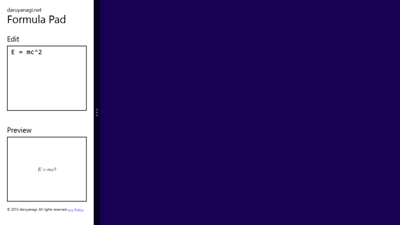
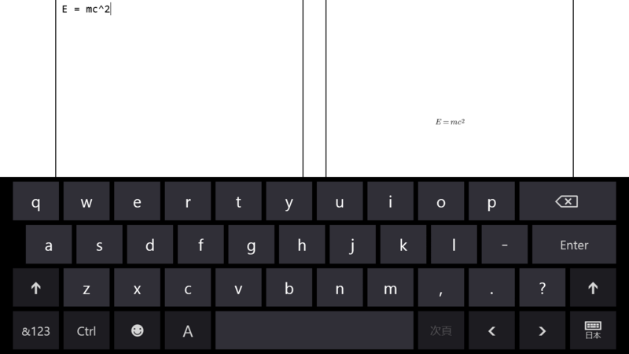

いろいろありましたが（<a href="https://blog.daruyanagi.jp/entry/2013/05/07/220402">Windows &#x30B9;&#x30C8;&#x30A2; &#x30A2;&#x30D7;&#x30EA;&#xFF1A;&#x30EA;&#x30B8;&#x30A7;&#x30AF;&#x30C8;&#x3092;&#x98DF;&#x3089;&#x3044;&#x307E;&#x3057;&#x305F;&#x3002; - &#x3060;&#x308B;&#x308D;&#x3050;</a>、<a href="https://blog.daruyanagi.jp/entry/2013/05/09/011459">Windows Store Apps&#xFF1A;&#x516C;&#x958B;&#x3055;&#x308C;&#x307E;&#x3057;&#x305F;&hellip;&hellip;&#x304C;&#xFF01; - &#x3060;&#x308B;&#x308D;&#x3050;</a>）、無事（日本の）Windows ストアにも公開されました。

<ul>
<li><a href="http://apps.microsoft.com/windows/ja-JP/app/formula-pad/86b6ecdc-e810-4aa2-9bdb-bb0da5b34737">http://apps.microsoft.com/windows/ja-JP/app/formula-pad/86b6ecdc-e810-4aa2-9bdb-bb0da5b34737</a></li>
</ul>

<h3>1.1.0（2013/05/09）</h3>

<ul>
<li>日本市場をはじめとするすべての市場に公開しました</li>
</ul>
1.0.0 なんてなかったんや……！

<h3>基本的な機能</h3>

ほとんど <a href="https://blog.daruyanagi.jp/entry/2013/05/02/021238">Formula Pad 1.0.1 - &#x3060;&#x308B;&#x308D;&#x3050;</a> と同じです。Surface RT で使うために作りました。まぁ、むかしカメラ目当てで作ったアプリ（<a href="https://blog.daruyanagi.jp/entry/2012/09/27/195233">&#x521D;&#x3081;&#x3066;&#x306E; Windows &#x30B9;&#x30C8;&#x30A2;&#x30A2;&#x30D7;&#x30EA;&#x304C;&#x7121;&#x4E8B;&#x30B9;&#x30C8;&#x30A2;&#x3067;&#x516C;&#x958B;&#x3055;&#x308C;&#x307E;&#x3057;&#x305F; &#xFF3C;(&#xFF3E;o&#xFF3E;)&#xFF0F; - &#x3060;&#x308B;&#x308D;&#x3050;</a>）よりは役に立つと思う。

アプリバーから数式をテキストや画像として保存したり、クリップボードへコピーできます。

スナップ表示にも対応しているよ！

でも、ソフトウェアキーボードで使う場面を考慮するのを忘れていました……これは直さねばならない。どうすればええんや……

<h3>プライバシーポリシーのリンクを［設定］チャームへ追加</h3>
<pre class="code lang-cs" data-lang="cs" data-unlink>SettingsPane.GetForCurrentView().CommandsRequested += (s, e) =&gt;
{
const string LAVEL_PRIVACY_POLICY = &quot;Privacy Policy&quot;;
const string URL_PRIVACY_POLICY = &quot;http://download.daruyanagi.net/Privacy%20Policy&quot;;

var show_privacy_policy = new UICommandInvokedHandler(async (target) =&gt;
{
switch (target.Id as string)
{
case LAVEL_PRIVACY_POLICY:
await Launcher.LaunchUriAsync(new Uri(URL_PRIVACY_POLICY));
break;
}
});

e.Request.ApplicationCommands.Clear();

e.Request.ApplicationCommands.Add(
new SettingsCommand(
LAVEL_PRIVACY_POLICY,
LAVEL_PRIVACY_POLICY,
show_privacy_policy
)
);
};
</pre>
OnLaunched イベントハンドラに以下のコードを追加しておいた。これでいいのかな？

