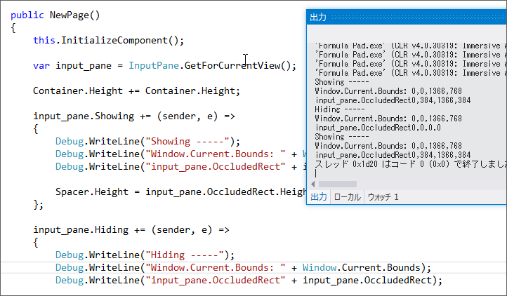

<a href="https://blog.daruyanagi.jp/entry/2013/05/09/191152">Formula Pad 1.1.0 for Windows 8 - &#x3060;&#x308B;&#x308D;&#x3050;</a> は大失敗だった。オンスクリーンキーボード（ソフトウェアキーボード）を表示した状態では、肝心の数式プレビューが見えないことがある。

理想としてはこうなってほしいわけだが。

<h3>InputPane によるオンスクリーンキーボードイベントと領域の取得</h3>

一応 <a href="http://msdn.microsoft.com/ja-JP/library/windows/apps/windows.ui.viewmanagement.inputpane(v=win.10).aspx">InputPane Class (Windows.UI.ViewManagement) - Windows UWP applications | Microsoft Docs</a> を利用すればオンスクリーンキーボードの表示・非表示は取得できるというのはわかった。

<pre class="code lang-cs" data-lang="cs" data-unlink>var input_pane = InputPane.GetForCurrentView();

input_pane.Showing += (sender, e) =&gt;
{
Debug.WriteLine(&quot;Showing -----&quot;);
Debug.WriteLine(&quot;Window.Current.Bounds: &quot; + Window.Current.Bounds);
Debug.WriteLine(&quot;input_pane.OccludedRect&quot; + input_pane.OccludedRect);
};

input_pane.Hiding += (sender, e) =&gt;
{
Debug.WriteLine(&quot;Hiding -----&quot;);
Debug.WriteLine(&quot;Window.Current.Bounds: &quot; + Window.Current.Bounds);
Debug.WriteLine(&quot;input_pane.OccludedRect&quot; + input_pane.OccludedRect);
};
</pre>

<h3>オンスクリーンキーボード表示の際のアニメーション</h3>

しかし、これを利用して Page の高さを操作しても、期待通りの動作はしない。

初期表示。画面をスクロールして位置を補正することはできない。

オンスクリーンキーボードを一度非表示にして表示。画面をスクロールして位置を補正することは可能。

オンスクリーンキーボードキーボードの出し入れで、アプリがアニメーションして上に移動するのが邪魔なのだけど、それを無効化するにはどうすればいいのだろうか。たとえば「Internet Explorer 10」などはこのアニメーションが無効化されているようなので、やり方はあるような気がするのだけど。

<h3>暫定の修正案</h3>

とりあえず、今回は「オンスクリーンキーボードを表示したときのみスペーサーとなるグリッド列を用意する」という方法をとった。

初期表示。

オンスクリーンキーボードを一度非表示にして表示。

上に少しズレているが、スクロールして戻せる。これで当分は我慢することにする。

<h3>解決</h3>

諦めきれず電子の海をさまよっていたら、浴衣の似合う漢のサイトに答え（<a href="http://mimumimu.net/blog/2012/08/22/windows-%E3%82%B9%E3%83%88%E3%82%A2%E3%82%A2%E3%83%97%E3%83%AA-%E6%97%A7-metro-%E3%82%B9%E3%82%BF%E3%82%A4%E3%83%AB%E3%82%A2%E3%83%97%E3%83%AA-%E3%81%A7%E3%82%B9%E3%82%AF%E3%83%AA%E3%83%BC%E3%83%B3/">Windows &#x30B9;&#x30C8;&#x30A2;&#x30A2;&#x30D7;&#x30EA; (&#x65E7; Metro &#x30B9;&#x30BF;&#x30A4;&#x30EB;&#x30A2;&#x30D7;&#x30EA;) &#x3067;&#x30B9;&#x30AF;&#x30EA;&#x30FC;&#x30F3;&#x30AD;&#x30FC;&#x30DC;&#x30FC;&#x30C9;&#x306E;&#x30B5;&#x30A4;&#x30BA;&#x306B;&#x3042;&#x308F;&#x305B;&#x3066;&#x753B;&#x9762;&#x3092;&#x8ABF;&#x7BC0;&#x3059;&#x308B;&#x3002; | &#x307F;&#x3080;&#x3089;&#x306E;&#x624B;&#x8A18;&#x624B;&#x5E33;</a>）が書いてあった。

<pre class="code lang-cs" data-lang="cs" data-unlink>input_pane.Showing += (sender, e) =&gt;
{
Debug.WriteLine(&quot;Showing -----&quot;);
Debug.WriteLine(&quot;Window.Current.Bounds: &quot; + Window.Current.Bounds);
Debug.WriteLine(&quot;input_pane.OccludedRect&quot; + input_pane.OccludedRect);

Spacer.Height = input_pane.OccludedRect.Height + 36;
e.EnsuredFocusedElementInView = true;
};
</pre>
<blockquote cite="http://msdn.microsoft.com/ja-JP/library/windows/apps/windows.ui.viewmanagement.inputpanevisibilityeventargs.ensuredfocusedelementinview.aspx">

このプロパティが false の場合、Windows では、入力ウィンドウがフォーカスのある要素に重ならないようにします。

<cite><a href="http://msdn.microsoft.com/ja-JP/library/windows/apps/windows.ui.viewmanagement.inputpanevisibilityeventargs.ensuredfocusedelementinview.aspx">InputPaneVisibilityEventArgs Class (Windows.UI.ViewManagement) - Windows UWP applications | Microsoft Docs</a></cite>
</blockquote>

つまり、true にしておけば勝手にスクロールしない。なるほど。

