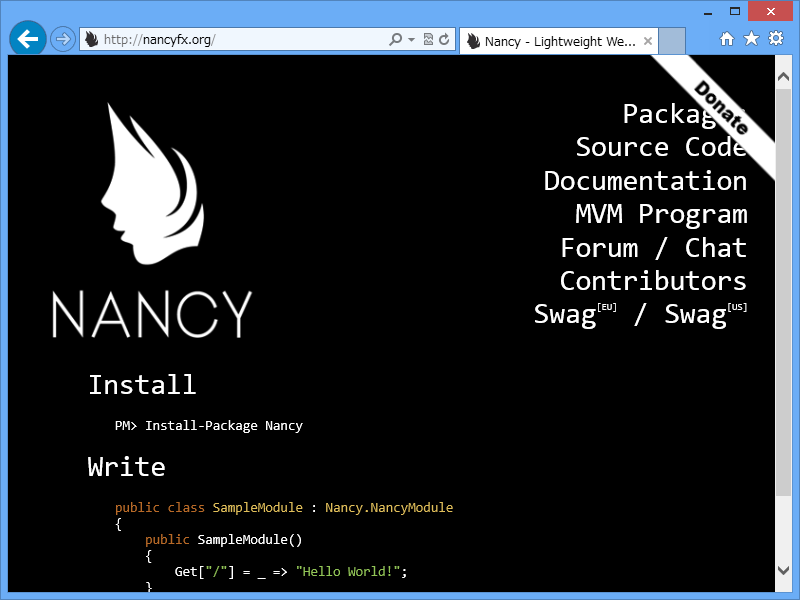
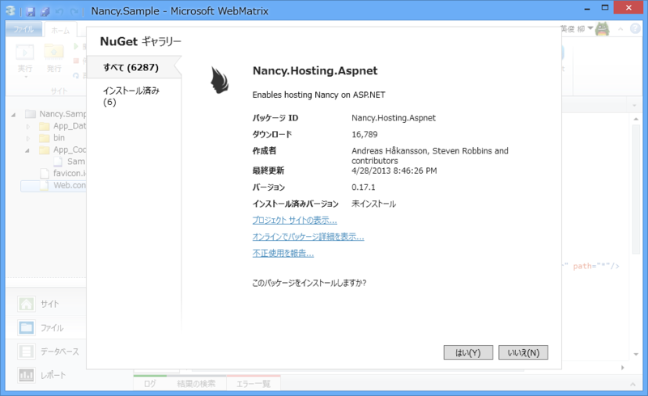
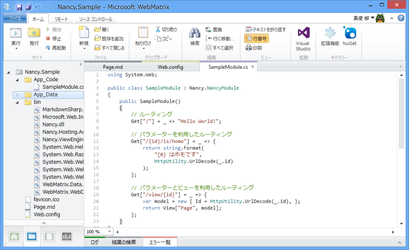
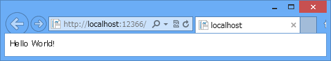
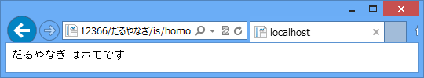
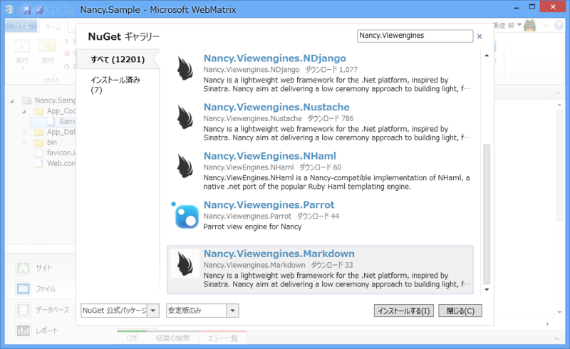
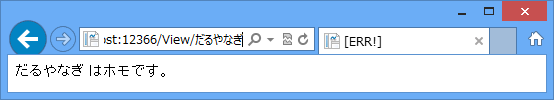

 

<blockquote cite="https://github.com/NancyFx/Nancy/wiki/Hosting-nancy-with-asp.net">

Nancy is a lightweight, low-ceremony, framework for building HTTP based services on .Net and Mono. The goal of the framework is to stay out of the way as much as possible and provide a super-duper-happy-path to all interactions.

<cite><a href="https://github.com/NancyFx/Nancy/wiki/Hosting-nancy-with-asp.net">Hosting Nancy with asp.net &middot; NancyFx/Nancy Wiki &middot; GitHub</a></cite>
</blockquote>

Scott Hanselman 氏のブログ（<a href="http://www.hanselman.com/blog/OneASPNETNancyTemplatesForVisualStudio.aspx">One ASP.NET: Nancy.Templates for Visual Studio - Scott Hanselman</a>）で知ったのですが、 「Nancy」なんてのがあるんですね！

<ul>
<li><a href="http://nancyfx.org/">Nancy - Lightweight Web Framework for .net</a></li>
</ul>
前々からこういうのがほしいなって思ってたんですよね……。

<blockquote cite="https://blog.daruyanagi.jp/entry/2012/06/30/211729">

個人的に一番おすすめなのは Pure HTML または Razor （ASP.NET Web Pages）かな。 HTML5/CSS3（Pure HTML）で書くところからはじめて、変数とテンプレート、初歩的なデータベースが使いたくなれば Razor へ進めばいい。もっと大規模なWebサイトであれば、 ASP.NET MVC が利用できるけど、これはちょっと個人用途にはデカすぎる気がした（<b>その中間に、 Ruby で言えば Sinatra とか、軽いフレームワークがあればいいなぁ、と思う</b>）。仮想化だのクラウドだのという言葉を忘れて、 HTML ファイルひとつ、ぽつんと Azure Web Sites に置くところから始めてもらえればと。

<cite><a href="https://blog.daruyanagi.jp/entry/2012/06/30/211729">#GoAzure &#x306B;&#x884C;&#x3063;&#x3066;&#x304D;&#x307E;&#x3057;&#x305F;&#xFF01; - &#x3060;&#x308B;&#x308D;&#x3050;</a></cite>
</blockquote>

で、試そうかなって思ったまま、ちょっとストアアプリの方に浮気している間に、しばやん氏がいろいろ調べてくれていました。

<ul>
<li><a href="http://shiba-yan.hatenablog.jp/entry/20130509/1368107112">Sinatra &#x30E9;&#x30A4;&#x30AF;&#x306A; .NET &#x7528;&#x8EFD;&#x91CF; Web &#x30D5;&#x30EC;&#x30FC;&#x30E0;&#x30EF;&#x30FC;&#x30AF;&#x300C;Nancy&#x300D;&#x3092;&#x4F7F;&#x3063;&#x3066;&#x307F;&#x305F; - &#x3057;&#x3070;&#x3084;&#x3093;&#x96D1;&#x8A18;</a></li>
</ul>
ありがとう！　さっそく WebMatrix で動かしてみますかネ。

ちなみに、Nancy は Frank Sinatra のお嬢さんです（<a href="http://ja.wikipedia.org/wiki/%E3%83%8A%E3%83%B3%E3%82%B7%E3%83%BC%E3%83%BB%E3%82%B7%E3%83%8A%E3%83%88%E3%83%A9">&#x30CA;&#x30F3;&#x30B7;&#x30FC;&#x30FB;&#x30B7;&#x30CA;&#x30C8;&#x30E9; - Wikipedia</a>）。Sinatra の名前も Frank Sinatra から来ているはず。

<h3>NuGet パッケージのインストール</h3>

<a href="http://nuget.org/packages/Nancy.Hosting.Aspnet/">NuGet Gallery | Nancy.Hosting.Aspnet 1.4.1</a> をインストール。<a href="http://nuget.org/packages/Nancy/">NuGet Gallery | Nancy 1.4.5</a> のインストールに加え、Web.config の構成（<a href="https://github.com/NancyFx/Nancy/wiki/Hosting-nancy-with-asp.net">Hosting Nancy with asp.net &middot; NancyFx/Nancy Wiki &middot; GitHub</a>）なんかもしてくれるみたいです。

<h3>App_Code に Nancy Module を記述</h3>

このブログではすっかりお馴染み、App_Code フォルダに C# を記述するスタイルを今回も採用。Web Matrix には Razor C# の補完機能はあっても C# の補完機能はないので、Visual Studio にスイッチしてゴリゴリ書くのがおすすめ。まぁ、この程度ならインテリセンスはなくてもいいけど。

<h4>基本的なパターンの記述（Literal segments）</h4>

 

<pre class="code lang-cs" data-lang="cs" data-unlink>public class SampleModule : Nancy.NancyModule
{
public SampleModule()
{
Get[&quot;/&quot;] = _ =&gt; &quot;Hello World!&quot;;
}
}
</pre>
GET、POST、PUT、DELETE……といった動詞（<b>メソッド</b>）にインデクサでパス（<b>パターン</b>）を指定して、レスポンス（<b>アクション</b>）をラムダ式でブチ込むだけ。<i>簡単━━━━━━(ﾟ∀ﾟ)━━━━━━!!!!</i> 

<h4>パラメーター（Capture segments）</h4>

 

<pre class="code lang-cs" data-lang="cs" data-unlink>public class SampleModule : Nancy.NancyModule
{
public SampleModule()
{
Get[&quot;/{id}/is/homo&quot;] = _ =&gt; {
return string.Format(
&quot;{0} はホモです&quot;,
HttpUtility.UrlDecode(_.id)
);
};
}
}
</pre>
パラメーターも扱えるみたい。

ほかにも <b>/{name?}</b> でオプションパラメーター（なくてもいいパラメーター）や、<b>/{name?unnamed}</b> でデフォルト値を指定したパラメーターなんかも使える。

<h4>正規表現（RegEx Segment）</h4>

本家 Sinatra は正規表現なんかも使えたと思うのだけど、正規表現リテラルのない C# ではちょっと難しいかな？

<pre class="code lang-cs" data-lang="cs" data-unlink>Delete[@&quot;/products/(?&lt;id&gt;[\d]{1,7})&quot;] = parameters =&gt; {
return 200;
};
</pre>
……と思ったらぜんぜんイケるし。

以上、おおまかに3種類のパターンが指定できる。

<h3>ビューとビューモデル</h3>

<blockquote cite="http://shiba-yan.hatenablog.jp/entry/20130509/1368107112">

実はこのままだとビューを返すことは出来ません。Nancy はデフォルトでビューエンジンを持っていないので、使いたいビューエンジンを NuGet からインストールする必要があります。

現在公開されている Nancy 用のビューエンジンは以下の通りです。

<ul>
<li>Nancy.Viewengines.Razor</li>
<li>Nancy.Viewengines.Spark</li>
<li>Nancy.Viewengines.DotLiquid</li>
<li>Nancy.Viewengines.NDjango</li>
<li>Nancy.Viewengines.Nustache</li>
<li>Nancy.ViewEngines.NHaml</li>
<li>Nancy.Viewengines.Parrot</li>
<li>Nancy.Viewengines.Markdown</li>
</ul>
これは NuGet のパッケージ ID となっているので、使いたいものをインストールしてください。今回は面白そうだったので Markdown を選択してみました。

<cite><a href="http://shiba-yan.hatenablog.jp/entry/20130509/1368107112">Sinatra &#x30E9;&#x30A4;&#x30AF;&#x306A; .NET &#x7528;&#x8EFD;&#x91CF; Web &#x30D5;&#x30EC;&#x30FC;&#x30E0;&#x30EF;&#x30FC;&#x30AF;&#x300C;Nancy&#x300D;&#x3092;&#x4F7F;&#x3063;&#x3066;&#x307F;&#x305F; - &#x3057;&#x3070;&#x3084;&#x3093;&#x96D1;&#x8A18;</a></cite>
</blockquote>

わしも今回は Markdown を使ってみたのだけれど、リポジトリのソースを WebMatrix パッケージから NuGet 公式に変更しないと検索で出てこなかった。WebMatrix にもコマンドラインでインストールする手段があればいいなぁ（もうあるのかな？）。

 

<pre class="code lang-cs" data-lang="cs" data-unlink>public class SampleModule : Nancy.NancyModule
{
public SampleModule()
{
Get[&quot;/view/{id}&quot;] = _ =&gt; {
var model = new { Id = HttpUtility.UrlDecode(_.id), };
return View[&quot;Page&quot;, model];
};
}
}
</pre>
使い方はこんな感じ。ビューは Page.md としてルートに配置しておいた。

<pre class="code lang-html" data-lang="html" data-unlink>&lt;!DOCTYPE html&gt;

&lt;html lang=&quot;en&quot;&gt;
&lt;head&gt;
        &lt;meta charset=&quot;utf-8&quot; /&gt;
        &lt;title&gt;@Model.Title&lt;/title&gt;
    &lt;/head&gt;
&lt;body&gt;
&lt;p&gt;@Model.Id はホモです。&lt;/p&gt;
&lt;/body&gt;
&lt;/html&gt;
</pre>
ビューモデルを dynamic で渡してやれば、ビューが分から参照できる<a href="#f-95ddb365" name="fn-95ddb365" title="参照できなければ ERR! が表示されるようだ">*1</a>。どうにかしてレイアウトを使えるようにしたいな。

<h3>まとめ</h3>

<ul>
<li>WebMatrix からも問題なく利用できる</li>
<li>メソッド、パターン、アクションを指定するだけ</li>
<li>パターンには Literal、Capture、Regular Expression の3つが利用できる</li>
</ul>
ASP.NET Web Pages（WebMatrix）はファイル指向で、ファイルを増やして“静的なコンテンツ”を増やすアプローチ。個人向け Web サイトをちょっと動的に実装したい場合などに向いている。

Nancy/Sinatra はパターン・アクション指向。パターンを記述していくことで、“機能を動的に”追加していける。Web API に実装に向いてそう。

もちろん、二つを組み合わせてもよいと思う。関連 NuGet の名前を眺めているだけでもかなりのことができそうなので、これからもちょくちょく試してみたい。

<a href="#fn-95ddb365" name="f-95ddb365" class="footnote-number">*1</a>:参照できなければ ERR! が表示されるようだ

