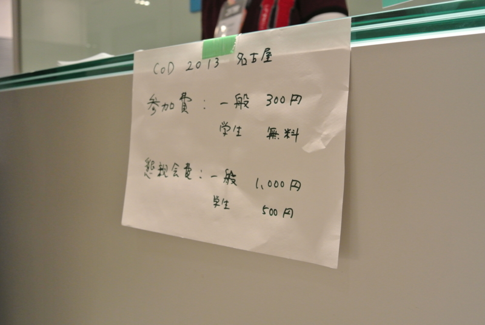

東京会場もあるのに、わざわざ名古屋まで。いつも来てくれてる @you_and_i さんに義理返ししたかったのと（なったんかいな？）、ついでに名張まで墓参り行きたかったこともあり。で、なんで YAGOYA なん？（笑

<ul>
<li><a href="http://cod.ms/Pages/default.aspx">cod</a></li>
<li><a href="http://atnd.org/events/38803">Community Open Day 2013 &#x540D;&#x53E4;&#x5C4B;&#x4F1A;&#x5834; #cod2013jp : ATND</a></li>
</ul>
いろんな人と会ってお話できたし、行ってよかったと思います<a href="#f-6b89ff89" name="fn-6b89ff89" title="四日市は一度行きたいなぁ、っておほんとに思いました。お小遣いの関係で、いろいろ厳しいものはあるけど">*1</a>。名古屋は近鉄特急の乗り換えでしか降りたことがなかったのだけど、またのんびり行きたいですねぇ……巫女居酒屋というものがあるらしいし。

勉強会といえば、「なんのためにあるのか」「行く意義を感じない」という言葉も（おもに不参加の方から）ときどき頂戴します。確かに勉強のためだけなら、家でこうしたイベントの Ustream を自分の役に立ちそうな部分だけ聞きかじりながら、技術書片手にガリガリとコードを書いている方が効率がいいと思います。また、勉強会が生き甲斐みたいなのもちょっと変かなって思うし、人と関わることで面倒な義理を感じることだってあるかもしれない<a href="#f-73562317" name="fn-73562317" title="あ、今回参加したのはそれじゃないぞ？">*2</a>。

でも、生身の人間と会うことは、そんなこととは少し違うことだと思います。Ustream では本当の言葉は聞けないし、生の情熱にも触れられない<a href="#f-c1bd3f0a" name="fn-c1bd3f0a" title="まぁ、たいていはそんな大層なものじゃなくて、仕事の愚痴とか「ターンエーガンダムがわからん自称ガンヲタ技術者は死ね」みたいな話ですけど">*3</a>。

今回の Community Open Day では、いろんな人が参加の感想をブログや Twitter に書いてくれていますが、個人的にはこの言葉が印象に残りました<a href="#f-4767f41b" name="fn-4767f41b" title="この言葉だって、Ustream では聞けませんよね">*4</a>。

<blockquote cite="http://blog.livedoor.jp/haruka_sao/archives/52032302.html">

「ああやって、誰か一人でも 
この技術が良いんだっ！面白いんだっ！みたいなことを言ってる人が居ないと 
やってみようかな～っていう気にもならないから、良かったと思いますよ～」

<cite><a href="http://blog.livedoor.jp/haruka_sao/archives/52032302.html">&#x9065;&#x4F50;&#x4FDD;&#x306E;&#x6280;&#x8853;&#x30E1;&#x30E2;:[C++/CX]Windows&#x30B9;&#x30C8;&#x30A2;&#x30A2;&#x30D7;&#x30EA;&#x3092;C++&#x3068;XAML&#x3067;&#x958B;&#x767A;&#x3059;&#x308B;&#x305F;&#x3081;&#x306E;&#x5B66;&#x7FD2;&#x30B5;&#x30A4;&#x30C8; - livedoor Blog&#xFF08;&#x30D6;&#x30ED;&#x30B0;&#xFF09;</a></cite>
</blockquote>

それも（基本的に）ボランティアで勉強会という発表の場を提供している方たちがいるからだと思います。日頃あんまりこういうことを言ってなかったと思うで、ココでお礼させてください。いつも、ありがとうございます！

Community Open Day は全国各地の IT 勉強会コミュニティが繋がる一種のお祭りみたいな日。<i>「おんなじことを頑張っている仲間がいる」</i>ということを再確認できる日ですね。なかには日頃のコミュニティの運営で少し疲れていた方もいたようですけど、こういう機会に元気を補充していただければと思います。

僕はあまり他人の言葉に感心したりしないタイプですけど、最近では Ruby 言語の生みの親・まつもとゆきひろさんのこの言葉がとてもすきです。

<blockquote cite="http://el.jibun.atmarkit.co.jp/rails/2012/10/ruby-matz-7080.html">

われわれにとって最も大切なリソースはマンパワーではなくて、モチベーションだ。

<cite><a href="http://el.jibun.atmarkit.co.jp/rails/2012/10/ruby-matz-7080.html">&#x300C;&#x306A;&#x3093;&#x3067;Ruby&#x306A;&#x3093;&#x304B;&#x4F5C;&#x3063;&#x305F;!? &#x8FF7;&#x60D1;&#x3060;&#xFF01;&#x300D;&#x306B;&#x5BFE;&#x3059;&#x308B;Matz&#x306E;&#x7B54;&#x3048;&#xFF1A;Rails Hub&#x60C5;&#x5831;&#x5C40;&#xFF1A;&#x30A8;&#x30F3;&#x30B8;&#x30CB;&#x30A2;&#x30E9;&#x30A4;&#x30D5;</a></cite>
</blockquote>

経済学的な見地からだととかく人間を資源の一種としてみてしまいがちですが、僕たちは生産要素の一種にとどまる存在じゃけっしてない。ましてや、ボランティアというのは労働力という生産要素を単に無償で提供する行為ではない。また、お互いにお互いをそうやって扱っちゃいけない。

便利というのは、突き詰めて言えば、他者を道具化していくことです。機械に対してだけでなく、ときには人間に対してもそうです。便利を追及する IT の本質には、そういう危険が常に潜んでいる。

だから、そうでないための抵抗として、生身の人に会いに行くことは大事だと個人的に思うんですよね<a href="#f-b488bce8" name="fn-b488bce8" title="これは僕の共和主義にも関係があります">*5</a>。道具化は“関心の分離”から始まる<a href="#f-b4e74f4e" name="fn-b4e74f4e" title="意味がちゃうｗ">*6</a>。だから、分断されちゃいけない。あと、マルクス的に言えば「死んだ労働力」にならないように、僕らは常に楽しく活き活きとしてなきゃいけない<a href="#f-b19eaaf2" name="fn-b19eaaf2" title="言い回しをまねただけで、あの「死んだ労働」とは意味合いが異なりますが">*7</a>。じゃないと、“人月”で数えられても仕方ないでしょう。だから、もし万が一偶然たまたま自分に余裕があれば、お互いに進んでモチベーションを分け合い、高めあっていきたいものだと最近思うのです<a href="#f-b39f8ff3" name="fn-b39f8ff3" title="この前の特集にはここまで盛り込みたかったのだけど、さすがにブログに書くべきことかと思い自重した">*8</a>。

そんなわけで、僕も拙いけれど LT をしてきました。内容は <a href="https://blog.daruyanagi.jp/entry/2013/05/10/085706">WebMatrix 3: Sinatra on ASP.NET &#x300C;Nancy&#x300D; &#x3092;&#x5229;&#x7528;&#x3059;&#x308B; - &#x3060;&#x308B;&#x308D;&#x3050;</a> の焼き直しです。

<iframe src="https://skydrive.live.com/embed?cid=1A437B6679510052&resid=1A437B6679510052%212991&authkey=AIq7lENO7HI7-KU&em=2" width="402" height="327" frameborder="0" scrolling="no"></iframe>

まじすまんかったｗ

<a href="#fn-6b89ff89" name="f-6b89ff89" class="footnote-number">*1</a>:四日市は一度行きたいなぁ、っておほんとに思いました。お小遣いの関係で、いろいろ厳しいものはあるけど

<a href="#fn-73562317" name="f-73562317" class="footnote-number">*2</a>:あ、今回参加したのはそれじゃないぞ？

<a href="#fn-c1bd3f0a" name="f-c1bd3f0a" class="footnote-number">*3</a>:まぁ、たいていはそんな大層なものじゃなくて、仕事の愚痴とか「ターンエーガンダムがわからん自称ガンヲタ技術者は死ね」みたいな話ですけど

<a href="#fn-4767f41b" name="f-4767f41b" class="footnote-number">*4</a>:この言葉だって、Ustream では聞けませんよね

<a href="#fn-b488bce8" name="f-b488bce8" class="footnote-number">*5</a>:これは僕の共和主義にも関係があります

<a href="#fn-b4e74f4e" name="f-b4e74f4e" class="footnote-number">*6</a>:意味がちゃうｗ

<a href="#fn-b19eaaf2" name="f-b19eaaf2" class="footnote-number">*7</a>:言い回しをまねただけで、あの「死んだ労働」とは意味合いが異なりますが

<a href="#fn-b39f8ff3" name="f-b39f8ff3" class="footnote-number">*8</a>:この前の特集にはここまで盛り込みたかったのだけど、さすがにブログに書くべきことかと思い自重した

