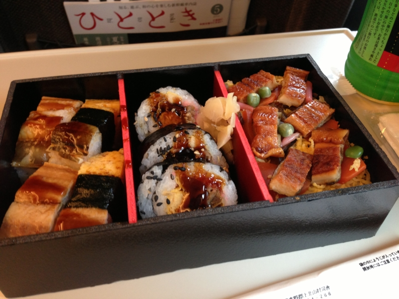

以前に東海道<b>本線</b>で東京から名古屋まで行ったが<a href="#f-3babe211" name="fn-3babe211" title="記事は旧ブログの失効・削除とともに消えた">*1</a>、あれはちょっと面白かった。さすがにちょっとしんどいけど。というわけで、今回の名古屋行き（<a href="https://blog.daruyanagi.jp/entry/2013/05/14/100409">Community Open Day 2013 &#x540D;&#x53E4;&#x5C4B;&#x306B;&#x53C2;&#x52A0;&#x3057;&#x305F;&#x3063;&#x305F; #cod2013jp - &#x3060;&#x308B;&#x308D;&#x3050;</a>）も「なにか面白い方法でいけないかなぁ」と考えていたのだけど、そういえばあった。ぷらっとこだま。

ぷらっとこだま（<a href="http://www.jrtours.co.jp/kodama/">&#x3077;&#x3089;&#x3063;&#x3068;&#x3053;&#x3060;&#x307E;&#xFF5C;JR&#x6771;&#x6D77;&#x30C4;&#x30A2;&#x30FC;&#x30BA;</a>）は、JR東海ツアーズという旅行会社がやっている添乗員の付き添いがないタイプのツアー（募集型企画旅行）。事前に予約したこだましか乗れないが、その分価格が抑えられている。注意しとかなきゃいけないのは、「JR」と名前が冠してあるので、なにかお得な切符の一種かと勘違いしやすいところ。あくまでもツアーなんでそこんところを間違えるといろいろ痛い目に合う。なんか最近 Twitter でブチ切れてて総ツッコミもらってたひとがいたよね。

<h3>お得なところ</h3>

<ul>
<li>安い。東京→名古屋（10,500円）が8,000円になる</li>
<li>グリーン車も安い。東京→名古屋の場合、1,000円足すだけ（通常は＋4,000円）</li>
<li>ドリンク券がもらえる。駅の売店で 500ml のお茶や、350ml のビールと交換してもらえる<a href="#f-b31c7605" name="fn-b31c7605" title="こだまは車内販売がないので注意">*2</a></li>
</ul>

<h3>気を付けなきゃいけないところ</h3>

<ul>
<li>予約した列車にしか乗れない。しかも、指定された列車しか予約できない。</li>
<li>予約できるのは前日まで。</li>
<li>再発行不可。紛失したり、乗り遅れたら（ほぼ）自己責任。</li>
<li>受け取りは郵送（200円）か東京支店に行くかの2択</li>
</ul>
今回、行きの予定は固まってたけれど、帰りの予定は流動的だったので、行きはこだまのグリーン車でのんびり、帰りはのぞみでサクッと帰るというプランを立てた。ぷらっとこだまに乗るなら、断然グリーン車やな。ぷらっとこだまは、

<ul>
<li>エコノミープラン（普通席）：1時間を2,500円で買う</li>
<li>グリーン車エコノミープラン：1時間を1,000円＋「普通席→グリーン車」という条件で買う</li>
</ul>
こととほぼ等価なのだけど、グリーン車だったら1時間余計に過ごすのもさして苦痛ではないし、むしろのんびり本を読むなり寝るなりできていい。さらにグリーン車を我慢して1,500円浮かせるかどうかは、まぁ、それぞれの好みによると思った。自分はちょっとそこまでする気にはなれないかなｗ

ちなみに、浮いたお金は「あなごづくし弁当」に化けました。早起きの対価としては上々。時間だって安くはないし、大阪へ行く時に使うのは微妙だと思ったけど、名古屋までだったらまた使ってもいいかなぁ。

<a href="#fn-3babe211" name="f-3babe211" class="footnote-number">*1</a>:記事は旧ブログの失効・削除とともに消えた

<a href="#fn-b31c7605" name="f-b31c7605" class="footnote-number">*2</a>:こだまは車内販売がないので注意

