
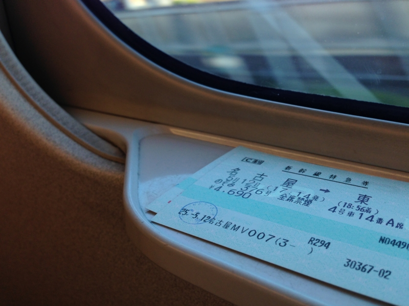

こだまでぷらりと名古屋へ行き（<a href="https://blog.daruyanagi.jp/entry/2013/05/16/051505">&#x3077;&#x3089;&#x3063;&#x3068;&#x3053;&#x3060;&#x307E;&#x306B;&#x306E;&#x3063;&#x3066;&#x307F;&#x305F;&#x3063;&#x305F;&#x3002; - &#x3060;&#x308B;&#x308D;&#x3050;</a>）、Community Open Day 2013 に参加（<a href="https://blog.daruyanagi.jp/entry/2013/05/14/100409">https://blog.daruyanagi.jp/entry/2013/05/14/100409</a>）したのだけど、今回はそれ以外にもいろいろ目的があった。

まず、第一は名古屋メシ。

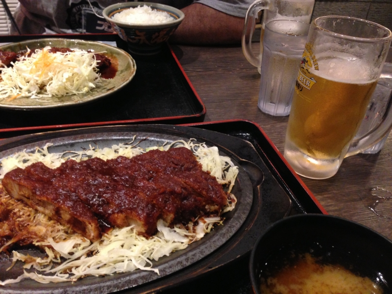

こんなこと言うの申し訳ないけど、CoD 2013 の基調講演は日本未発売デバイスの話で少しうんざりだった。そこで @mankitsu2009 を誘って最後30分を抜け出し、味噌カツを狩りに。アツアツの鉄板にキャベツを敷き（キャベツうめえ）、その上にジュウジュウと味噌カツが鳴いていて、みるからに美味そう。よく名古屋の味噌が苦手という人をみかけるけど、わしはそれほど苦手意識もなく。むしろこういう甘いのもたまにはいいかなって思う。口が甘くなったら、ビールでキッと洗い流せばよろしい。

ほんとはひつまぶしを食べたかったが、4,000円弱するので少し躊躇してしまった。今思えば食べてもよかったかも。

CoD 2013 のあとは懇親会（ハッピーなんちゃらと二次会）でしこたま飲んだのだけど、栄にとったホテルの場所がよくわからん。わかんねーわかんねーと喚いていると、たぬき（@tyorosan）が案内してくれるというのでそれに甘える。それでは申し訳ないし、もう一軒行こう！　奢るぜ！　というノリになって、かの有名な「世界の山ちゃん」（<a href="http://www.yamachan.co.jp/">http://www.yamachan.co.jp/</a>）へ行くことに。

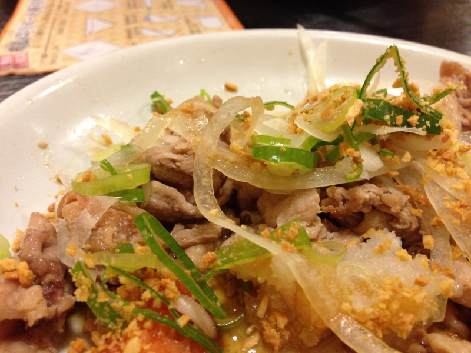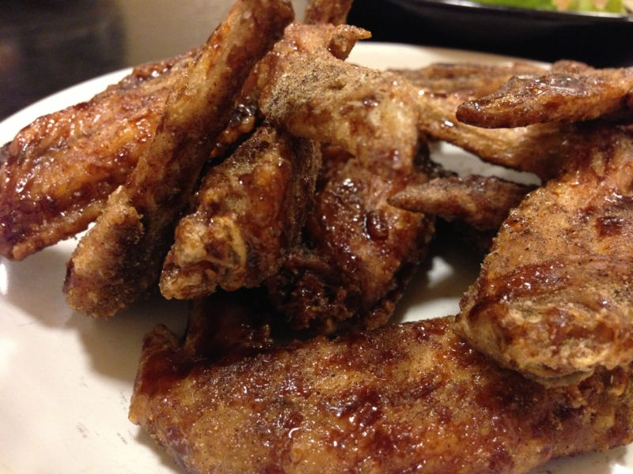

「世界の山ちゃん」と言えばなんといっても手羽先だけど、ほかのメニューもジャンクで美味しかった（手羽先だってもともとは捨てていたものを安く美味しく食べられるように工夫したのが始まりと聞いたことがある）。名古屋はこういうジャンク飯がかなり発達してるな。ここらへんは我が故郷・大阪と少し似ていて、人間が素直でよいと思う。この街とは相性がいいかもしれない。

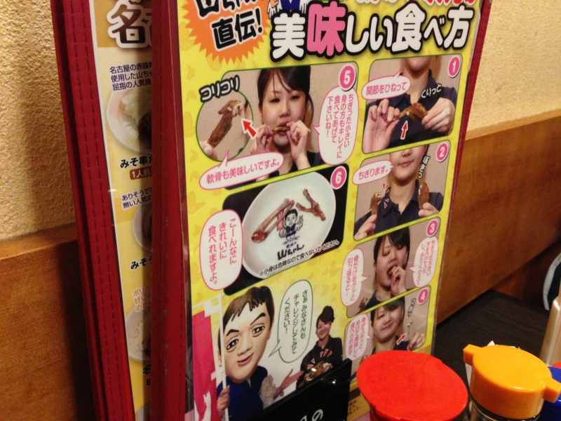

ちなみに、手羽先には食べ方があるのだそうだ。プチっと2つに折って、大きい方を齧って骨を抜くというもので、やってみるとなるほど、綺麗に食べられる。名古屋人は偉大やな。

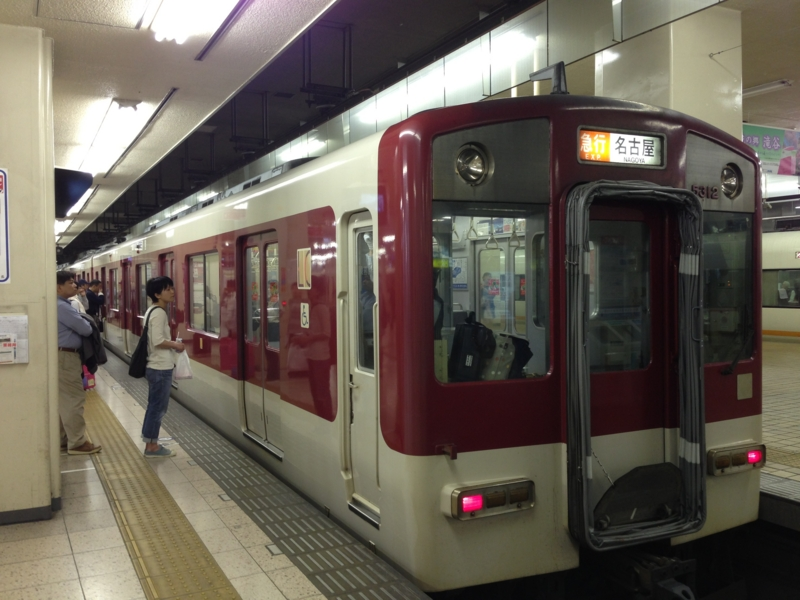

翌朝は9時までホテル（<a href="http://www.jalan.net/yad302313/?vos=evpajal0131x0161942">&#x540D;&#x53E4;&#x5C4B;&#x6804;&#x30B0;&#x30EA;&#x30FC;&#x30F3;&#x30DB;&#x30C6;&#x30EB; - &#x5BBF;&#x6CCA;&#x4E88;&#x7D04;&#x306F;&#xFF1C;&#x3058;&#x3083;&#x3089;&#x3093;&#xFF1E;</a> 安くて便利）でのんびりしたあと、近鉄で名張へ。去年11月から一度も墓参りしていない先祖不幸をジャンピング土下座にて許しを請う。

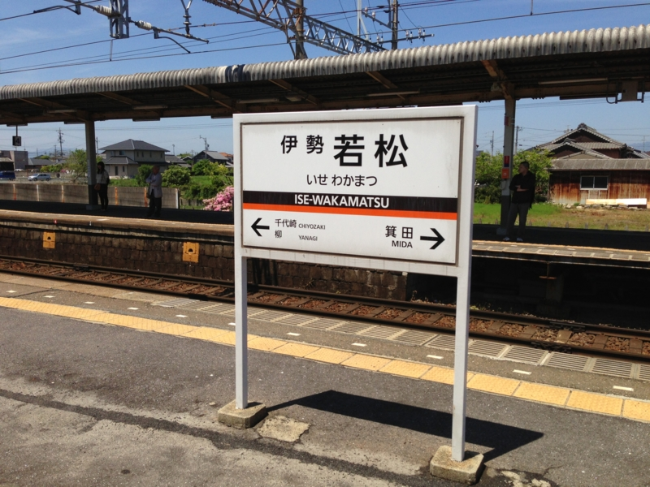

まぁ、急ぐこともないので急行でのんびり（写真よく見て！　柳駅！）。

何故か監視されたりしつつ。

途中、塩浜の車庫で近鉄祭り（<a href="http://www.kintetsu.co.jp/event-hiking/event_info/event0014230.html">http://www.kintetsu.co.jp/event-hiking/event_info/event0014230.html</a>）をやってたそうで、賑わっていた。あらかじめ知っていれば寄ったのだけど……帰りはもう終わっていて、ちょっと悲しかった。

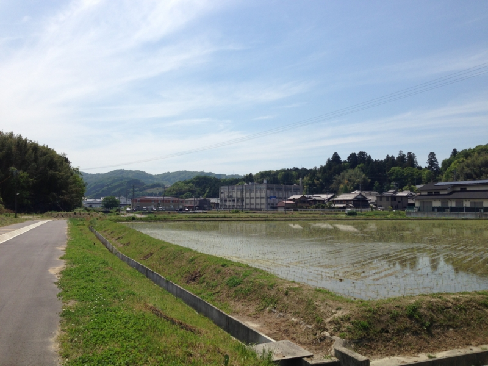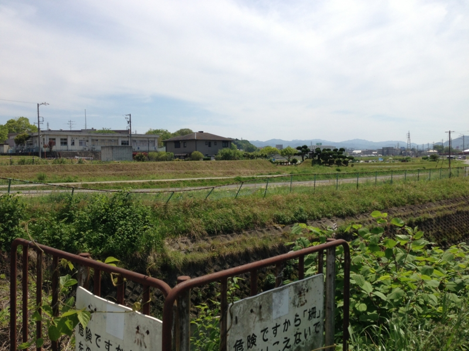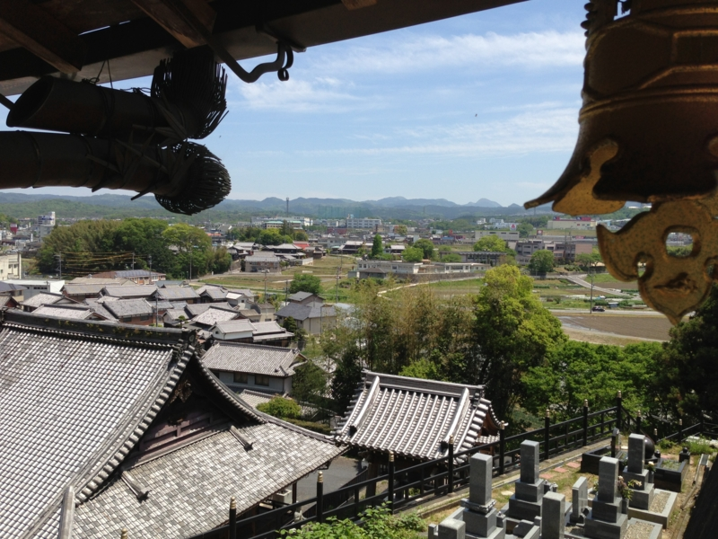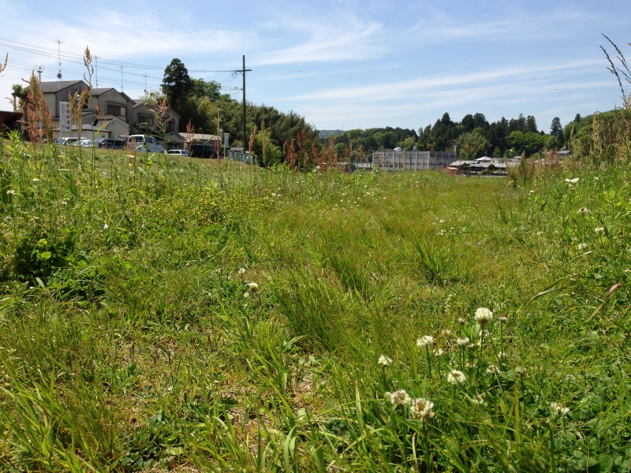

相変わらずなにもないところだったけれど、それがいい。酒と花を買ってお供えし、ちょびっとだけ雑草を抜いて、墓石に水をぶっかけて、それだけで疲れてしまったので、あとはお堂の軒先でゴロゴロしていた。弟か妹かの同級生の子が寺の跡を継いだみたいで、その子が坊主のコスプレで出かけた以外は、誰に会うこともなかった。

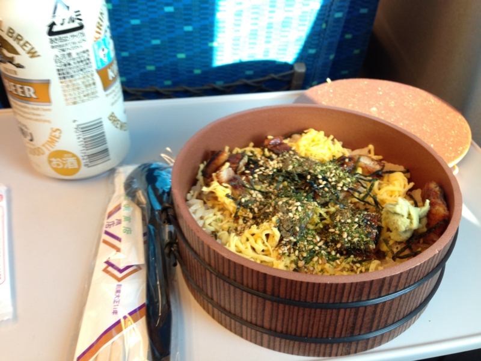

そのあとはフツーに近鉄と新幹線を乗り継いで7時半頃に帰宅。寝坊して松阪まで行くというアクシデントはあったものの、とくになにごともなかった。名古屋でひつまぶしが食べられなかった悔しさは、とりあえず駅弁で晴らしておいた。ひつまぶし弁当という割にはひつまぶしっぽくないけど、まぁまぁ、満足。

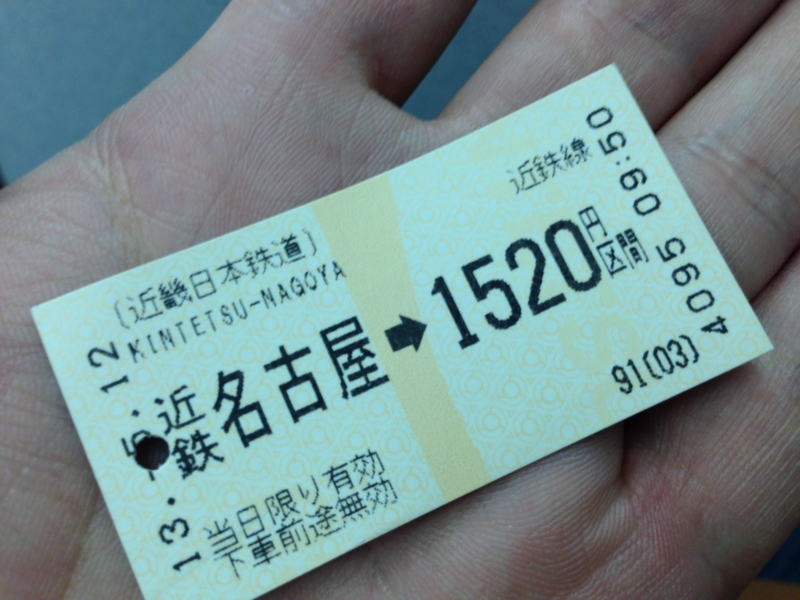

最後に。買った切符は写真にとっておくとよい。わしのように途中で落としても、近鉄ならばそれを見せれば通してくれる（ぁ

