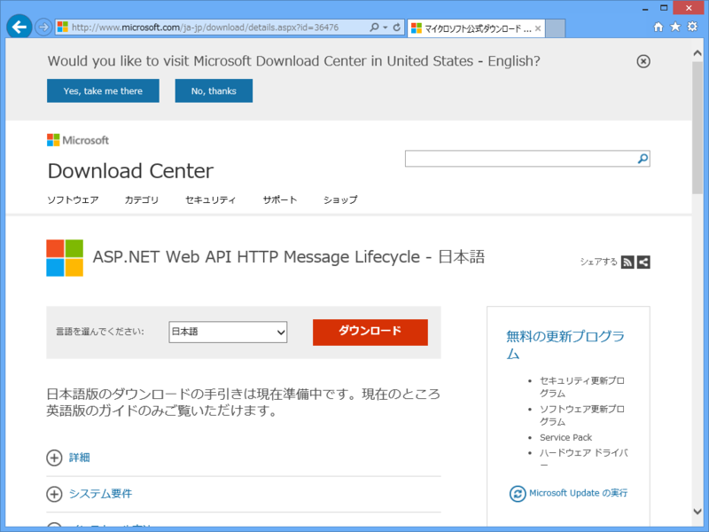
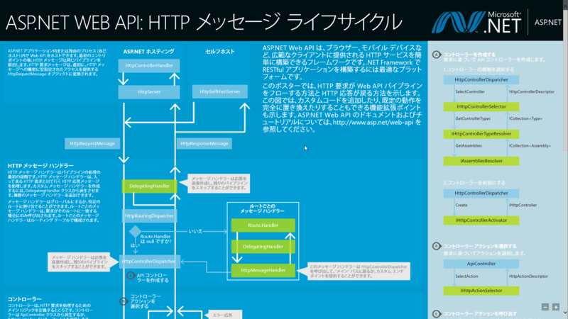

まぁまぁいいかも。全体的にメトロ（死語）っぽくまとまっている。お前らのお目当てであろうダウンロードボタンがわかりやすくデカデカと置いてあって、俺のような人間にしか用のないオプションの情報は折りたたんでシンプルに表示してあるのがイイ。ここ半年間デザインが二転三転し、米国と日本でデザインがチグハグだったりしてややこしかったけれど、これが一番いいんじゃないかなぁ。

どんなデザインか確認するついでに、ASP.NET Web API HTTP Message Lifecycle ポスター（<a href="http://www.microsoft.com/ja-jp/download/details.aspx?id=36476">http://www.microsoft.com/ja-jp/download/details.aspx?id=36476</a>）でもダウンロードしてみよう ☆（ゝω・）vｷｬﾋﾟ

<blockquote cite="http://blogs.msdn.com/b/chack/archive/2013/01/25/aspnet-web-api-http-message-lifecycle-poster.aspx">

日本語化＆実寸印刷配布したいなぁ・・・(ﾁﾗｯ

<cite><a href="http://blogs.msdn.com/b/chack/archive/2013/01/25/aspnet-web-api-http-message-lifecycle-poster.aspx">ASP.NET Web API HTTP Message Lifecycle &#x30DD;&#x30B9;&#x30BF;&#x30FC; - THE TRUTH IS OUT THERE - Site Home - MSDN Blogs</a></cite>
</blockquote>

日本語化はされている。実寸印刷のものが貰えたら、便所に貼りたいと思う。

あと、これの WebMatrix （ASP.NET Web Pages）版ないかしら！

