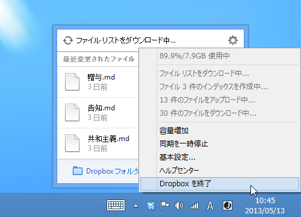
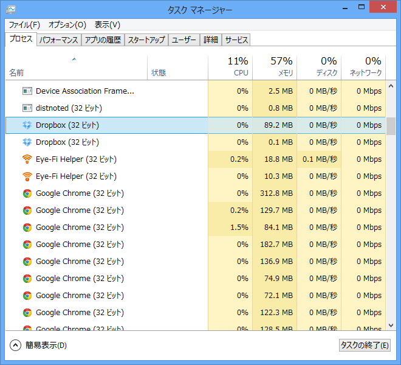
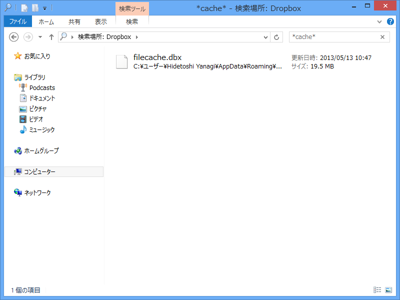
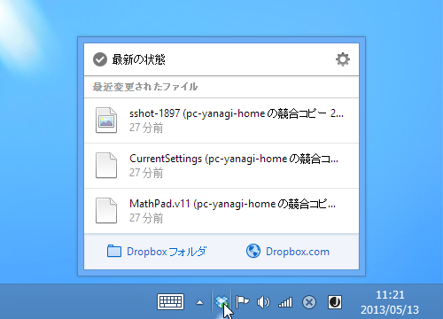
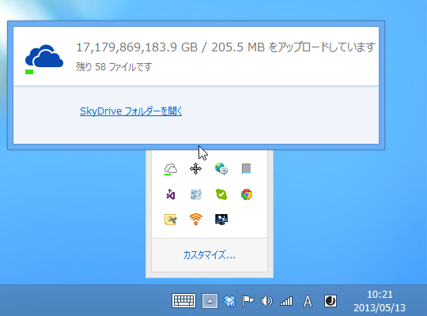

デスクトップ機の Dropbox が同期しなくなってしまった。“ファイルリストのダウンロード中”というステータスのまま、数日経ってもファイルの同期が完了しない。アプリや OS の再起動などを試みたが、改善は見られず。これは困った。

おまけにタスクトレイから Dropbox を終了しても、なんかゾンビプロセスが残るようになってしまった。おーまいがっ！

ただ、この手の問題は少なくないようで、フォーラムに解決策が書かれていた。

<blockquote cite="https://forums.dropbox.com/topic.php?id=14997">

Just wanted to update everyone with same error. I fixed the problem by clearing the cache however the Dropbox application will not recognize the cleared cache until you unlink your computer then relink your computer. They had to be in that order. So here is what I did:

<ol>
<li>Close Dropbox application</li>
<li>Clear Cache (You figure Dropbox would make it easier to do then manually) Where is your cache you say? Like I F'in did and had to spend time searching can be found here: <i>C:\Users\"Your Computer Name"\AppData\Roaming\Dropbox\cache</i></li>
<li>Delete everything in the cache folder contents not cache folder itself.</li>
<li>I always reboot but dont know if you need too</li>
<li>Start Dropbox and Launch Dropbox preferences and unlink your computer then link your computer back.</li>
</ol>
After these steps Dropox had to recache everything which if you have a 100 gig account can take a while but started uploading my changes and I did not get that same message "downloading file list" again.

Hope this helps some people. 
Regards, 
Alan

<cite><a href="https://forums.dropbox.com/topic.php?id=14997">&quot;Downloading file list...&quot; forever!! &laquo; Dropbox Forums</a></cite>
</blockquote>

要はローカルキャッシュがぶっ壊れているから消せってことらしい。ナイスだ、Alan！　愛してる！

ただ、キャッシュのパスはちょっと違った。バージョンによって多少差異があるのかもしれない。今回は filecache.dbx を削除して Dropbox を再起動。

無事なおったけれど、ここ数日間ほかの環境でいじったファイルとの競合で、ゴミファイルが大量に生産されてしまった。めんどくせえ。

と、まぁ、このように解決したのだけど、今度は SkyDrive がよくわからないことに。実用上とくに問題ないので放置する方針だけど、最近はクラウドストレージに頼りきった生活をしているので、この手のソフトが不安定だと結構困るなぁ、と思った。

