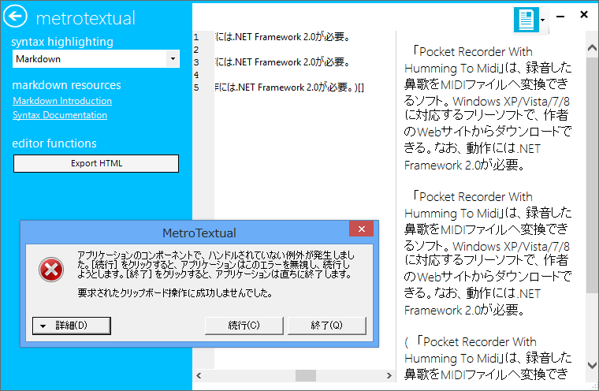
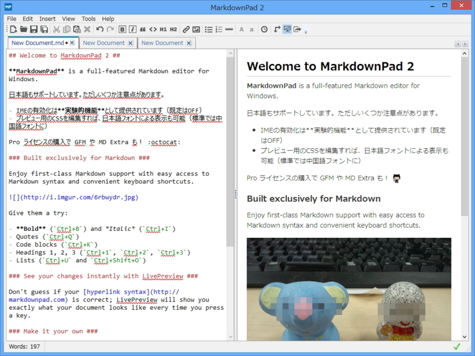

最近こんなの（<a href="http://www.forest.impress.co.jp/docs/news/20130513_599085.html">&ldquo;Markdown&rdquo;&#x30D7;&#x30EC;&#x30D3;&#x30E5;&#x30FC;&#x306B;&#x5BFE;&#x5FDC;&#x3057;&#x305F;&#x30C6;&#x30AD;&#x30B9;&#x30C8;&#x30A8;&#x30C7;&#x30A3;&#x30BF;&#x30FC;&#x300C;MetroTextual 1.4&#x300D; - &#x7A93;&#x306E;&#x675C;</a>）を扱ったが、ちょっと不安定な印象を受けた。目新しいユーザーインターフェイスは推しだけど、Markdown サポートが目当てなら素直に MarkdownPad 2 （<a href="http://www.forest.impress.co.jp/docs/news/20130307_590701.html">&#x30BC;&#x30ED;&#x304B;&#x3089;&#x518D;&#x8A2D;&#x8A08;&#x3055;&#x308C;&#x305F;&#x300C;MarkdownPad 2&#x300D;&#x304C;&#x516C;&#x958B;&#x3001;&#x30BF;&#x30D6;&#x30FB;&#x69CB;&#x6587;&#x5F37;&#x8ABF;&#x306A;&#x3069;&#x306E;&#x65B0;&#x6A5F;&#x80FD;&#x3092;&#x642D;&#x8F09; - &#x7A93;&#x306E;&#x675C;</a>）をお薦めする。

エディター部分でハイライトが効くのがカッコいい。無償版と有償版があるが、無償版でも大いに役に立つはず。有償版では Markdown Extra や Github Flavored Markdown（GFM）といった記法がサポートされるほか、PDF 出力なんかも可能（<a href="http://markdownpad.com/compare.html">MarkdownPad - Feature Comparison</a>）。自分はかなり気に入ったので、有償版を購入している。まぁ、実のところを言えば、Markdown 支援のないエディターでもそれほど苦痛ではないので、あまり使っていないのだけど<a href="#f1" name="fn1" title="オクトキャットのアイコンなんかを使いたい場合は必須だ！">*1</a>。.md ファイルをダブルクリックすると WebMatrix が起動しちゃう！　なんていうお茶目さんはこいつを入れて関連付けておくといいんじゃないかな！

ちなみに、初期バージョンは日本語入力に問題があったけれど、フィードバックを送ったら解消してくれた。時を同じくして SharpDevelop の AvalonEdit にも修正が入ったのだけど、まさか手を入れてくれたのかな。

<blockquote cite="http://www.icsharpcode.net/OpenSource/SD/Changes.aspx">

SharpDevelop 4.3 Beta [4.3.0.9338] (01/02/2013)

<ul>
<li>Portable Libraries Support</li>
<li>MVC Scaffolding and T4MVC Support</li>
<li>Code First Migrations with Entity Framework</li>
<li>Import and Export of Highlighting Settings</li>
<li>IME Support in AvalonEdit</li>
<li>NUnit 2.6.1</li>
<li>WiX 3.6</li>
</ul>
<cite><a href="http://www.icsharpcode.net/OpenSource/SD/Changes.aspx">#develop Change Log</a></cite>
</blockquote>

胸熱。ちなみに SharpDevelop の最新版では Markdown Highlighting がサポートされている。もちろん、これは MarkdownPad 2 でも利用できるアレだ。

<a href="#fn1" name="f1" class="footnote-number">*1</a>:オクトキャットのアイコンなんかを使いたい場合は必須だ！

