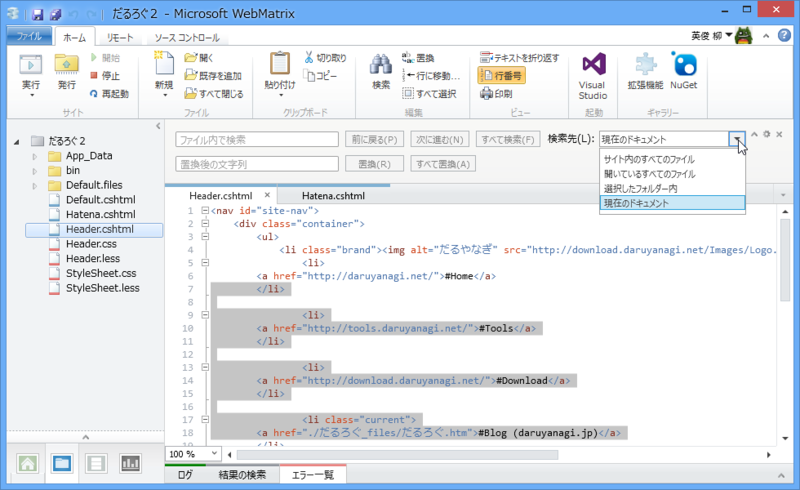
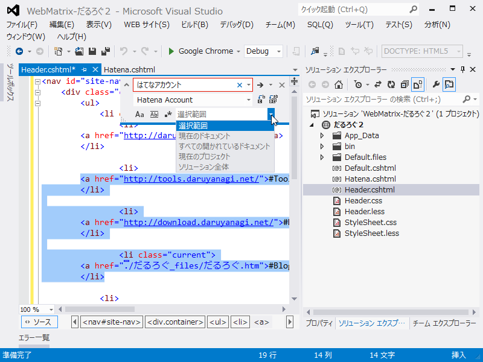
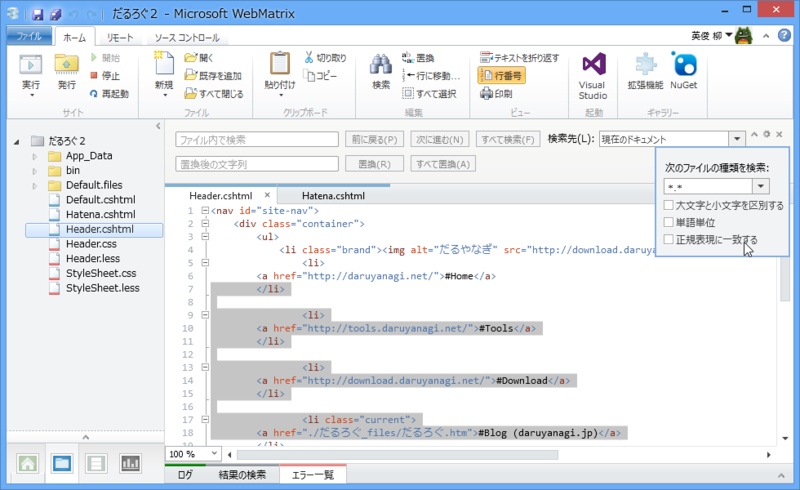

      今気づいたけどWebMatrix（のエディタ）って「選択範囲内のみを検索・置換」てないのね

<a href="http://twitter.com/coddledegg/status/334937789508501505" class="twitter-detail-info-permalink">2013-05-16 16:46:06</a> via <a href="http://www.crowy.net/" rel="nofollow">Crowy</a>

えっ！？　と思って確認してみたけれど、確かになかった。たま師匠に言われるまでまったく気づかなかった。

ちなみに、Visual Studio のほうにはちゃんとある。

個人的にはあまり使わない機能だったので気にならなかったが、気にする人は気にするような気がするので（あぁ、書いてて頭おかしくなってきた）、次のバージョンでの改善を期待したいと思う。

十分と思っていても抜けている機能というのはあるものなのだなぁ。

