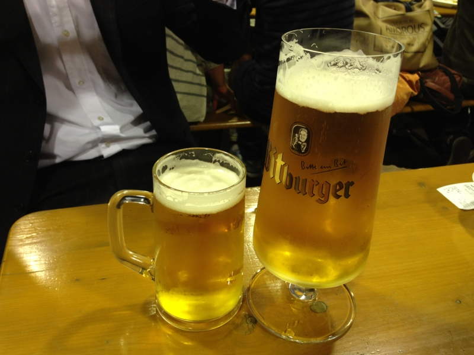
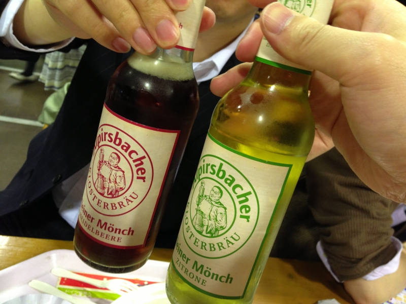

<a href="http://www.oktober-fest.jp/2013hibiya_spring/index.html">OKTOBERFEST 2013&#xFF5C;&#x65E5;&#x6BD4;&#x8C37;&#x30AA;&#x30AF;&#x30C8;&#x30FC;&#x30D0;&#x30FC;&#x30D5;&#x30A7;&#x30B9;&#x30C8;2013</a> に行ってきたった。ビールおいしい。なんていう名前のビール飲んだのかは全部忘れたけど、2リットルちょっと飲んだと思う。なんか知らん人とも乾杯したりしちゃって、いい感じの雰囲気やねぇ。

あちこちに「グラスの盗難に注意」って書いてあったけど、グラスを受け取るときには1,000～2,000円ぐらいのデポジットを払う仕組みだからなんだね。デポジットはグラスの返却時に返してもらえるんだけど、5、6本ほどパクれば、なるほど、いい商売になるのかもしれない。

それはともかく、今月のお小遣い尽きた。あと一週間、霞を食って生きるか。

