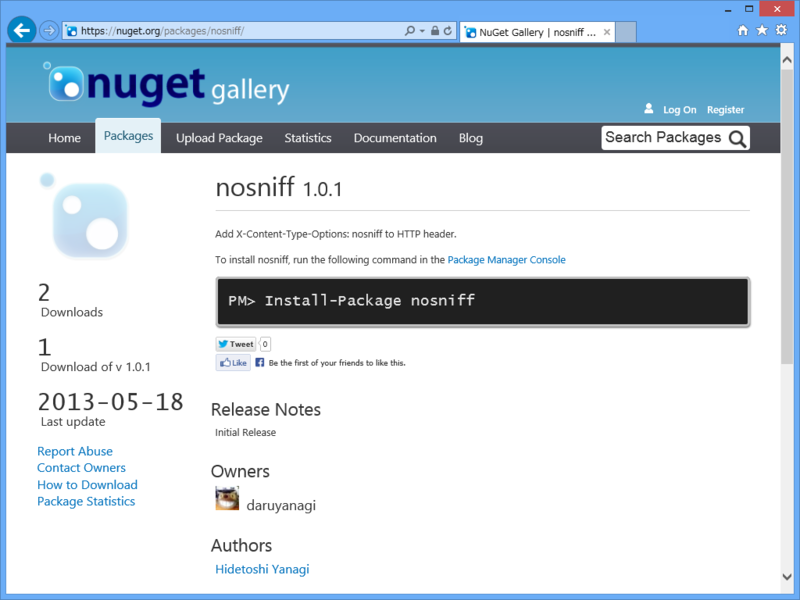
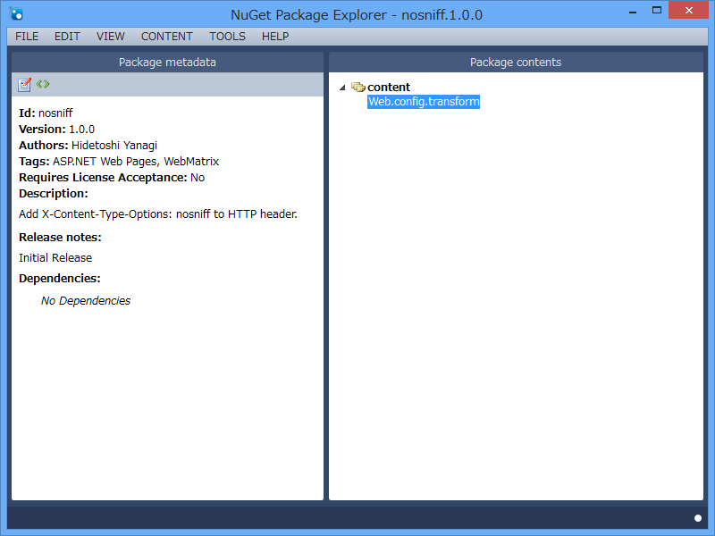

<blockquote cite="http://d.hatena.ne.jp/hasegawayosuke/20130517/p1">

必ず X-Content-Type-Options: nosniff レスポンスヘッダをつけるようにしましょう

<cite><a href="http://d.hatena.ne.jp/hasegawayosuke/20130517/p1">&#x6A5F;&#x5BC6;&#x60C5;&#x5831;&#x3092;&#x542B;&#x3080;JSON&#x306B;&#x306F; X-Content-Type-Options: nosniff &#x3092;&#x3064;&#x3051;&#x308B;&#x3079;&#x304D; - &#x8449;&#x3063;&#x3071;&#x65E5;&#x8A18;</a></cite>
</blockquote>

とのことなので、<a href="http://shiba-yan.hatenablog.jp/entry/20130518/1368861454">ASP.NET &#x3067;&#x30AB;&#x30B9;&#x30BF;&#x30E0; HTTP &#x30D8;&#x30C3;&#x30C0;&#x3092;&#x8FFD;&#x52A0;&#x3059;&#x308B;&#x65B9;&#x6CD5; - &#x3057;&#x3070;&#x3084;&#x3093;&#x96D1;&#x8A18;</a> を参考に X-Content-Type-Options: nosniff を付ける NuGet を作っておいた。

<ul>
<li><a href="https://nuget.org/packages/nosniff/">NuGet Gallery | nosniff 1.0.1</a></li>
</ul>
Web.config.transform を記述しただけのシンプルなものだけど、いかがでしょうかね。

<h3>使用前</h3>

<h3>使用後</h3>

