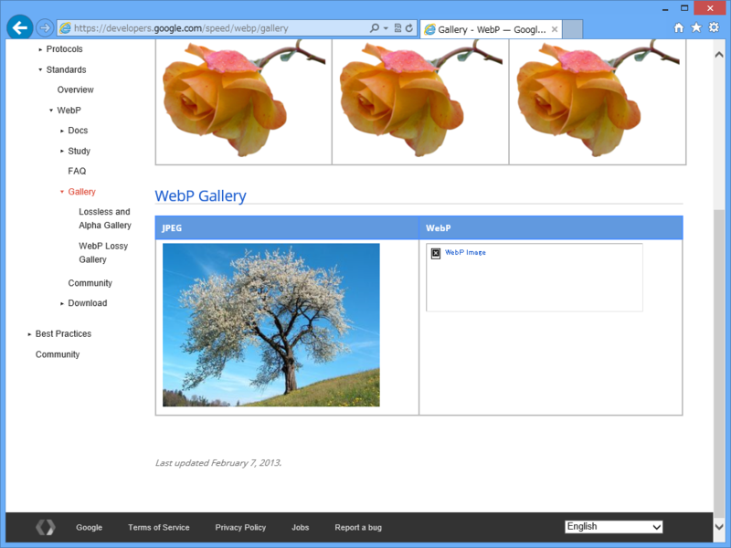

Google+ の Android アプリは、画像フォーマットを WebP に変えて、帯域を50%節約しているのだそうな。

<blockquote cite="http://jp.techcrunch.com/2013/05/18/20130517google-app-for-android-quietly-switched-to-webp-image-format-a-month-and-a-half-ago-saves-50-bandwidth/">

現時点でのWebPの問題は、圧縮率の改善で帯域の大きな節約になるとはいえ、AndroidとChromeとOperaしかサポートしていないことだ。そのほかのプラットホームでは従来どおりJPEGやPNGなどしか使えないし、WebPをあえて使うためにはデベロッパが工夫しなければならない。しかし今日の話では、来年はFirefoxもWebPをサポートするそうだ。いずれにしても担当チームとしては、建前上からもこのフォーマットの将来に関してきわめて楽観的であった。

<cite><a href="http://jp.techcrunch.com/2013/05/18/20130517google-app-for-android-quietly-switched-to-webp-image-format-a-month-and-a-half-ago-saves-50-bandwidth/">Google+&#x306E;Android&#x30A2;&#x30D7;&#x30EA;&#x306F;&#x753B;&#x50CF;&#x30D5;&#x30A9;&#x30FC;&#x30DE;&#x30C3;&#x30C8;&#x3092;&#x79D8;&#x304B;&#x306B;WebP&#x306B;&#x30C1;&#x30A7;&#x30F3;&#x30B8;, &#x5E2F;&#x57DF;&#x3092;50%&#x7BC0;&#x7D04; | TechCrunch Japan</a></cite>
</blockquote>

そこでふと Internet Explorer 10 ではどうなのだろうと思ったのだけど……

もちろん、表示できなかった。もしかしたら <a href="http://www.forest.impress.co.jp/docs/review/20120119_505505.html">&#x7A93;&#x306E;&#x675C; - &#x3010;REVIEW&#x3011;&ldquo;WebP&rdquo;&#x5F62;&#x5F0F;&#x306E;&#x753B;&#x50CF;&#x3092;&#x8868;&#x793A;&#x3059;&#x308B;&#x305F;&#x3081;&#x306E;&#x30B3;&#x30FC;&#x30C7;&#x30C3;&#x30AF;&#x300C;WebP Codec for Windows&#x300D;</a> を入れれば何とかなるのかもしれないと思ったが……

それもだめだった（久しぶりに使ってみたが、バージョンは 0.19 とのこと）。

video 要素や audio 要素は OS のメディア機能を使って再生する仕組みになっていると記憶していたが、img 要素はそうではなかったようだ。もしくは codec 側がブラウザーでの利用を想定していないか<a href="#f1" name="fn1" title="この形式の生まれたわけを思えば、それはあまり考えにくいが">*1</a>。

<a href="#fn1" name="f1" class="footnote-number">*1</a>:この形式の生まれたわけを思えば、それはあまり考えにくいが

