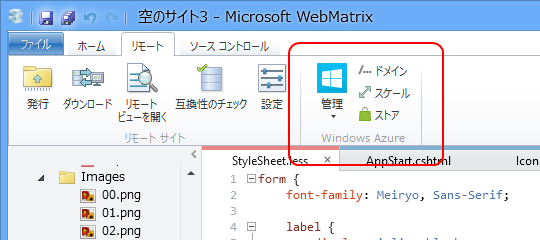
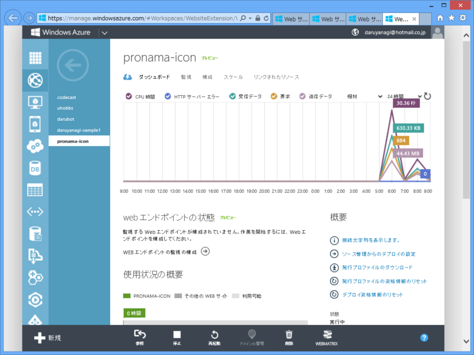
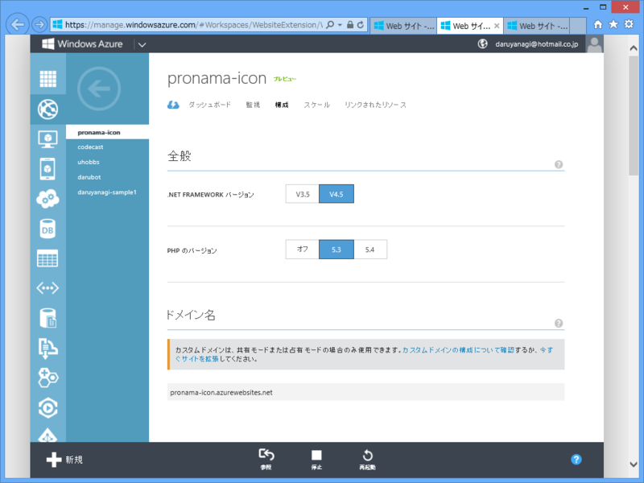
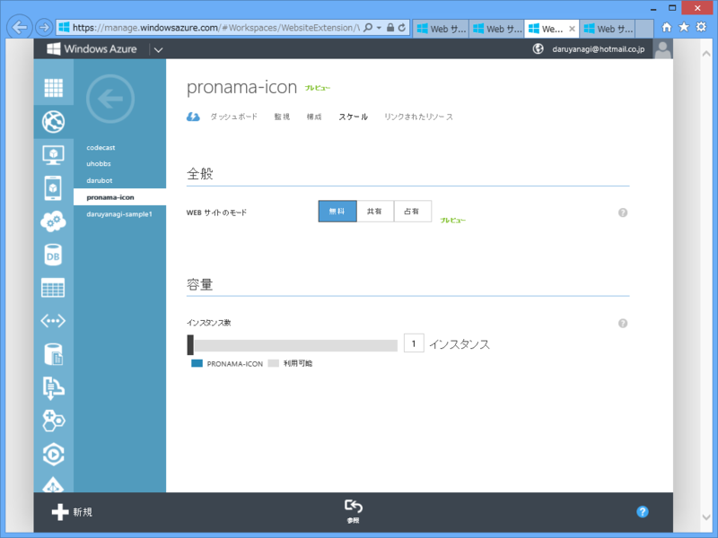

気付いてなかったのだけど、WebMatrix から Windows Azure Web Sites へデプロイすると、［リモート］リボンにこんなボタンが追加されるんだね。管理ポータルをサクッと開ける。

<h3>［管理］ボタン</h3>

ダッシュボードページをひらく。トラフィックなんかがみられる。

<h3>［ドメイン］ボタン</h3>

構成ページを開く。“Share”以上のプランを選択している場合、カスタムドメインが設定できるらしい。貧乏だから試せない。

<h3>［スケール］ボタン</h3>

負荷に応じてインスタンをが増やせる。貧乏だから試せない。

