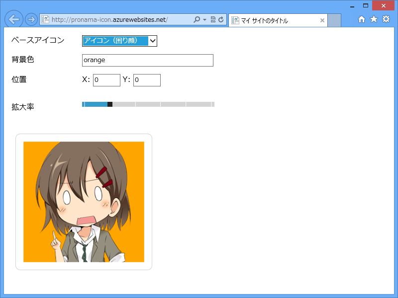
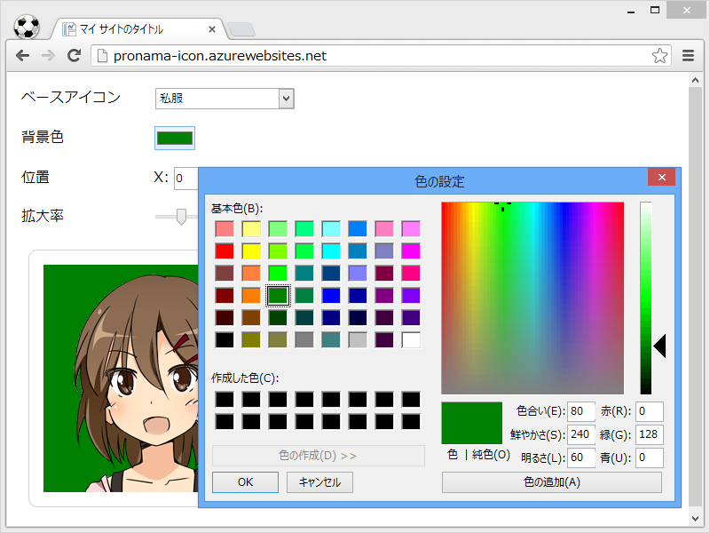
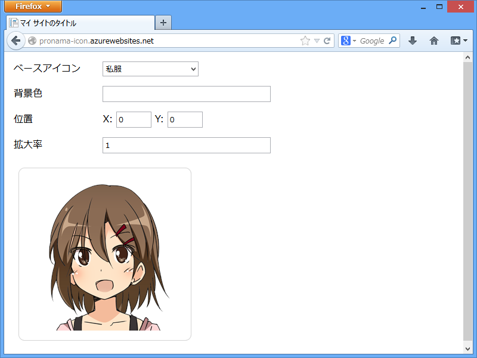
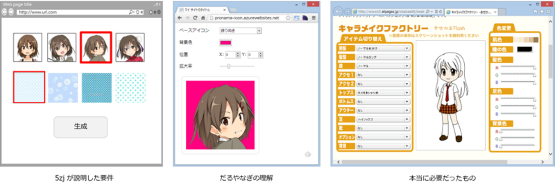

      @<a class="twitter-user-screen-name" href="http://twitter.com/daruyanagi" target="_top">daruyanagi</a> WebMatrix でアイコンジェネレーターつくってよー

<a href="http://twitter.com/jz5/status/335385156229685248" class="twitter-detail-info-permalink">2013-05-17 22:23:47</a> via <a href="http://janetter.net/" rel="nofollow">Janetter</a> to @<a href="http://twitter.com/daruyanagi/"  class="twitter-user-screen-name">daruyanagi</a>

なんかアイコンファイルが ZIP で送られてきたので、テキトーに作った。アイコンジェネレーターってなにをどうすんだよ ( ﾟДﾟ)！

<ul>
<li><a href="http://pronama-icon.azurewebsites.net/">http://pronama-icon.azurewebsites.net/</a></li>
</ul>
一応 Windows Azure Web Sites に置いてあるけど、ExpressWeb に移すかもしれない。

<h3>Google Chrome の場合</h3>

Google Chrome だと input[typr=color] が効くのでいい感じ。

<h3>Mozilla Firefox の場合</h3>

意外なことに Mozilla Firefox が一番ダメダメだった。 input[typr=range] すら使えない。Mozilla さん、Internet Explorer 10 に負けてますよ！

<h3>評価</h3>

      @<a class="twitter-user-screen-name" href="http://twitter.com/daruyanagi" target="_top">daruyanagi</a> <a class="twitter-tweet-url" href="http://t.co/6MXd1A7fm1" target="_top">URL</a>

<a href="http://twitter.com/jz5/status/335906862912397312" class="twitter-detail-info-permalink">2013-05-19 08:56:51</a> via <a href="http://janetter.net/" rel="nofollow">Janetter</a> to @<a href="http://twitter.com/daruyanagi/status/335900791166599168"  class="twitter-user-screen-name">daruyanagi</a>

気に入ってもらえなかったらしい。まぁ、徐々に改善するかもしれないし、放置するかもしれない。

