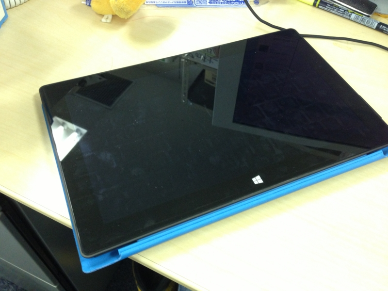
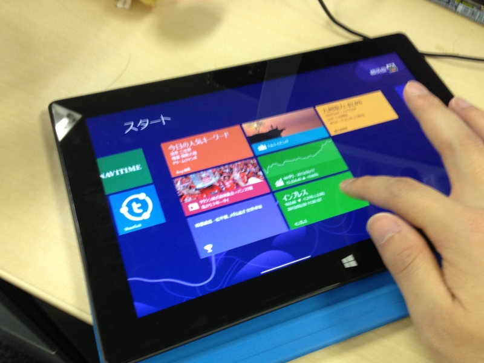
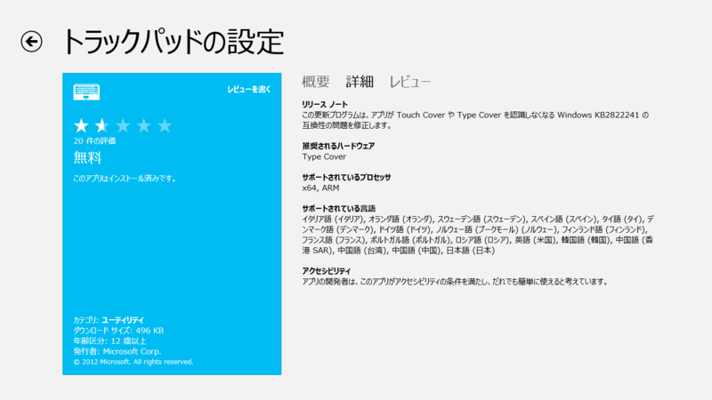
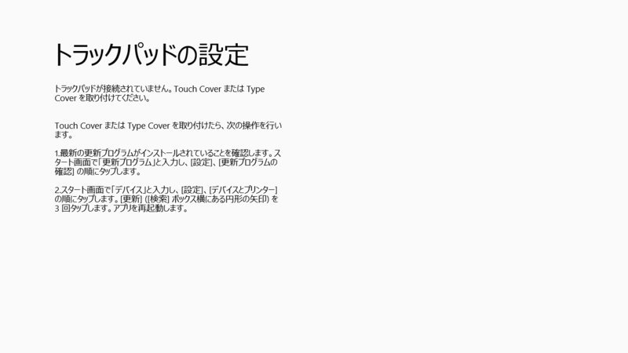

<blockquote cite="http://www.microsoft.com/Surface/en-US/support/performance-and-maintenance/rt-update-history">

Released May 14

The May update includes these firmware and performance improvements:

<ul>
<li>UEFI firmware update that enhances Surface RT speaker volume and improves system stability.</li>
<li>Driver pack that improves performance and works with the updated UEFI firmware to enhance Surface RT speaker volume.</li>
<li>Trackpad Settings driver for Surface Type Cover to enable interaction with the Trackpad Settings app for Japanese customers.</li>
</ul>
<cite><a href="http://www.microsoft.com/Surface/en-US/support/performance-and-maintenance/rt-update-history">Surface RT update history | Windows update | Surface RT updates</a></cite>
</blockquote>

ファームウェアをアップデートしてから、Touch Cover を後ろに畳んだ（holded back）状態で机の上に置くと（写真の状態）、操作中にもかかわらずスリープ状態になる問題が発生するようになった。これはちょっと使いにくい。

キーボードを外したり、ペンか何かを下に敷いて机との間に少し隙間を作ってやると改善する。

      @<a class="twitter-user-screen-name" href="http://twitter.com/daruyanagi" target="_top">daruyanagi</a> 我が家の端末でも発生しましたよ

<a href="http://twitter.com/mizukiX9/status/336314561709883393" class="twitter-detail-info-permalink">2013-05-20 11:56:54</a> via web to @<a href="http://twitter.com/daruyanagi/status/336314184545480704"  class="twitter-user-screen-name">daruyanagi</a>

ほかの環境でも再現するようだ。ただ、いつもなるというわけでもないみたい。現に、今はちゃんと動いてる（ぇ

<h5>追記</h5>

<blockquote>

AC アダプタを接続しているときだけ、そうなるみたい？

</blockquote>

      @<a class="twitter-user-screen-name" href="http://twitter.com/daruyanagi" target="_top">daruyanagi</a> Surfaceはカバーの開閉の判定に本体とカバーの加速度センサーを比較して使ってると聞いたことがあるので、そのあたりのセンサーがおかしくなってる気配がありますね。

<a href="http://twitter.com/kaorun/status/336373459573682176" class="twitter-detail-info-permalink">2013-05-20 15:50:56</a> via <a href="http://www.metrotwit.com/" rel="nofollow">MetroTwit</a> to @<a href="http://twitter.com/daruyanagi/status/336372838518886400"  class="twitter-user-screen-name">daruyanagi</a>

<blockquote cite="http://www.microsoft.com/surface/ja-JP/accessories/covers">

タッチ カバーの極小型センサーは、入力時に各キーの圧力を 1 秒あたり 1,000 回測定して、すばやい応答性と入力を可能にしています。 入力動作と指を置いているだけの状態を正確に判別してキー入力の誤りを防ぐ、賢いキーボードです。 加速度センサーを内蔵しており、折りたたむとキーボードがオフになります。

<cite><a href="http://www.microsoft.com/surface/ja-JP/accessories/covers">Surface &#x3068;&#x30BF;&#x30C3;&#x30C1; &#x30AB;&#x30D0;&#x30FC;&#x3001;&#x30C8;&#x30E9;&#x30C3;&#x30AF;&#x30D1;&#x30C3;&#x30C9;&#x306E;&#x7D44;&#x307F;&#x5408;&#x308F;&#x305B;</a></cite>
</blockquote>

結構ハイテク（？）な作りになっているんだね。場合によって判定がシビアになってしまうのはある意味しょうがないことなのかもしれない。

もうひとつ、Trackpad Settings app （<a href="http://apps.microsoft.com/windows/ja-jp/app/indstillinger-for-pegefelt/5a4e4cdf-4d60-4084-8d9f-61d2e8f4830b">Windows &#x30B9;&#x30C8;&#x30A2; &#x306E; Windows &#x7528; &#x30C8;&#x30E9;&#x30C3;&#x30AF;&#x30D1;&#x30C3;&#x30C9;&#x306E;&#x8A2D;&#x5B9A; &#x30A2;&#x30D7;&#x30EA;</a>）が日本でも利用できるようになったという変更点が気になるけれど、相変わらずうちの環境では動作しなかった。

まぁ、Type Cover とは書いてあるが Touch Cover とは書いてないので、そもそも今回の改善の対象外なのかもしれない。

こうした細かい問題はあるけれど、VAIO Duo 11 よりも利用頻度は圧倒的に高いので、買った価値はあったと思う。ただ、スタイラスが使えない点だけは悔やまれる。「One Note」でペン入力を使いたいんだけどなぁ。

