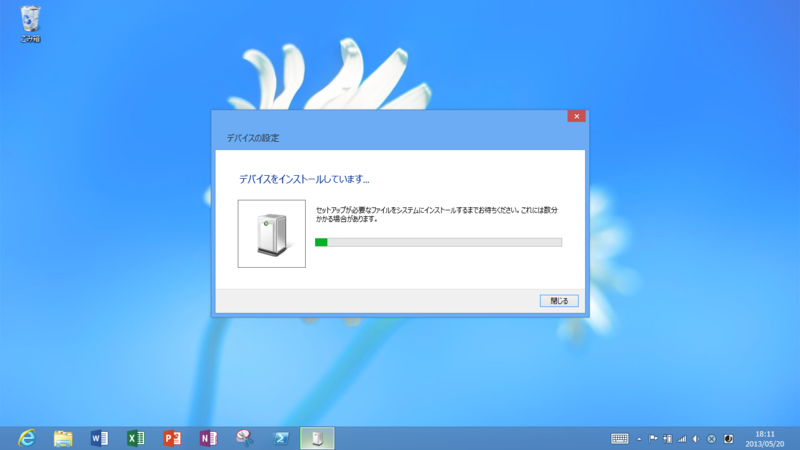
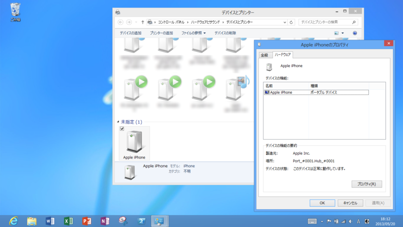
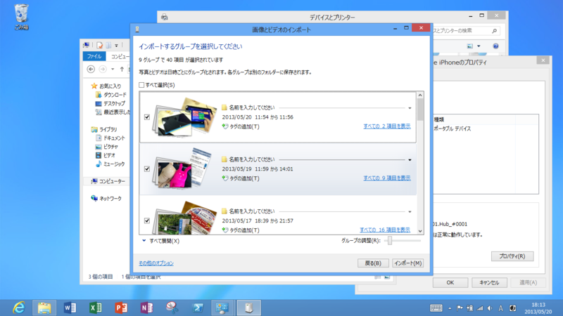

      @<a class="twitter-user-screen-name" href="http://twitter.com/daruyanagi" target="_top">daruyanagi</a> なるほどね。あと、これは知ってればでいいんだけど、iPhoneつなぐとどうなるんだろ？カメラデバイスとして認識するんかな？

<a href="http://twitter.com/yankinu/status/336408307927482368" class="twitter-detail-info-permalink">2013-05-20 18:09:25</a> via <a href="http://tapbots.com/tweetbot" rel="nofollow">Tweetbot for iOS</a> to @<a href="http://twitter.com/daruyanagi/status/336407800764846080"  class="twitter-user-screen-name">daruyanagi</a>

試してみた。

<h3>結果</h3>

“ポータブルデバイス”として認識された。

エクスプローラーで開いたり、写真のインポートが行えるようだ。Surface RT には Camera Codec Pack（<a href="http://www.forest.impress.co.jp/docs/news/20110727_463426.html">&#x7A93;&#x306E;&#x675C; - &#x3010;NEWS&#x3011;MS&#x88FD;&#x306E;&#x5199;&#x771F;&#x7BA1;&#x7406;&#x30BD;&#x30D5;&#x30C8;&#x300C;Windows Live &#x30D5;&#x30A9;&#x30C8; &#x30AE;&#x30E3;&#x30E9;&#x30EA;&#x30FC;&#x300D;&#x304C;RAW&#x753B;&#x50CF;&#x306B;&#x5BFE;&#x5FDC;</a>）がプリインストールされているので、RAW 画像も閲覧できる。ただ、その場合は容量の大きなモデルを選んだ方がいいかもしれないね。

<h5>P.S.</h5>

ぇ、<i>Windows Phone 7.x を繋げたらどうなるか</i>だって？　そんなこと聞かないでくれたまえ。

