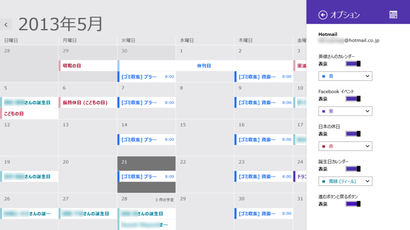
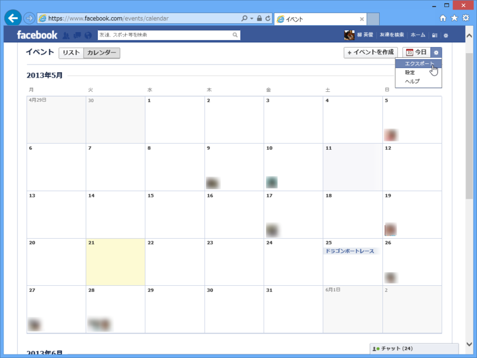
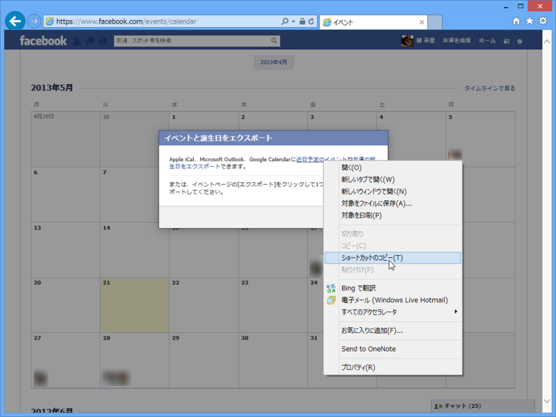
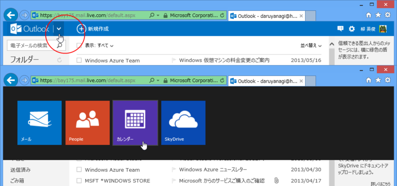
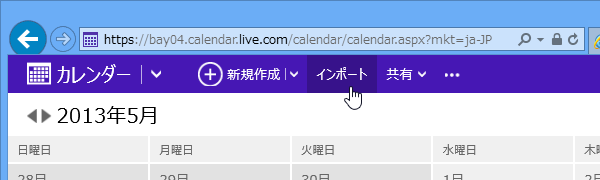
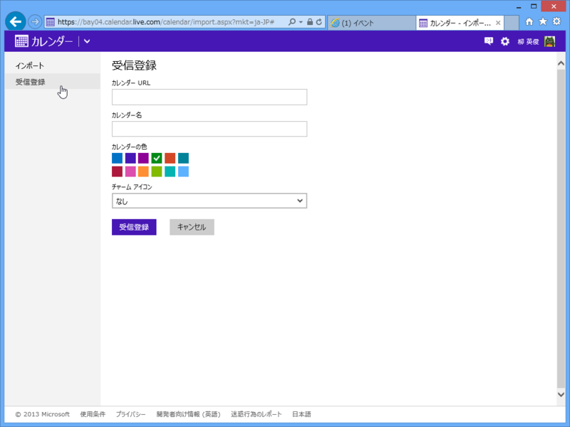
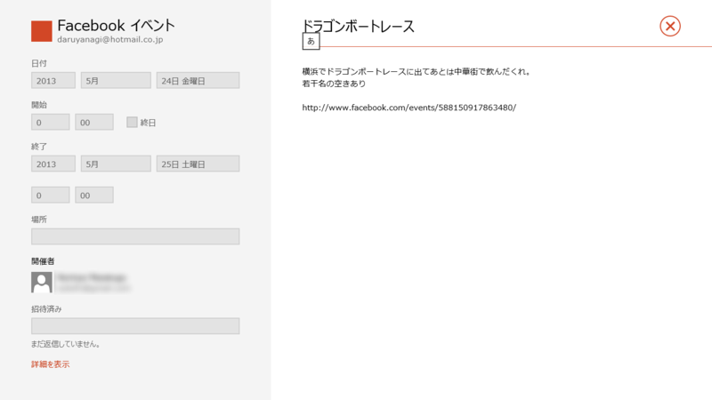
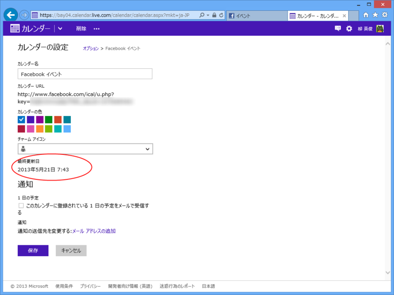
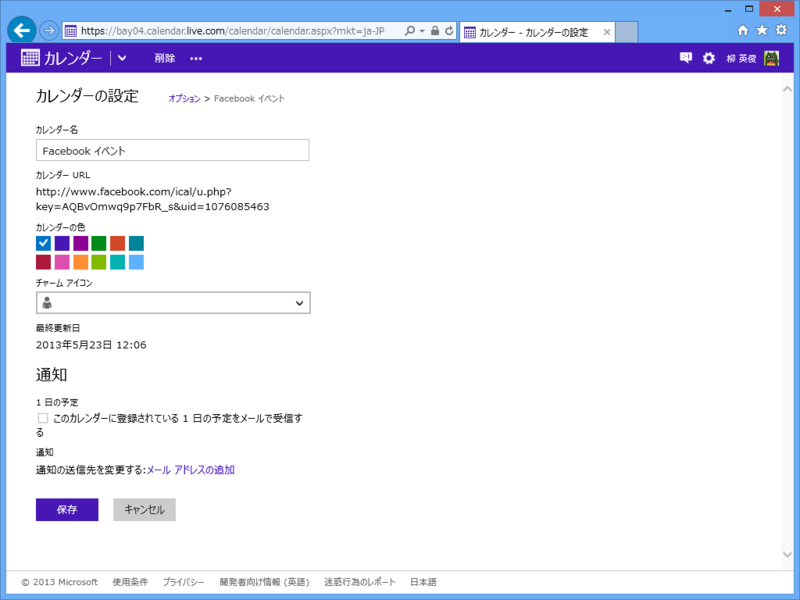

Windows 8（Windows RT を含む）では、Microsoft アカウントに Facebook を紐づけている場合、Facebook の友だちの誕生日が「カレンダー」アプリに表示されます。同じようにして Facebook のイベントも「カレンダー」アプリと同期できれば便利ですよね、たぶん。

<h3>Facebook イベントのエクスポート</h3>

まずは Facebook イベントのデータを取得。イベント画面の設定メニューで［エクスポート］を選択。

そして、URL（Internet Explorer の場合は“ショートカット”、Google Chrome の場合は“リンク アドレス”）をクリップボードへコピー。

<pre class="code" data-unlink>webcal://www.facebook.com/ical/b.php?uid=***&amp;key=***</pre>
こんな感じの URL が取得できれば成功です。なるほど、WebCal（<a href="http://en.wikipedia.org/wiki/Webcal">Webcal - Wikipedia, the free encyclopedia</a>）なんですね。

<h3>outlook.com へインポート</h3>

「カレンダー」アプリのデータは outlook.com のカレンダーと同期されています（普通は）。なので、「カレンダー」アプリと同期するには outlook.com と同期させればいい。ちなみに、メールからカレンダーへ移動するには、Outlook ロゴの右隣にあるボタンを押す（これ、Windows 8 のユーザーインターフェイスに慣れてないとわかりにくいよね？）。

次に［インポート］メニューを開く。

あとは［受信登録］の欄にさきほどの URL を登録するだけ。

これで outlook.com はもちろん、Surface RT の「カレンダー」アプリとも同期される。「カレンダー」アプリを再起動すると、［オプション］画面で新しく受信登録したカレンダーを ON にすることができる。

<h3>注意</h3>

Facebook と outlook.com の同期にはかなりラグがあるので注意。今は 2013/05/22 7:05 で、登録からほぼ丸一日たつけど、いまだに更新されていない。

<h3>追記</h3>

同期されました。数日間のラグは考えておいた方がよさそう。

