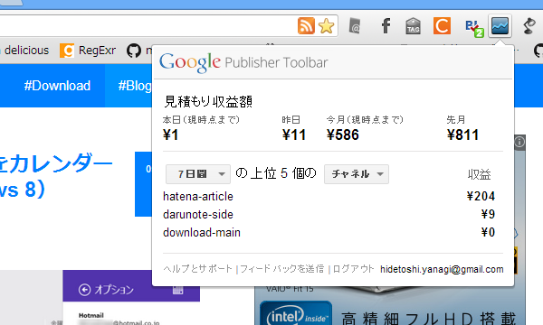
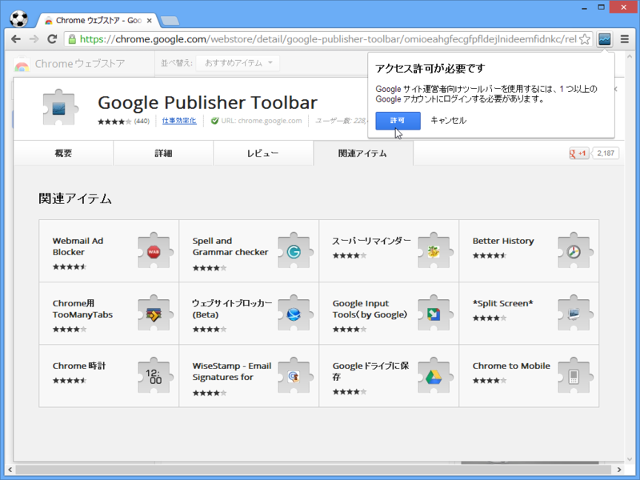
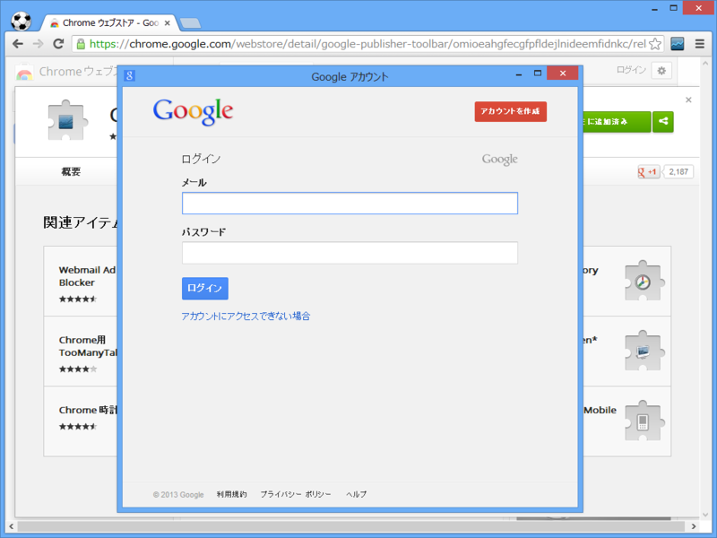
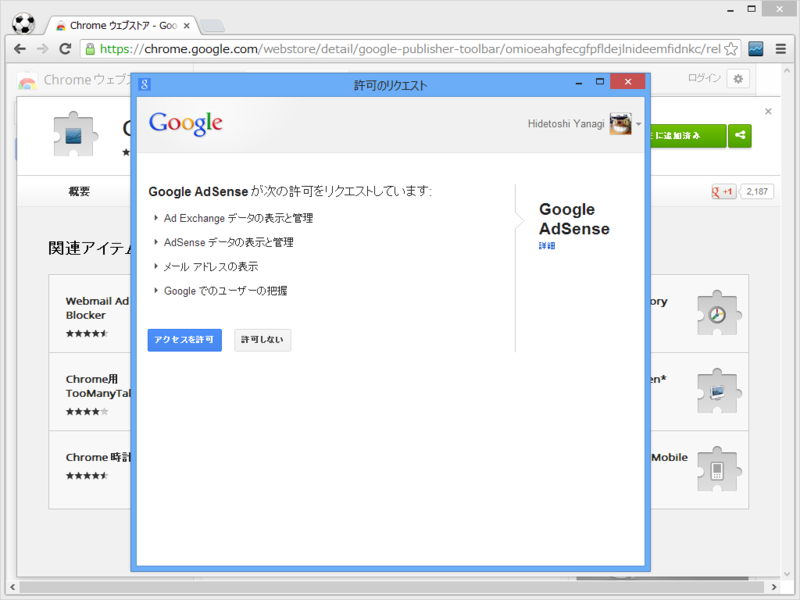
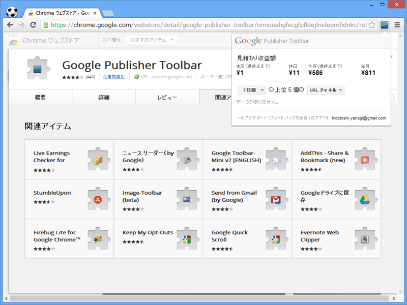
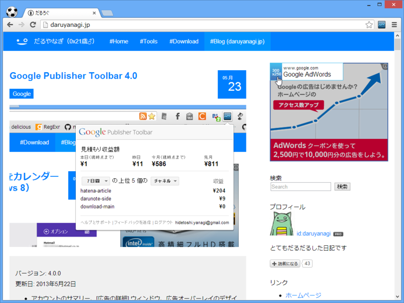
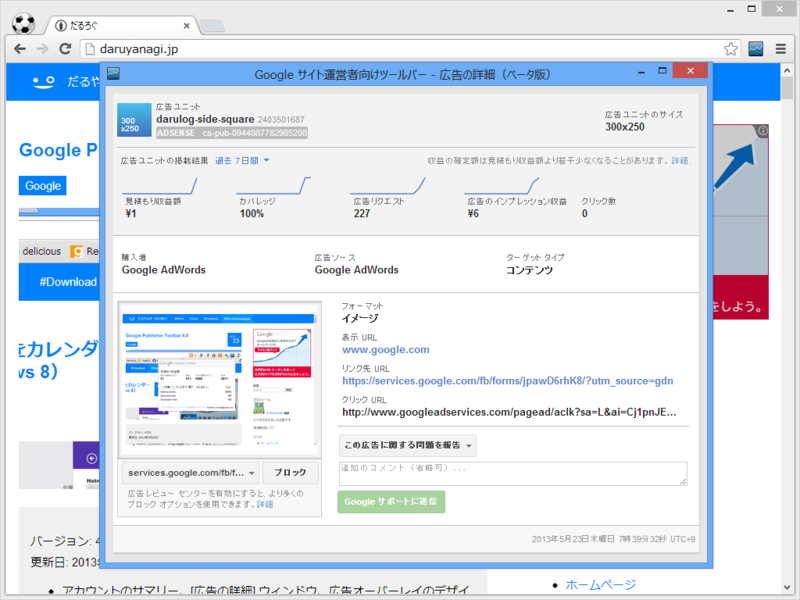

<blockquote cite="https://chrome.google.com/webstore/detail/google-publisher-toolbar/omioeahgfecgfpfldejlnideemfidnkc">

バージョン: 4.0.0 
更新日: 2013年5月22日

<ul>
<li>アカウントのサマリー、[広告の詳細] ウィンドウ、広告オーバーレイのデザインを一新</li>
<li>報告されたログイン問題を解決するために認証メカニズムを改善</li>
<li>[広告の詳細] ウィンドウで広告ネットワークを表示</li>
<li>[広告の詳細] ウィンドウから購入者単位でブロックが可能</li>
<li>フィードバック コメント用の新しいフィールド</li>
<li>その他の小さなバグ修正</li>
</ul>
<cite><a href="https://chrome.google.com/webstore/detail/google-publisher-toolbar/omioeahgfecgfpfldejlnideemfidnkc">Chrome Web Store - Google Publisher Toolbar</a></cite>
</blockquote>

デザインが変わってちょっとびっくりした。個人的には認証メカニズムの改善がありがたい。以前のバージョンには、ログインしたにもかかわらず情報が取得できない不具合があった。

アクセスの許可。

認証情報の入力。

アクセスの許可。

拡張機能のボタンから広告の詳細情報をチェック。

オーバーレイによる収益の表示機能……が前のバージョンではできたのだけど、ココはちょっと変わったのかな。広告のプロバイダーが表示されるようになった。

クリックすれば別ウィンドウでより詳細な情報が閲覧できる。

旧ブログを契約更新のミスでふっとばし、はてなブログだけになってからかなり収益下がった。月1,000円ぐらいいかないとドメイン代とはてなブログ Pro 代と ExpressWeb のおカネが出ないのでお小遣いもちだしになっちゃう (ノД`)・゜・。

<ul>
<li><a href="http://www.forest.impress.co.jp/docs/review/20120208_510310.html">&#x7A93;&#x306E;&#x675C; - &#x3010;REVIEW&#x3011;Chrome&#x304B;&#x3089;AdSense&#x53CE;&#x76CA;&#x3092;&#x624B;&#x8EFD;&#x306B;&#x78BA;&#x8A8D;&#x3067;&#x304D;&#x308B;&#x516C;&#x5F0F;&#x62E1;&#x5F35;&#x300C;AdSense Publisher Toolbar&#x300D;</a></li>
</ul>