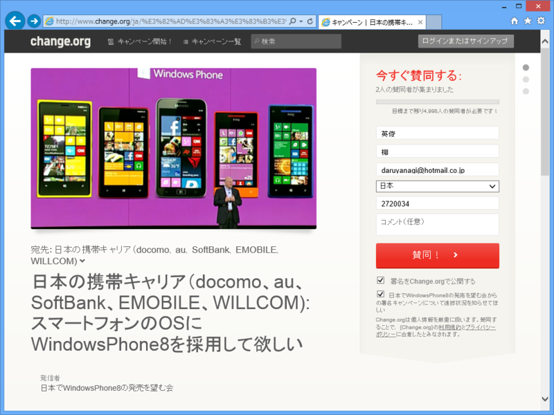
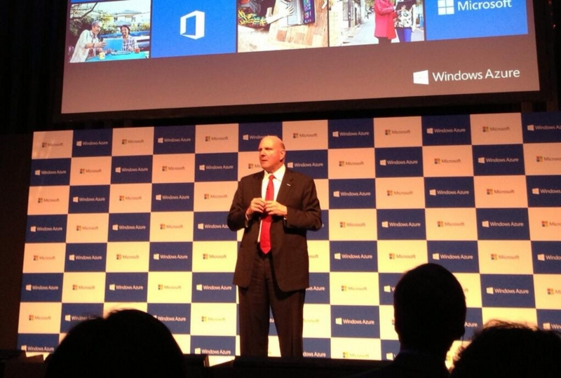

<blockquote>

日本でauから発売された唯一のWindowsPhone7端末IS12Tが発売されて、もうすぐ2年が経ちます。 

プラットフォームとしては一部を除き日本ローカライズが既にされているのに「売れる見込み＝需要」が見えないからキャリアが採用しないというのが一因だと思います。 

じゃぁどれくらい待ち望んでいる人がいるのか可視化してみようということで署名を募ってみます。 

</blockquote>

<ul>
<li><a href="http://www.change.org/ja/%E3%82%AD%E3%83%A3%E3%83%B3%E3%83%9A%E3%83%BC%E3%83%B3/%E6%97%A5%E6%9C%AC%E3%81%AE%E6%90%BA%E5%B8%AF%E3%82%AD%E3%83%A3%E3%83%AA%E3%82%A2-docomo-au-softbank-emobile-willcom-%E3%82%B9%E3%83%9E%E3%83%BC%E3%83%88%E3%83%95%E3%82%A9%E3%83%B3%E3%81%AEos%E3%81%ABwindowsphone8%E3%82%92%E6%8E%A1%E7%94%A8%E3%81%97%E3%81%A6%E6%AC%B2%E3%81%97%E3%81%84">http://www.change.org/ja/%E3%82%AD%E3%83%A3%E3%83%B3%E3%83%9A%E3%83%BC%E3%83%B3/%E6%97%A5%E6%9C%AC%E3%81%AE%E6%90%BA%E5%B8%AF%E3%82%AD%E3%83%A3%E3%83%AA%E3%82%A2-docomo-au-softbank-emobile-willcom-%E3%82%B9%E3%83%9E%E3%83%BC%E3%83%88%E3%83%95%E3%82%A9%E3%83%B3%E3%81%AEos%E3%81%ABwindowsphone8%E3%82%92%E6%8E%A1%E7%94%A8%E3%81%97%E3%81%A6%E6%AC%B2%E3%81%97%E3%81%84</a></li>
</ul>
（おいおい、はてなさん、なんでこれ :title 記法が使えないの）

      auのWindows PhoneについてKDDI広報に確認したところ、「新機種を出す予定はない」とのこと。既存のWPユーザーから新機種の要望は上がってないのか？と尋ねたものの、「特にない」との回答でした。

<a href="http://twitter.com/tezawaly/status/336357596292329472" class="twitter-detail-info-permalink">2013-05-20 14:47:54</a> via <a href="http://twitter.com/download/iphone" rel="nofollow">Twitter for iPhone</a>

だそうですんで、要望を可視化しようということですね。さっそく僕も一票を投じてきました。

正直、ファン<a href="#f1" name="fn1" title="だけならまだしも、それなりに影響のある人まで">*1</a>が電波法違反端末をコソコソ使ってるのを見るのも「なんだかなー」って気がしますしね。OS 標準でキッズコーナー（<a href="http://www.windowsphone.com/ja-jp/how-to/wp8/basics/set-up-kids-corner">&#x30AD;&#x30C3;&#x30BA;&#x30B3;&#x30FC;&#x30CA;&#x30FC;&#x306E;&#x8A2D;&#x5B9A; | Windows Phone &#x306E;&#x4F7F;&#x3044;&#x65B9; (&#x65E5;&#x672C;)</a>）のようなペアレンタルコントロール機能なんかもあるし、ゲームタイトルはあまりそろってないし、とくにお子さま向けなどにいかがでしょうかね。だめですかね。

      バルマー「Windows Phone 8はまだ日本では発売されていないが、全力で取り組んでいる」 <a class="twitter-tweet-url" href="http://t.co/JF1OoT9Deh" target="_top">URL</a>

<a href="http://twitter.com/tezawaly/status/337434075398815744" class="twitter-detail-info-permalink">2013-05-23 14:05:27</a> via <a href="http://www.apple.com" rel="nofollow">Photos on iOS</a>

 

      バルマーの全力ってたいしたことないな

<a href="http://twitter.com/jz5/status/337496765345456128" class="twitter-detail-info-permalink">2013-05-23 18:14:33</a> via <a href="http://jigtwi.jp/?p=1" rel="nofollow">jigtwi</a>

そういわずに応援しようぜ！ｗ

<a href="#fn1" name="f1" class="footnote-number">*1</a>:だけならまだしも、それなりに影響のある人まで

