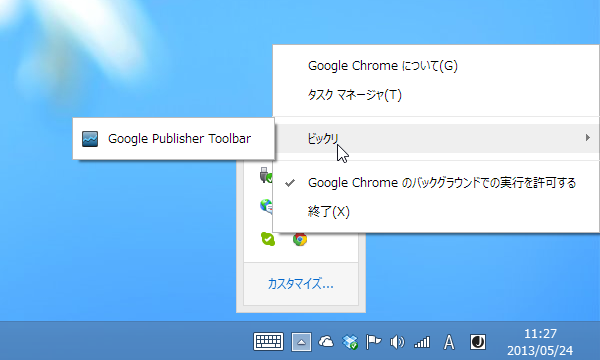
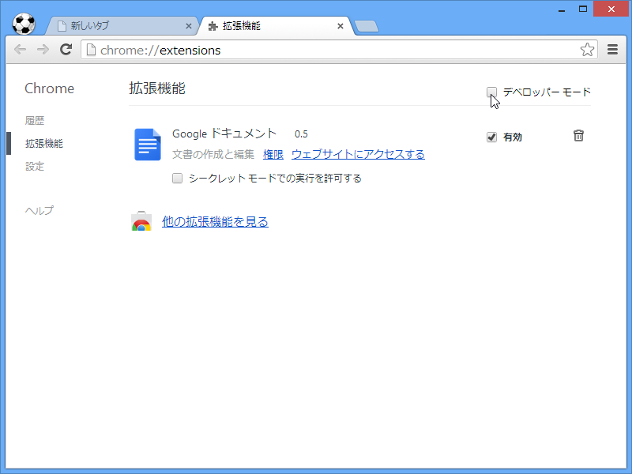
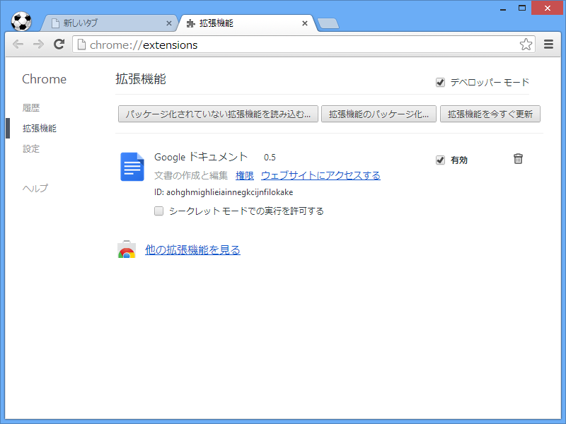
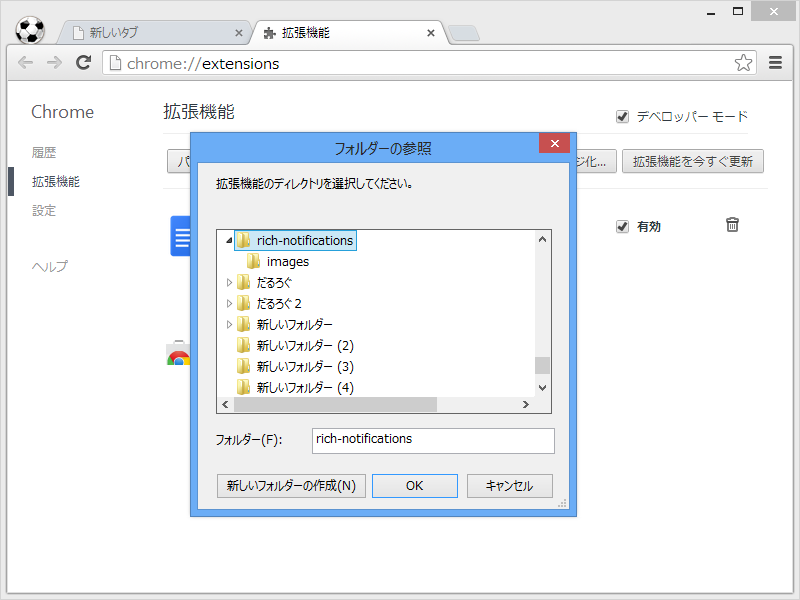
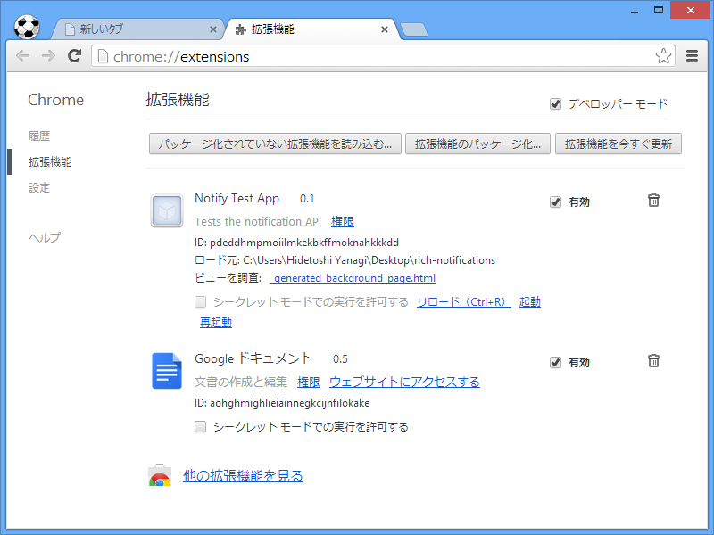
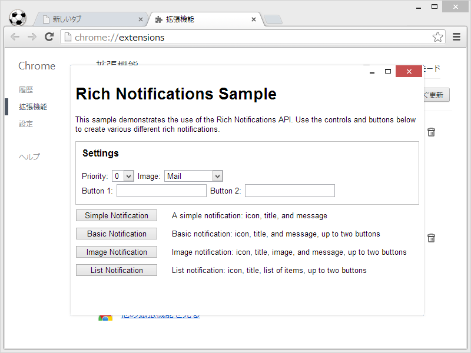
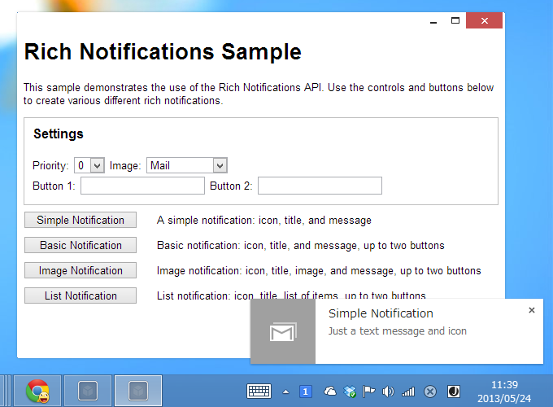

<a href="http://www.forest.impress.co.jp/docs/news/20130524_600786.html">&#x65B0;&#x30EC;&#x30F3;&#x30C0;&#x30EA;&#x30F3;&#x30B0;&#x30A8;&#x30F3;&#x30B8;&#x30F3;&ldquo;Blink&rdquo;&#x3092;&#x642D;&#x8F09;&#x3057;&#x305F;&#x300C;Google Chrome 28&#x300D;&#x30D9;&#x30FC;&#x30BF;&#x7248;&#x304C;&#x516C;&#x958B; - &#x7A93;&#x306E;&#x675C;</a> で使った拡張機能のサンプルは <a href="https://github.com/GoogleChrome/chrome-app-samples/tree/master/rich-notifications">chrome-app-samples/rich-notifications at master &middot; GoogleChrome/chrome-app-samples &middot; GitHub</a> にあるのだけど、今回はそれを実際どうやってインストールするのかっていう話。

（※このスクリーンショットは本編に関係ありません。）

まず、chrome://extensions/ でデベロッパーモードを ON にする。

すると、ボタンがいくつかあらわれるので［パッケージ化されていない拡張機能を読み込む］ボタンを押す。

あらかじめ GitHub からソースコードを ZIP でダウンロードして展開しておき、 サンプルフォルダを読み込む。

起動というリンクを選択。

できた━━━━━━(ﾟ∀ﾟ)━━━━━━!!!!

これでリッチな通知機能が使えますね。素敵な拡張機能ができたら、僕にも教えてください。

