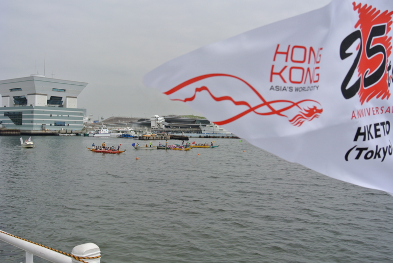
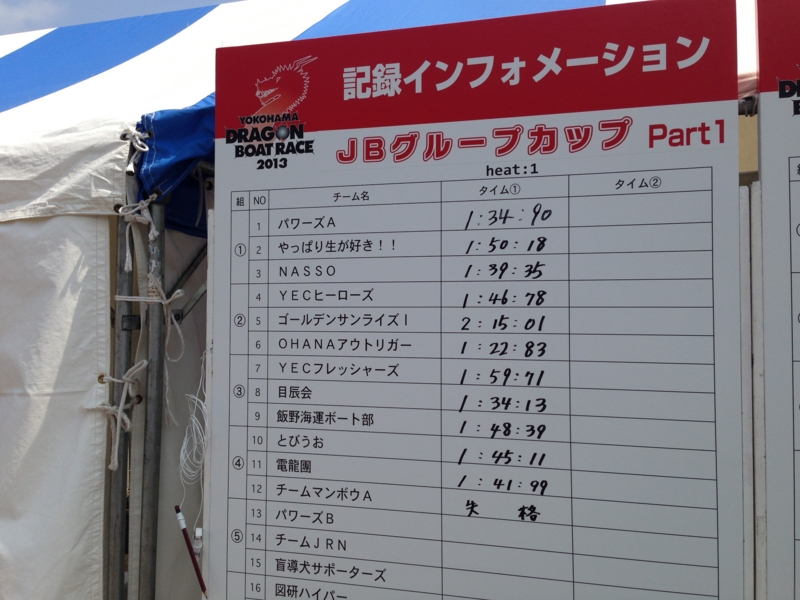
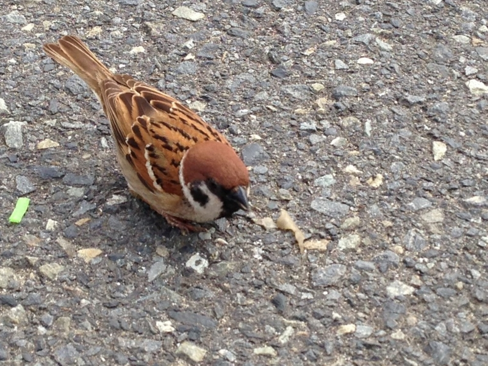
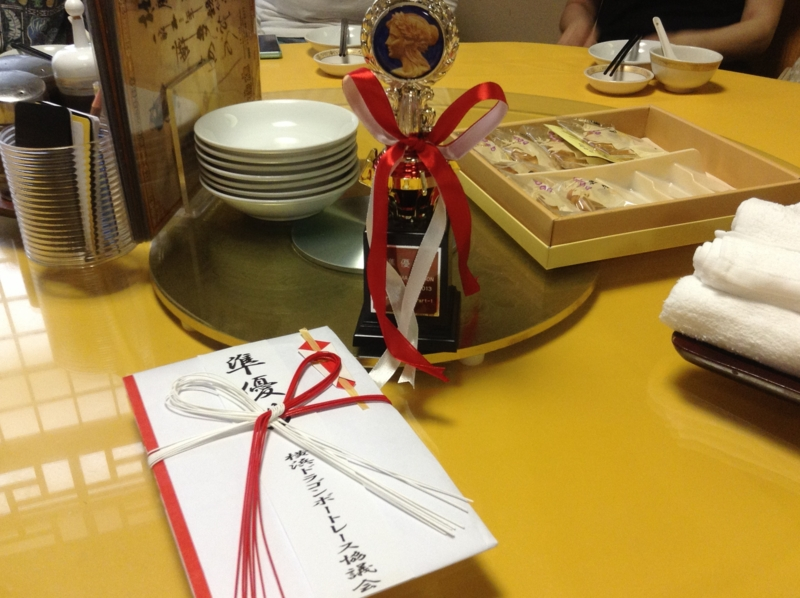
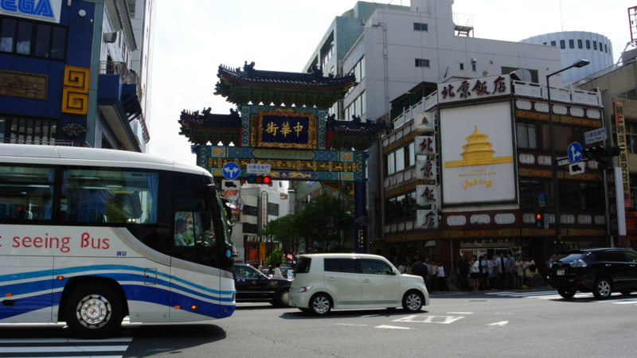

@subsfn に誘われて、横浜ドラゴンボートレース大会（<a href="http://www.yokohama-dragon.com/">&#x6A2A;&#x6D5C;&#x30C9;&#x30E9;&#x30B4;&#x30F3;&#x30DC;&#x30FC;&#x30C8;&#x30EC;&#x30FC;&#x30B9;&#x5927;&#x4F1A;&#x516C;&#x5F0F;&#xFF28;&#xFF30;</a>）に参加してきました。なんか、大勢で舟漕ぐらしいで。

チーム名は「NASSO」。逆から読んだら「OSSAN」。なかなかシャレが効いてて気に入った。もともとはシーカヤックをやってる（@subsfn もやってるし、自分も何回かしたことがある気がする）おっさん連中っぽくて、多少疎外感を感じないわけではなかったが、まぁまぁ、和気藹々としていいチームだと思う。

予選はレース（3艇一組）を2回行い、タイムのいい方から3チームが決勝に進出する。

早朝の曇り空、少し肌寒い中行われた第1レースの結果は 1:40 を少し切る程度。3艇のうちでは2位、全体では5位か6位ぐらいだった。どうやらそこそこの強豪の集まった組み合わせを引き当てたらしい。

とくに同じ組み合わせの「Powers A」（Bチームもあることから分かるように、会員1,000名を超えるかなり大所帯）というチームが強く、1:30 の前半をたたき出していた。全体では「OHANA アウトリガー」といいうチームが別格の強さを見せ 1:10 ちょっとのタイム。こうした強豪チームはシャツをチームで統一したり、自前のパドルまで用意していて、我が「NASSO」はそれを除く、装備も連携もバラバラなチームの中ではなかなかの好成績だ。ただし、決勝のタイムには5秒ほど足りず「もう1レース頑張ればお風呂と中華料理とビールかなぁ♪」という雰囲気が「OSSAN」の間を漂いはじめる。

「第1レースは体力を温存し、流す。第2レースは好タイムを狙う」という作戦もあり、第2レースは本気。太陽も雲間から顔を見せるようになり、気温も上昇。。チームの雰囲気もそれに合わせて少し上向きになってきた。気合が入る。

結果は、またもや「Powers A」に次ぐ2位で、タイムは 1:32 ぐらい。この時点で全体の上位3位に食い込む。このままいけば決勝だが、コンディションもよくなってるし、ほかのチームもタイムをあげてくるだろう。

……と思ったら、それほどでもなく、そのまま決勝に進出してしまいました ／(＾o＾)＼

チーム結成から苦節6年（なのだそうだ）。横浜中華街に予約した打ち上げのお店の予約時刻を遅らせるなど、対応に追われるメンバー。俺も腹が減ってきたので、屋台で焼き鳥などを買い、静かに決勝に備えた。

決勝は「OHANA アウトリガー」「Powers A」「NASSO」の3チームで競われる。「OHANA アウトリガー」はどうやら別格の強さで、「Powers A」にも僅差ながら2度も敗れている。当然3位で終わるものと思っていたが……

結果は2位。

途中まで「Powers A」に後れをとっていたが、後半マクって僅差で劇的な逆転勝利を収める。タイムは 1:31 ぐらいで、レースのごとにタイムを向上させた唯一のチームに。賞状とトロフィーのほか、コーラやビール、お菓子（横浜銘菓 ありあけ ハーバー）、スンドゥブ鍋の素（？）などを副賞として大量ゲットして、帰りは荷物が重かった。

そのあとはお風呂に浸かったあと、横浜中華街で打ち上げ。勝利の美酒のうまいことうまいこと（2位だけど）……来年も参加したいかも。

