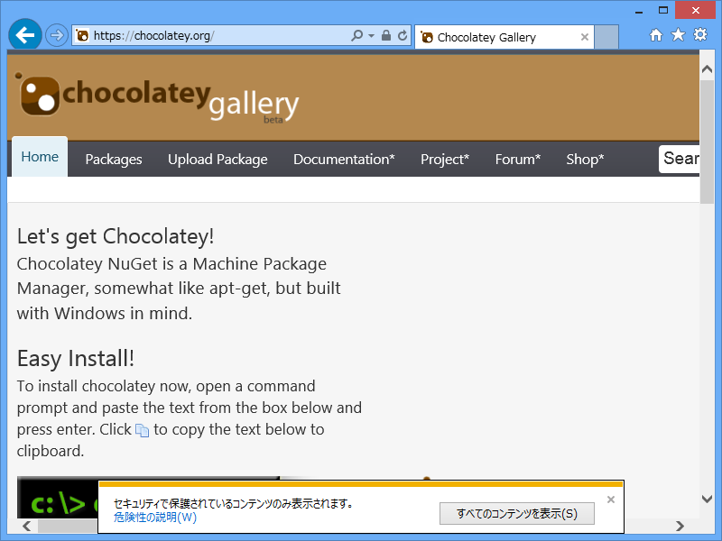
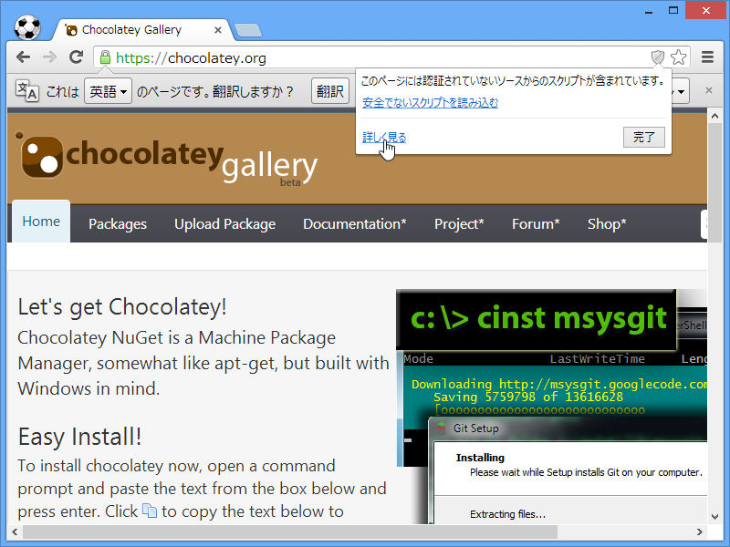
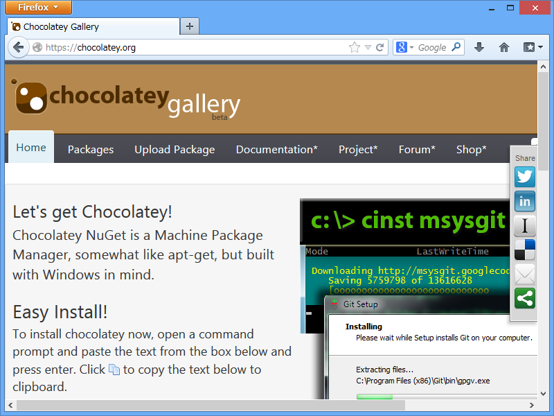
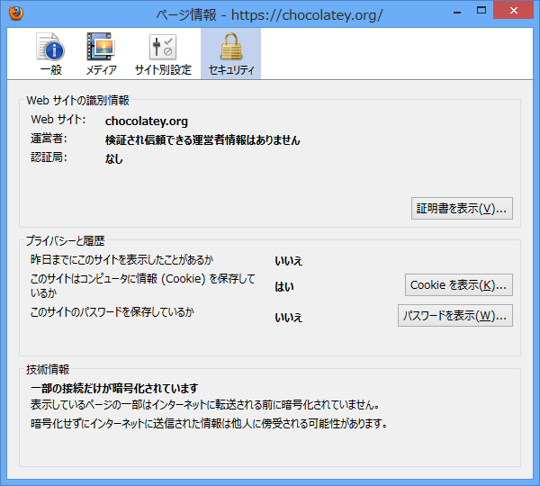

<h3>Internet Explorer 10 の場合</h3>

保護されていないコンテンツをブロックするとともに、画面下へそれを通知する。

<h3>Google Chrome 28（Beta）の場合</h3>

ウチにはいってたのがたまたまベータ版だったので。

保護されていないコンテンツをブロックするとともに、アドレスバー右端に小さくアイコンで通知する。

<h3>Mozilla Firefox 21（Release）の場合</h3>

保護されていないコンテンツがブロックされない（画面右に共有のためのバーが表示されている）。

<ul>
<li><a href="http://cpplover.blogspot.jp/2013/04/firefox-23sslssl.html">&#x672C;&#x306E;&#x866B;: Firefox 23&#x3067;&#x306F;&#x3001;&#x30C7;&#x30D5;&#x30A9;&#x30EB;&#x30C8;&#x3067;SSL&#x30DA;&#x30FC;&#x30B8;&#x5185;&#x3067;&#x975E;SSL&#x30B3;&#x30F3;&#x30C6;&#x30F3;&#x30C4;&#x306E;&#x8AAD;&#x307F;&#x8FBC;&#x307F;&#x3092;&#x30D6;&#x30ED;&#x30C3;&#x30AF;&#x3059;&#x308B;</a></li>
</ul>

