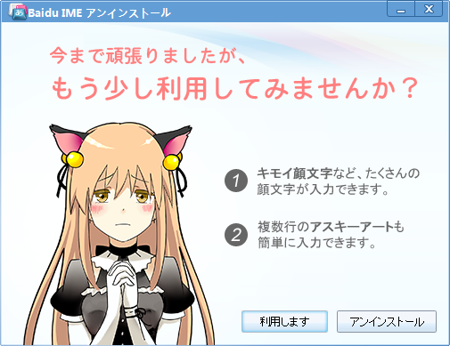
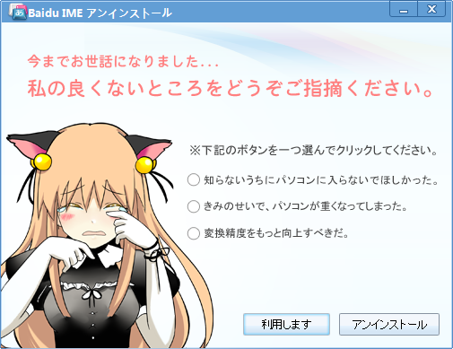

      やめろ！　やめろ！ <a class="twitter-tweet-url" href="http://t.co/IQ4jRDCWPv" target="_top">URL</a>

<a href="http://twitter.com/daruyanagi/status/340635937249841152" class="twitter-detail-info-permalink">2013-06-01 10:08:30</a> via <a href="http://www.metrotwit.com/" rel="nofollow">MetroTwit</a>

      これは卑怯だ <a class="twitter-tweet-url" href="http://t.co/qEPqkizjmH" target="_top">URL</a>

<a href="http://twitter.com/daruyanagi/status/340635805687107584" class="twitter-detail-info-permalink">2013-06-01 10:07:59</a> via <a href="http://www.metrotwit.com/" rel="nofollow">MetroTwit</a>

 

      まさかソフトに泣き落としされる時代がこようとは……

<a href="http://twitter.com/daruyanagi/status/340636214258454528" class="twitter-detail-info-permalink">2013-06-01 10:09:36</a> via <a href="http://www.metrotwit.com/" rel="nofollow">MetroTwit</a>

“バイドゥ”という名前だけで兎角厳しめに評価されがちな「Baidu IME」<a href="#f1" name="fn1" title="むかしは「Baidu Type」という名前だった。個人的にはそっちの名前の方が好き">*1</a>だけど、登場当時よりはだいぶよくなったと思う。「Google 日本語入力」の二番煎じと決めつける人もいるが、登場時期と開発にかかる時間を冷静に比べれば決してそんなハズもなく、それぞれ独自なプロジェクトだ。常用するかと言われれば正直なところ微妙だけど<a href="#f2" name="fn2" title="あえて選ぶ理由が薄い、「Google 日本語入力」の方が安定性・機能性ともに勝る">*2</a>、スキン機能なんかは気に入る人も多いのではないかな。

……べ、別に泣き落としに負けて擁護しているんじゃないんだからねっ！　健全な競争のためにはカウンターパートが必要ということだよ。

<ul>
<li><a href="http://www.forest.impress.co.jp/docs/news/20130524_600834.html">&#x30D0;&#x30A4;&#x30C9;&#x30A5;&#x3001;&#x300C;Baidu IME for Windows 8&#x300D;&#x30D9;&#x30FC;&#x30BF;&#x7248;&#x3092;&#x30A2;&#x30C3;&#x30D7;&#x30C7;&#x30FC;&#x30C8; - &#x7A93;&#x306E;&#x675C;</a></li>
</ul>

<a href="#fn1" name="f1" class="footnote-number">*1</a>:むかしは「Baidu Type」という名前だった。個人的にはそっちの名前の方が好き

<a href="#fn2" name="f2" class="footnote-number">*2</a>:あえて選ぶ理由が薄い、「Google 日本語入力」の方が安定性・機能性ともに勝る

