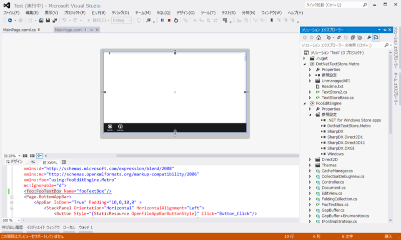

 

<blockquote cite="https://blog.daruyanagi.jp/entry/2013/03/13/184520">

さびねこにゃです。ストアアプリでエディターコンポーネントを作ったので、置いておきますね。<a href="http://sdrv.ms/12phlHk">http://sdrv.ms/12phlHk</a>

追記 
WM_CHARに相当するイベントがないので、IME経由でしか文字入力ができません。

<cite><a href="https://blog.daruyanagi.jp/entry/2013/03/13/184520">&#x3010;1&#x540D;&#x69D8;&#x3011; Metro &#x3067;&#x4F7F;&#x3048;&#x308B;&#x7D20;&#x6575;&#x306A;&#x30C6;&#x30AD;&#x30B9;&#x30C8;&#x30A8;&#x30C7;&#x30A3;&#x30BF;&#x30FC;&#x3092;&#x4F5C;&#x3063;&#x3066;&#x304F;&#x308C;&#x308B;&#x65B9;&#x306B;&#x3001;Samsung Series 7 Slate &#x3092;&#x5DEE;&#x3057;&#x4E0A;&#x3052;&#x307E;&#x3059; - &#x3060;&#x308B;&#x308D;&#x3050;</a></cite>
</blockquote>

スゴい！　<a href="http://blog.hatena.ne.jp/none_2271/">id:none_2271</a> さん、ありがとうございます！

手元でもちゃんと動きました（そのままでは動かなかったけど、ごにょごにょとエラーを潰しているうちに動きました）。

さらっと試してみたところ、

<ul>
<li>行番号、ルーラー、キャレットの描画</li>
<li>アンドゥ</li>
<li>印刷</li>
<li>シンタックスハイライト（ちょっと IHighliter の使い方が分かんなかった）</li>
</ul>
などができるのかな？　なかなかの大作で、基本的な機能は結構網羅されてるみたい。自分ではとてもじゃないけどここまでできないのでありがたいですね……。これで Windows 8/RT で動作するテキストエディターの誕生に一歩近づきましたね！！

<h3>追記</h3>

<blockquote cite="https://blog.daruyanagi.jp/entry/2013/03/13/184520">

skydriveだといろいろ面倒なのでgitの方に移動しました。あと、WM_CHARに相当するイベントを見つけたので実装してみました。これでおそらく普通に使えるはずです 
<a href="http://sourceforge.jp/projects/fooeditor/scm/git/FooEditEngine/">http://sourceforge.jp/projects/fooeditor/scm/git/FooEditEngine/</a>

<cite><a href="https://blog.daruyanagi.jp/entry/2013/03/13/184520">&#x3010;1&#x540D;&#x69D8;&#x3011; Metro &#x3067;&#x4F7F;&#x3048;&#x308B;&#x7D20;&#x6575;&#x306A;&#x30C6;&#x30AD;&#x30B9;&#x30C8;&#x30A8;&#x30C7;&#x30A3;&#x30BF;&#x30FC;&#x3092;&#x4F5C;&#x3063;&#x3066;&#x304F;&#x308C;&#x308B;&#x65B9;&#x306B;&#x3001;Samsung Series 7 Slate &#x3092;&#x5DEE;&#x3057;&#x4E0A;&#x3052;&#x307E;&#x3059; - &#x3060;&#x308B;&#x308D;&#x3050;</a></cite>
</blockquote>

