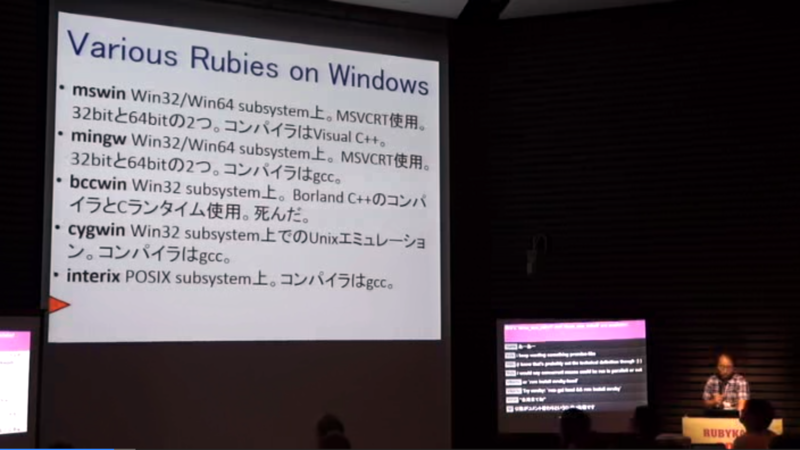
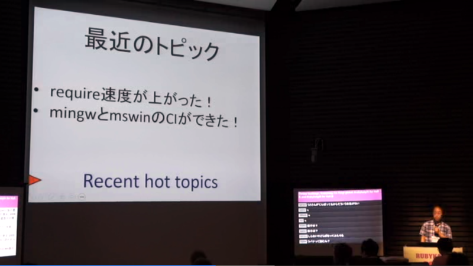
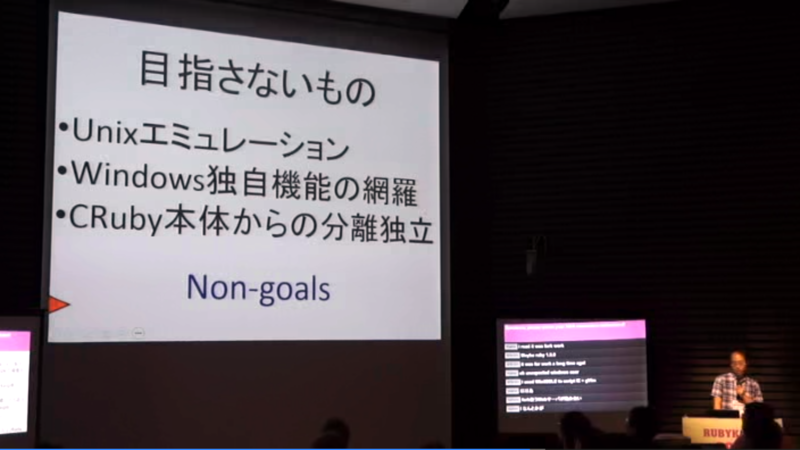
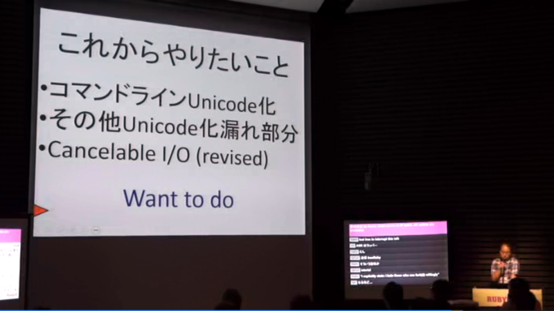
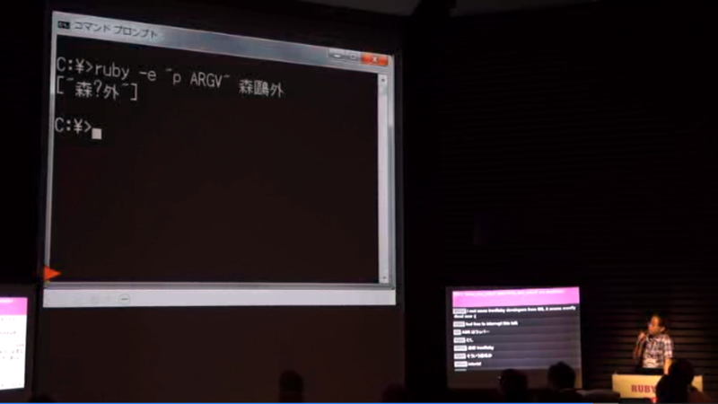
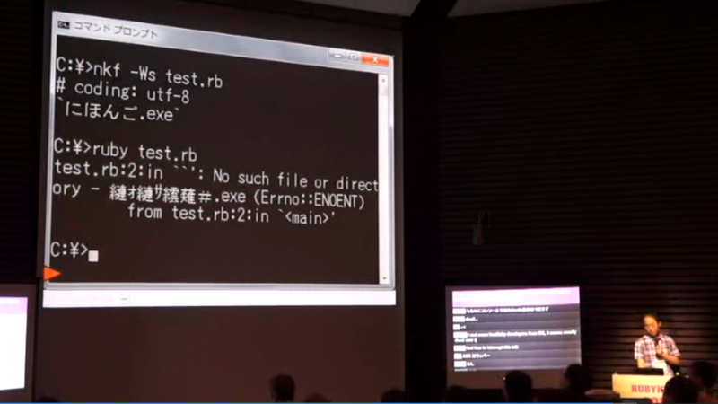
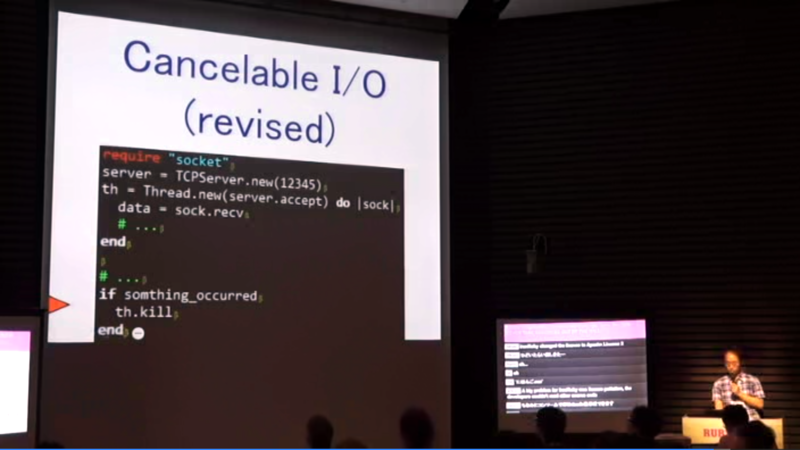

<iframe width="480" height="302" src="http://www.ustream.tv/embed/recorded/33569275?v=3&amp;wmode=direct" scrolling="no" frameborder="0" style="border: 0px none transparent;">    </iframe> 
 <a href="http://www.ustream.tv/" style="padding: 2px 0px 4px; width: 400px; background: #ffffff; display: block; color: #000000; font-weight: normal; font-size: 10px; text-decoration: underline; text-align: center;" target="_blank">Video streaming by Ustream</a>

<a href="http://opcdiary.net/?p=26717">RubyKaigi 2013, Ruby on Windows | OPC Diary - No Code, No Life.</a> 経由で興味をもったのだけど、緑の人がおすすめだというので見てみた。RubyKaigi での @unak さんのセッション。

<h3>Ruby for Windows の種類</h3>

いっぱいあるのだけど、今の主流はだいたい2種類＋1種類なのかな（IronRubyぇ……）。

<h4>mswin</h4>

コンパイラは Visual C++ 。

<ul>
<li><a href="http://www.garbagecollect.jp/ruby/mswin32/ja/download/release.html">http://www.garbagecollect.jp/ruby/mswin32/ja/download/release.html</a></li>
</ul>
unak さんがだいたいやっているのかな。

<h4>mingw</h4>

コンパイラは gcc 。

<ul>
<li><a href="http://rubyinstaller.org/">http://rubyinstaller.org/</a></li>
</ul>
luislavana さんがメンテナンス。なんとなくこれをいつも使っているし、ひとにもお勧めしてる。

<h4>ActiveScriptRuby</h4>

<a href="http://msdn.microsoft.com/ja-jp/library/cc409804.aspx">IActiveScript</a> を mswin に提供する ActiveX コントロール……なのらしい。

<ul>
<li><a href="http://www.artonx.org/data/asr/">http://www.artonx.org/data/asr/</a></li>
</ul>
作者は arton さん。<a href="http://nougakudo.codeplex.com/">NougakuDoCompanion - Home</a> を作ってる方だったんだね。

<h3>Ruby for Windows の歴史</h3>

割愛。mswin と mingw の Ruby の CI 環境は Windows Azure でやっているのだそうだ。あと、Microsoft から Visual Studio Ultimate が提供されているらしい（太っ腹！

<h3>Ruby for Windows の行方</h3>

基本的に「CRuby に追従する」という姿勢らしい。

<h4>コマンドラインの Unicode 対応</h4>

いたたたたｔ……互換性の問題で難しいところもあるという。

<h4>そのほか、Unicode 化が漏れている部分への対応</h4>

いててててｔ……

<h4>Windows XP 切り捨て</h4>

ちょっと面白かったのは Cancelable I/O の話で、並行処理関係の API は Windows Vista（Windows 6.0）でかなり強化されているのだそうだ。というわけで、Windows XP のサポートが切れ次第、さっくり新しい API へ移行したいとのこと（？）。

      いい内容ですよ！RT @<a class="twitter-user-screen-name" href="http://twitter.com/daruyanagi" target="_top">daruyanagi</a> 帰ったら見よう / “RubyKaigi 2013, Ruby on Windows | OPC Diary - No Code, No Life.” <a class="twitter-tweet-url" href="http://t.co/BBuIa7l6Sa" target="_top">URL</a>

<a href="http://twitter.com/masakit555/status/341415673139961856" class="twitter-detail-info-permalink">2013-06-03 13:46:54</a> via <a href="http://www.tweetdeck.com" rel="nofollow">TweetDeck</a>

確かに。

