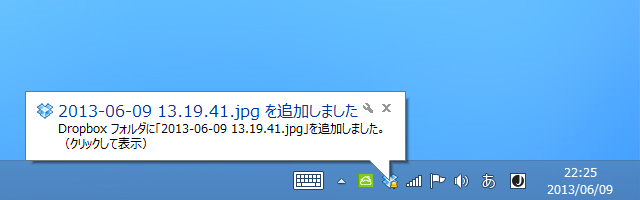
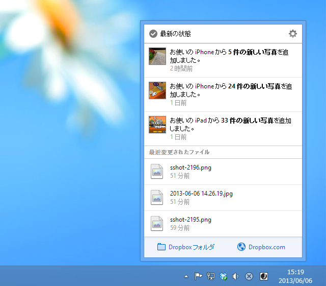

<blockquote cite="https://forums.dropbox.com/topic.php?id=101491">

<h4>New in 2.2.0</h4>

<ul>
<li>Fix an issue preventing Dropbox from starting up when it encounters a permissions error.</li>
<li>Fix an issue preventing Dropbox from syncing files that are being actively edited.</li>
</ul>

<h4>New in 2.2</h4>

<ul>
<li>New notifications badge</li>
<li>Refactoring of core sync engine</li>
<li>Improved memory usage</li>
<li>Startup performance improvements</li>
<li>Finder icon overlay improvements</li>
</ul>

<cite><a href="https://forums.dropbox.com/topic.php?id=101491">(6/5) - Release Candidate Build - 2.2.0 &laquo; Dropbox Forums</a></cite>
</blockquote>

Dropbox って自動アップデートだったんだっけ？　うちのはいつのまにか v2.2.1 になってた（<a href="https://forums.dropbox.com/topic.php?id=101602">(6/7) - Release Candidate Build - 2.2.1 &laquo; Dropbox Forums</a>）。このバージョンからの変更かどうかは知らないけれど、通知機能がすこしリッチになっているのは確か。

<ul>
<li><a href="http://www.forest.impress.co.jp/docs/news/20130606_602550.html">&#x30B9;&#x30AF;&#x30EA;&#x30FC;&#x30F3;&#x30B7;&#x30E7;&#x30C3;&#x30C8;&#x4FDD;&#x5B58;&#x6A5F;&#x80FD;&#x306A;&#x3069;&#x3092;&#x65B0;&#x305F;&#x306B;&#x642D;&#x8F09;&#x3057;&#x305F;&#x5B9F;&#x9A13;&#x30D3;&#x30EB;&#x30C9;&#x300C;Dropbox 2.3&#x300D;&#x304C;&#x516C;&#x958B; - &#x7A93;&#x306E;&#x675C;</a></li>
</ul>