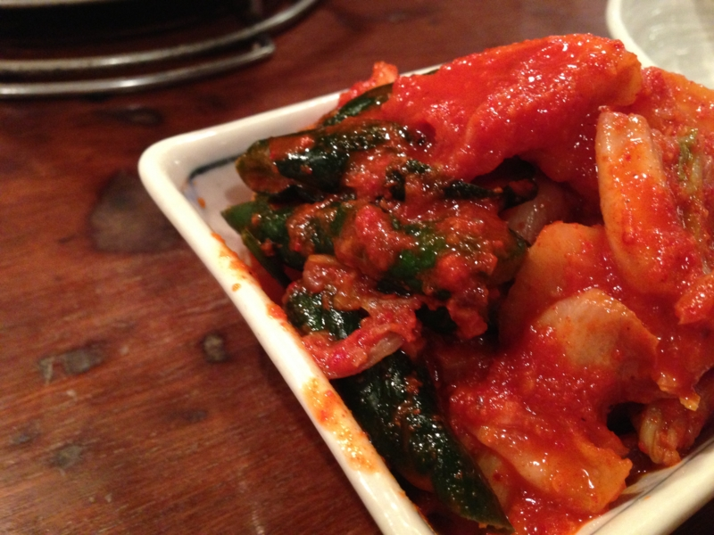
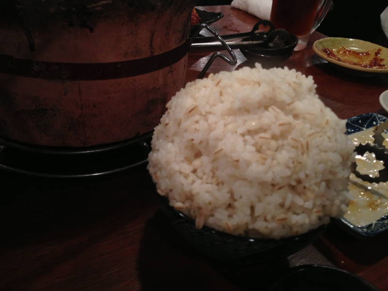

@shibayan が福岡へ行くというので、辛子高菜をおみやげに頼んだら、ちゃんと買ってきてくれたらしい。辛子高菜は結構好き。チャーハンにしてもいいし、スパゲッティに入れてもいい。もちろん、とんこつラーメンにはバッチリ。お土産の受け渡しがてら飯でも食うかということになり、木曜日に亀戸までホルモンを食べに行った。

今回行ったのは「亀戸ホルモン」。

<iframe width="425" height="350" frameborder="0" scrolling="no" marginheight="0" marginwidth="0" src="https://maps.google.co.jp/maps?q=%E4%BA%80%E6%88%B8+%E3%83%9B%E3%83%AB%E3%83%A2%E3%83%B3&amp;ie=UTF8&amp;hl=ja&amp;hq=%E4%BA%80%E6%88%B8+%E3%83%9B%E3%83%AB%E3%83%A2%E3%83%B3&amp;hnear=&amp;radius=15000&amp;t=m&amp;brcurrent=3,0x601888c69d7c713f:0x1104ec62555a1200,0&amp;cid=2731180440400718565&amp;ll=35.709096,139.829693&amp;spn=0.024393,0.036478&amp;z=14&amp;iwloc=A&amp;output=embed"></iframe> <small><a href="https://maps.google.co.jp/maps?q=%E4%BA%80%E6%88%B8+%E3%83%9B%E3%83%AB%E3%83%A2%E3%83%B3&amp;ie=UTF8&amp;hl=ja&amp;hq=%E4%BA%80%E6%88%B8+%E3%83%9B%E3%83%AB%E3%83%A2%E3%83%B3&amp;hnear=&amp;radius=15000&amp;t=m&amp;brcurrent=3,0x601888c69d7c713f:0x1104ec62555a1200,0&amp;cid=2731180440400718565&amp;ll=35.709096,139.829693&amp;spn=0.024393,0.036478&amp;z=14&amp;iwloc=A&amp;source=embed" style="color:#0000FF;text-align:left">大きな地図で見る</a></small>

結構な人気店のようで、1時間ぐらい待った。ほんとは店に入るのに待つのは大嫌いなのだけど、まぁ、たまにはいいかな、と。並ぶだけあって、まぁまぁ美味しかった。ビールさえ飲まなかったら結構安く上がると思う。自分には無理だけど。

どうしてもお肉で口が油っぽくなるので、さっぱりしたキムチが美味しい。麦飯の大盛りは、だいぶ日本昔話盛りだった。

ちなみに、辛子高菜は受け取れなかった。@shibayan が家に忘れたらしい。なので、ただホルモンを食いに行っただけになってしまった。

