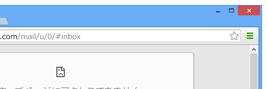
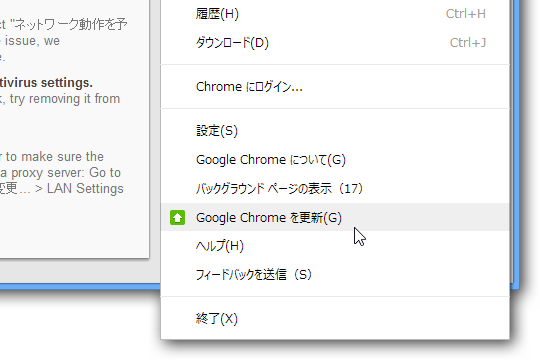
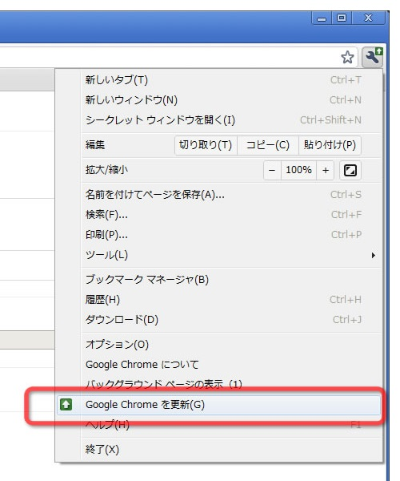

Google Chrome 28（Beta）を使っていたのだけど、［Google Chrome の設定］ボタン（通称［三］）が緑色になっていることに気付いた。

Google Chrome にアップデートがあると、このように表示されるようになったらしい。あいかわらず“意味的に”分かりやすいとは言えないけれど、一度そうだと知ってしまえば“視覚的に”分かりやすい。

かつてはどんな感じだったかというと――

もはや懐かしい。

