
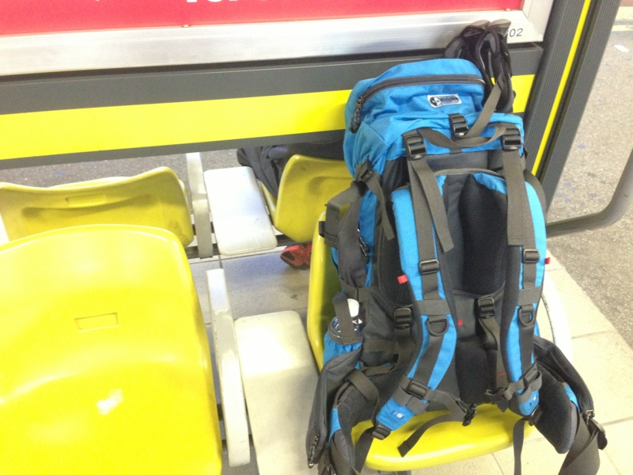

「のんびり山でも行きたいな」 
「せやな」 
「適当にスケジュール組んでよ」 
「わかった、6:30集合な（← ※この時点で4:00起き確定）」 
「( ﾟДﾟ)！」

こんな感じで決まった今回の山登り。目的地は、高尾の方にある陣馬山・景信山だ。まぁ、山の名前はその日の朝のブリーフィングで知ったのだが……そういう細かいことは全部 @subsfn 任せ。自分はひたすら生還することに集中しているのダ。

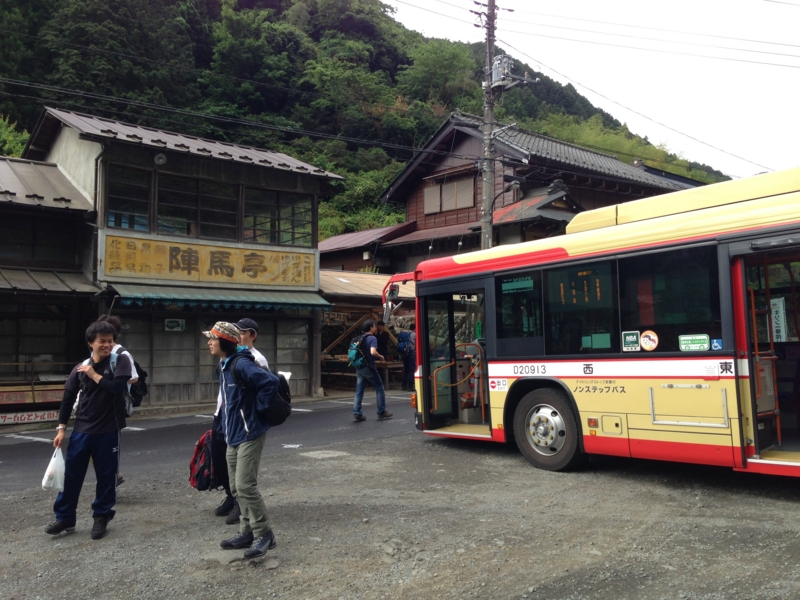

京王バスで揺られること30分ほど。終点の登山口っぽいところにたどり着いた。辛うじてソフトバンクの電波は入る。ここで @subsfn が軽量化（隠語）。同じバスでやってきた人たちが次々と出発するなか、僕と Y 氏は朝ごはんを食べながらひたすら @subsfn の帰りを待っていた。

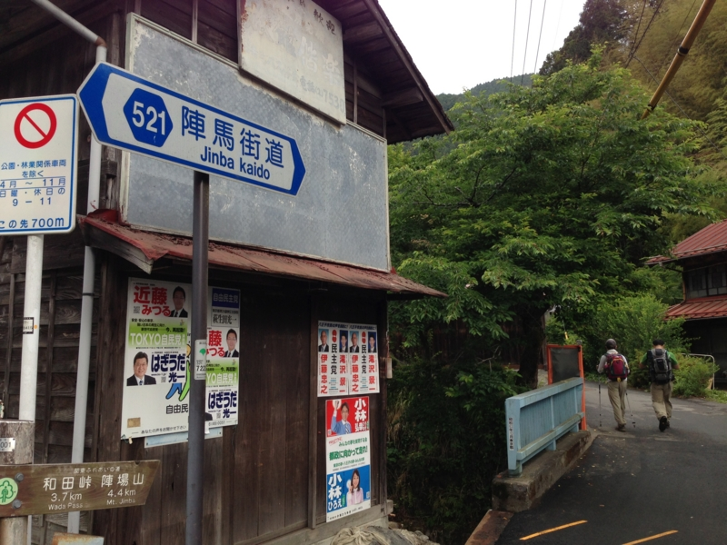

というわけで、ほぼ最後尾から出発。まだ30代なのに、明らかに年上の人に追い抜かされていく。少し情けないが、今回はなにより、生きて帰ることが目標だ。自分たちのペースを守らねばならない。

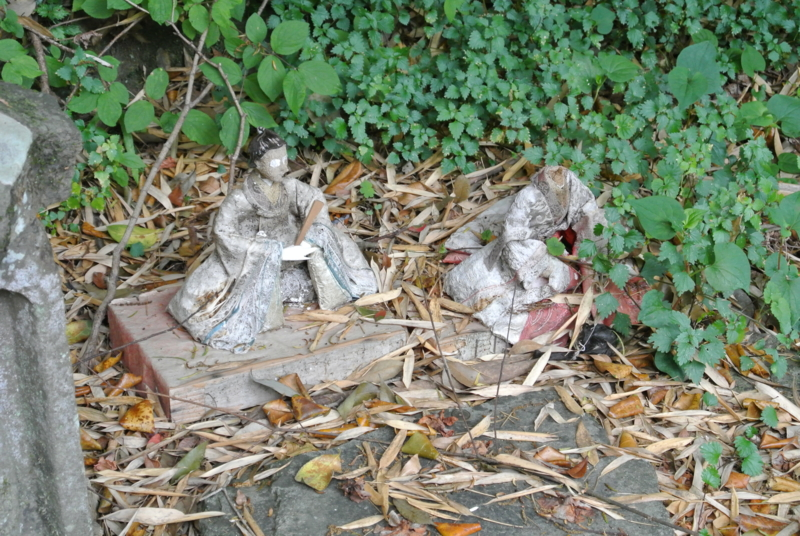

山を舐めたら、そこにあるのは死なのダ。

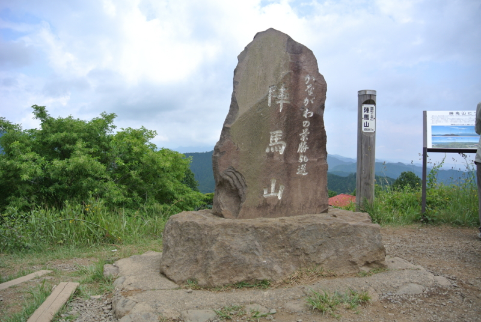

元気なうちに高度を稼ぎ、9時ごろだったか、陣馬山山頂に到着。カキ氷を食す。次の景信山までは平坦な道が多く、それほど困らないとの由。

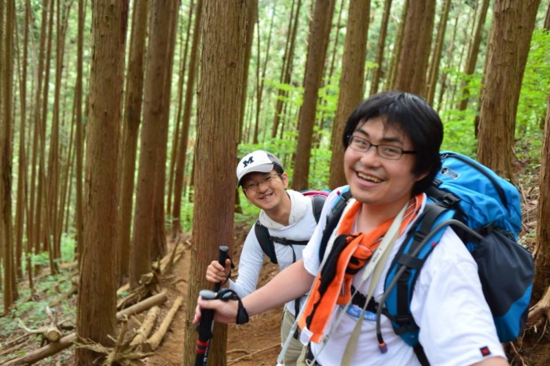

編隊は、アウトドア経験豊富な @subsfn を先頭に、体力にはまったく自信のない私 @daruyanagi がそれに続く。殿は、これまた登山経験をそれなりにもつ Y 氏がガッチリしめる。ちなみに、Y 氏は国家に魂を捧げた公僕である。調子に乗ると笑い方がヌラリヒョンに似てくる点を除けば、心配りの行き届いたナイスガイだ。この組み合わせならば、エベレストだろうがチョモランマだろうがお尻ぺんぺんに思われる。

しかし、景信山を目の前にして @subsfn が変調をきたしはじめた。

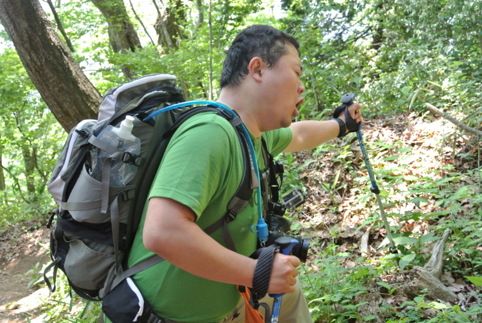

疲れたらしい。

なにせ @subsfn の体重は約 0.1 トン。愛のこもった奥さんの手料理を貪る毎日で、飛ぶことをすっかり忘れたブタなのだ。そのケツを二人で蹴り上げながら、ひたすら足を前へ運ぶこと1時間超。

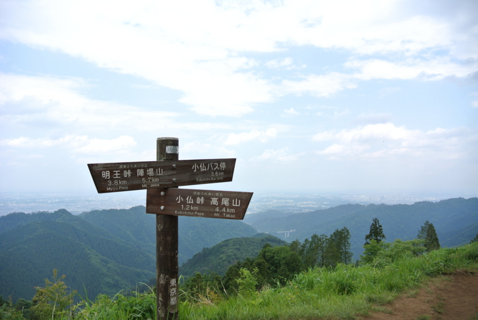

とうとう景信山の頂上へ到達。ここではソフトバンクの電波も入る。

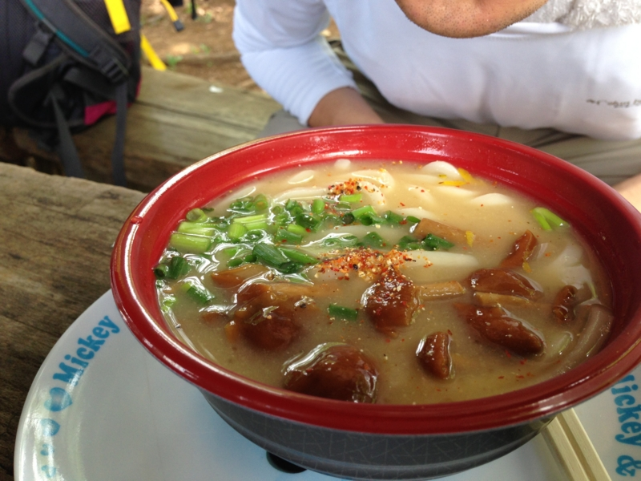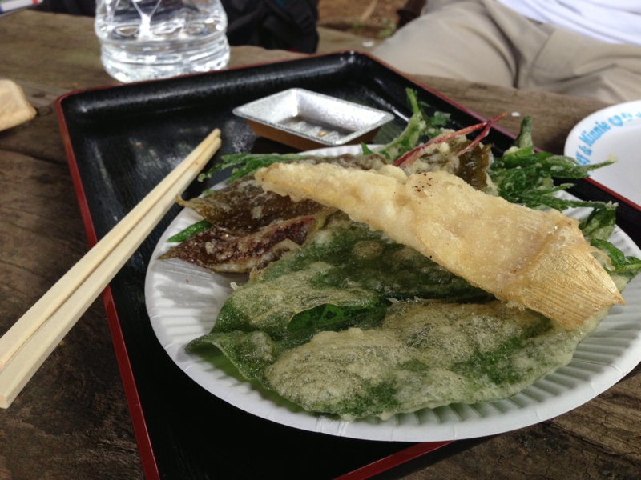

ここの名物はなめこ汁だそうで、なかなか、いうほどあって美味しい。重量感のあるなめこ風味が楽しめる。ただ、個人的には野草の天ぷらもおススメしておきたい。ホクホク、パリパリとこれまたウマい。

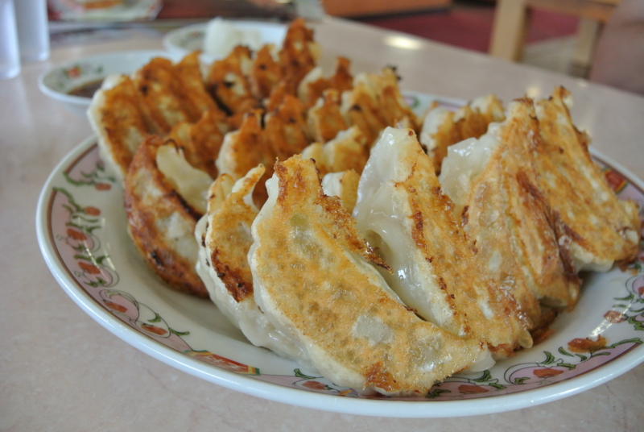

まぁ、なんとなくもうこれで十分かと意見一致した三人は、そのまま山を下り、小仏のバス停から高尾駅に帰っていったのであった。

スーパー銭湯に浸かったあと、王将の餃子でみんなの無事を祝福して解散！　お疲れさまー

<a href="http://www.amazon.co.jp/exec/obidos/ASIN/B00C2L22CO/bestylesnet-22/">karrimor(カリマー) クーガー 50-75 Kブルー</a>
<ul><li>出版社/メーカー: SBA</li><li>メディア: ウェア&シューズ</li><li><a href="http://d.hatena.ne.jp/asin/B00C2L22CO/bestylesnet-22" target="_blank">この商品を含むブログを見る</a></li></ul>

