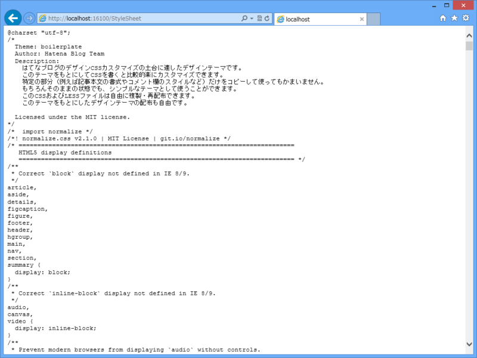

今回は WebMatrix 3 ではてなブログのデザインをいじってみた。みんな、はてなブログのデザインを作るときってどうやってるのかなぁ。あんまり効率のいい方法って思いつかなかったのだけど、こんなのはどうかな、というのを考えてみた。

<h3>テーマ確認用のブログを開設する</h3>

<ul>
<li><a href="http://help.hatenablog.com/entry/theme/custom-theme">&#x30C7;&#x30B6;&#x30A4;&#x30F3;&#x30C6;&#x30FC;&#x30DE;&#x5236;&#x4F5C;&#x306E;&#x624B;&#x5F15;&#x304D; - &#x306F;&#x3066;&#x306A;&#x30D6;&#x30ED;&#x30B0; &#x30D8;&#x30EB;&#x30D7;</a></li>
</ul>
上記リンクを参考に、テーマ確認用のブログを開設。サンプルエントリーをコピーして、ひととおりの HTML タグをテストできるようにする。自分の場合は、それに追加して、

<ul>
<li>/about</li>
<li>/archive</li>
</ul>
へのリンクを含むページを作っておいた。そうすると、次のステップではかどる。

<h3>テーマ確認用のブログをローカルにダウンロードする</h3>

この手のソフトはいろいろあると思うのだけど、たまたまこういうのを目にしたので、今回はそれを使ってみた。

まぁ、悪くはないかな。

<ul>
<li><a href="http://cyotek.com/cyotek-webcopy">Cyotek WebCopy - Copy websites locally for offline browsing &bull; Cyotek</a></li>
</ul>
サンプルエントリーには /archive へのリンクがないと思うので、ひと手間かけてリンクを足しておくと、こういったソフトで一気にダウンロードできて便利。

<h3>ローカルフォルダを WebMatrix 3 で開く</h3>

ダウンロードしたサイトを保存したフォルダを WebMatrix 3 で開く。コンテキストメニューから開けるよ。実行すれば、ローカルサーバーでホストされ、ちゃんとサイトが表示されるはず。

わざわざ WebMatrix 3 を利用する理由は、いくつかある。

<ul>
<li>テキストエディター：HTML/CSS の入力補完が効く</li>
<li>LESS：構造的に CSS が書ける。はてなでも採用しているみたい（<a href="https://blog.daruyanagi.jp/entry/2012/08/15/161932">WebMatrix &#x3067; LESS &#x3092;&#x4F7F;&#x304A;&#x3046;&#xFF01; - &#x3060;&#x308B;&#x308D;&#x3050;</a>）</li>
<li>テスト：システムにインストール済みのブラウザーでテストできる（iOS エミュレーターもある）</li>
<li>ASP.NET Web Page 2：ページを分割できる（後述）</li>
<li>レポート：ダメなマークアップを指摘してくれる（参考程度）</li>
<li>セットアップ：IIS とか Apache とか用意するの面倒じゃね？</li>
</ul>
まぁ、こだわればいくらでもいいツールはあると思うのだけど、オールインワンでめんどくさくないのが WebMatrix のいいところだと思う。

<h4>ASP.NET Web Page 2</h4>

たとえば、はてなブログにはヘッダーやフッター、記事の下にカスタム HTML が挿入できる。まぁ、それをソースにべた書きしてもいいのだけれど、できれば別ファイルに分離した方がいいよね。

そういうときに ASP.NET Web Page 2 の美味しい部分を使ってやるといい。

まず、index.htm を index.cshtml へリネーム。

これだけでも ASP.NET Web Page が使えるのだけど、そのままだと v1 をつかう羽目になるので、アップデートしておく。

次に、#top-editarea 内を以下のように書き換え。

<pre class="code lang-html" data-lang="html" data-unlink>&lt;div id=&quot;top-editarea&quot;&gt;
@RenderPage(&quot;~/Header.cshtml&quot;)
&lt;/div&gt;
</pre>
これでヘッダーに挿入できるカスタム HTML を Header.cshtml へ分離できた。

ほかにもこんな使い方はどうかな。

スタイルが膨大になると、役割ごとに CSS ファイルを分割したくなる。けれど、はてなのデザイン画面に貼り付けるときは、それを一つに統合しなきゃいけない。

ので。

<pre class="code lang-cs" data-lang="cs" data-unlink># ~/StyleSheet.cshtml

@{
var path = Server.MapPath(&quot;~/&quot;);
}

&lt;pre&gt;
@File.ReadAllText(path + &quot;Content/HatenaBase.css&quot;)
@File.ReadAllText(path + &quot;Content/Site.css&quot;)
@File.ReadAllText(path + &quot;Content/Hatena.css&quot;)
&lt;/pre&gt;
</pre>
こんな感じのコードを書いてやる。

すると、/StyleSheet を叩くだけで結合済みの CSS が得られる。たいしたことじゃないけど、こういう使い方もありかな。

ちょっとイレギュラーな使い方かもしれないけど、こういうのもあるということで。

