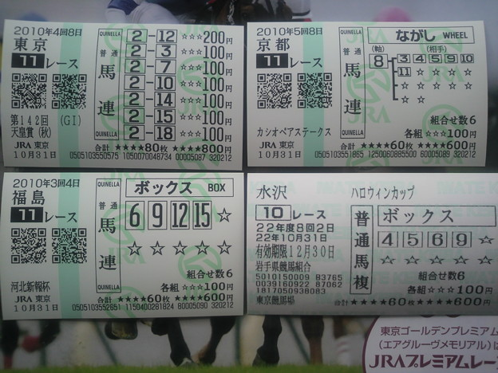

<blockquote cite="http://www.itmedia.co.jp/news/articles/1305/22/news044.html">

　報道によると、被告人の男性（39）は100万円を元手に、当たり馬券の払戻金を次々につぎ込む形で馬券を購入。自作の予想システムを駆使し、2009年までの3年間で合計約28億7000万円分の馬券を買い、トータルで約30億1000万円の払い戻しを得た。つまり、差し引きして約1億4000万円の「黒字」となった。

　単純に考えると、この黒字分の約1億4000万円が「所得」であり、税金がかかるとしたら、この部分だと思うだろう。ところが、男性が確定申告しなかったために所得税法違反で起訴された際に、検察が「所得」と主張したのは、なんと28億8000万円という途方もない金額だった。

<cite><a href="http://www.itmedia.co.jp/news/articles/1305/22/news044.html">&#x5916;&#x308C;&#x99AC;&#x5238;&#x306F;&#x300C;&#x5FC5;&#x8981;&#x7D4C;&#x8CBB;&#x300D;&#x304B;&#xFF1F; &#x5DE8;&#x984D;&#x300C;&#x7AF6;&#x99AC;&#x8131;&#x7A0E;&#x4E8B;&#x4EF6;&#x300D;&#x306E;&#x5224;&#x6C7A;&#x306E;&#x884C;&#x65B9;&#x306F;&#xFF1F; - ITmedia &#x30CB;&#x30E5;&#x30FC;&#x30B9;</a></cite>
</blockquote>

一審は「弁護側の主張通り、外れ馬券も含めたすべての馬券代を経費と認めたうえで、男に懲役２月、執行猶予２年（求刑懲役１年）を言い渡した」という結果に<a href="#f1" name="fn1" title="http://www.nikkei.com/article/DGXNASHC2300V_T20C13A5000000/">*1</a>。

<h3>まず前提として</h3>

これは「脱税」だということ。ある一定以上の所得を得たら申告しなければならない。今回は、この所得の申告を怠たり、本来払うはずの税金をちょろまかして、馬券に“投資”していたわけだ。

なので、一部の人が言っていた「なぜ懲役なのか」という意見はまったくおかしい。

税制そのものの是非はともかく、現行法では申告が義務となっている。それを不当に免れるのはよくない。脱税に関しては被告も認めており、その分の追徴課税と「懲役２月、執行猶予２年」の実刑は妥当なのかな、と思う。

<h3>そういうことは脱税する前に言えよ</h3>

さて本題の「外れ馬券が経費か？」だが、個人的には「脱税で捕まる前に言えよ」と思う。

1万円の商品を万引きして捕まった後、商品と同じ額の賠償を請求されて「お前のところの商品は高い、まけろ」といってるようなものだと思う。そういう交渉は万引きする前にやるべきだ。

<h3>どっちが“常識”？</h3>

<blockquote>

所得税法37条1項により、被告人の男性の馬券購入費が『必要経費』として認められるためには、次の2つのどちらかに該当しなければならないとされています。 
（1）売上原価など、総収入金額を得るために直接要した費用 
（2）販売費や一般管理費など、所得を生ずべき業務についての費用

</blockquote>

外れ馬券の購入は、どちらに該当するとも言い難い。「先物取引やFXによる所得」と同一視する見方もあるが、金融商品の取引とギャンブルは同じではないだろう。

「担税力」の観点はもっとも説得力があるが、儲けた都度ちゃんと申告していれば「担税力」以上の課税にはならなかったはずだ。

<blockquote>

法律論としては正しいが、常識感覚からすれば、どこかおかしい。そんな判決が出るのかどうか

</blockquote>

「競馬ファンが納得できるような結論を示せ」というが、別に税法は競馬ファンにあるわけじゃないので放っておけばよろしい。

むしろ、これを機に「所得は申告する」という“常識”をもう一度確認すべきだ。

たとえば、払い戻しのときに注意を促すようにすべきじゃないかな？　自分は競艇しかしたことないけど、確かに言われない気がする。無論、「払い戻しの際に天引きしろよ」という意見はあると思うが、それはまた別の議論になるだろう。

<h3>ギャンブルは“業”として認められるべきか</h3>

あと、この記事にはなかったが、なぜ“（必要）経費”というものが認められるのか、ということについても考えておきたいなと思う。

<blockquote>

所得税法 
（必要経費）  
第三十七条 その年分の不動産所得の金額、事業所得の金額又は雑所得の金額（事業所得の金額及び雑所得の金額のうち山林の伐採又は譲渡に係るもの並びに雑所得の金額のうち第三十五条第三項（公的年金等の定義）に規定する公的年金等に係るものを除く。）の計算上必要経費に算入すべき金額は、別段の定めがあるものを除き、これらの所得の総収入金額に係る売上原価その他当該総収入金額を得るため直接に要した費用の額及びその年における販売費、一般管理費その他これらの所得を生ずべき業務について生じた費用（償却費以外の費用でその年において債務の確定しないものを除く。）の額とする。  
２ 山林につきその年分の事業所得の金額、山林所得の金額又は雑所得の金額の計算上必要経費に算入すべき金額は、別段の定めがあるものを除き、その山林の植林費、取得に要した費用、管理費、伐採費その他その山林の育成又は譲渡に要した費用（償却費以外の費用でその年において債務の確定しないものを除く。）の額とする。

</blockquote>

よくわからないが、

<ul>
<li>その年分の不動産所得</li>
<li>その年分の事業所得</li>
<li>その年分の雑所得</li>
</ul>
を得るために必要だった

<ul>
<li>販売費</li>
<li>一般管理費</li>
<li>その他これらの所得を生ずべき業務について生じた費用</li>
</ul>
が必要経費になるらしい。家計の費用などは、生きるために必要だが経費とは認められない。どうやら“事業”を運営し、儲けを出すにあたって、必要なコストを経費というらしい。

であるならば、ギャンブルが“事業”であるかどうかも論点になっていいのではないかと思う。果たしてギャンブルは“事業”だろうか。

それはよくわからないが、個人的には“事業”と認めるべきことではないと思う。もしギャンブルが“事業”だというのならば、ギャンブルによる破産も認めるべきだろう。

<blockquote>

（免責許可の決定の要件等） 
第二百五十二条 　裁判所は、破産者について、次の各号に掲げる事由のいずれにも該当しない場合には、免責許可の決定をする。 
四 　浪費又は賭博その他の射幸行為をしたことによって著しく財産を減少させ、又は過大な債務を負担したこと。

</blockquote>

ちなみに FX は射幸性が高いが、厳密に言うとギャンブルではないというわけか、多くの場合破産が認められるという。

<h3>最後に～とても不思議に思うこと～</h3>

自分が思うに、ギャンブルというのは胴元以外は基本的に全員が損をする遊びだ<a href="#f2" name="fn2" title="そうでないものもあるが">*2</a>。なかには今回の被告のように大きく勝ち越す者もいるけれど、その裏には、その分さらに損をしている人たちがいるわけだ。

今回の外れ馬券騒動で被告に同情している多くの一般的な“競馬ファン”は、そんな損に損を重ねた人たちなのだろう<a href="#f3" name="fn3" title="もしかしたら同じようなシステムで勝ちまくってる人が大声で弁護しているのかもしれないが">*3</a>。コンピューター賭博師におカネを貢いで、さらに彼が捕まると同情さえ寄せる、とてもお人好しな人たち。

コンピューター賭博をする人に、その対象への愛着などないだろう。別に競艇だって競輪だって、儲けられればいいのではないか。単に競馬が一番おカネの規模が大きいだけだ。彼らは、競馬を“目的”ではなく“手段”として扱っている。

これは一般的な“ファン”とまったく相いれない考えだと思うのだけれど、なぜここまで一般のファンの注目と同情を引き、支持を受けるのだろうか。個人的にはそこが一番不思議だ。

<a href="#fn1" name="f1" class="footnote-number">*1</a>:http://www.nikkei.com/article/DGXNASHC2300V_T20C13A5000000/

<a href="#fn2" name="f2" class="footnote-number">*2</a>:そうでないものもあるが

<a href="#fn3" name="f3" class="footnote-number">*3</a>:もしかしたら同じようなシステムで勝ちまくってる人が大声で弁護しているのかもしれないが

