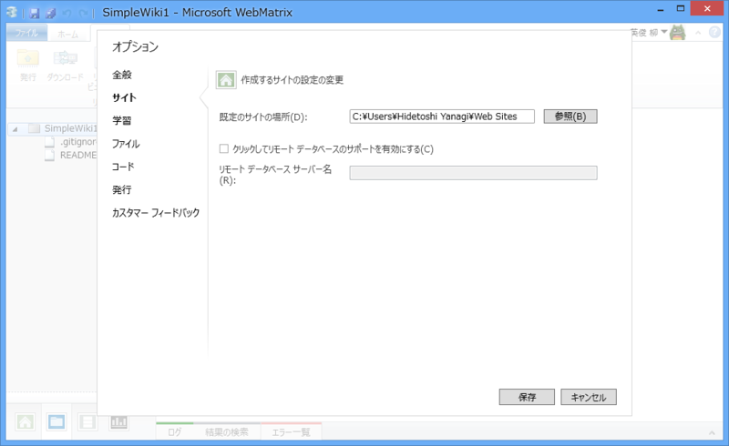

<blockquote>

An error was raised by libgit2. Category = Os (NotFound). 
Existing path is not a directory '（プロジェクトフォルダ）': 既に存在するファイルを作成することはできません。

</blockquote>

困った。

とりあえず、プロジェクトの保存フォルダを変更。再度 git init することで問題を回避した。

