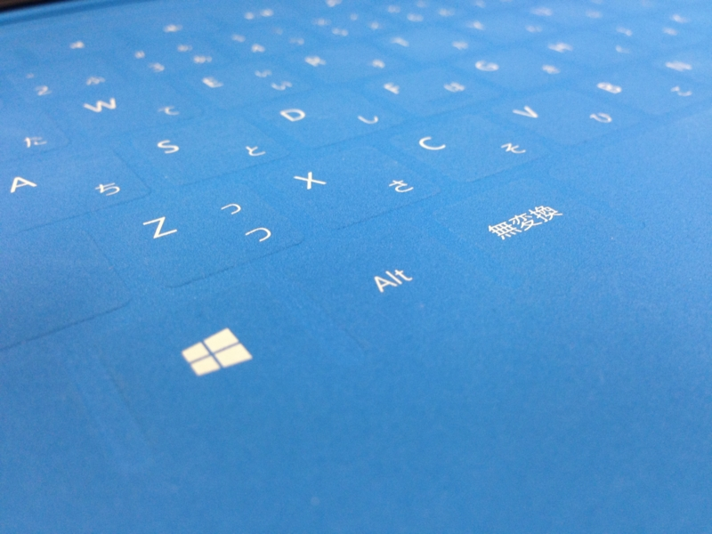
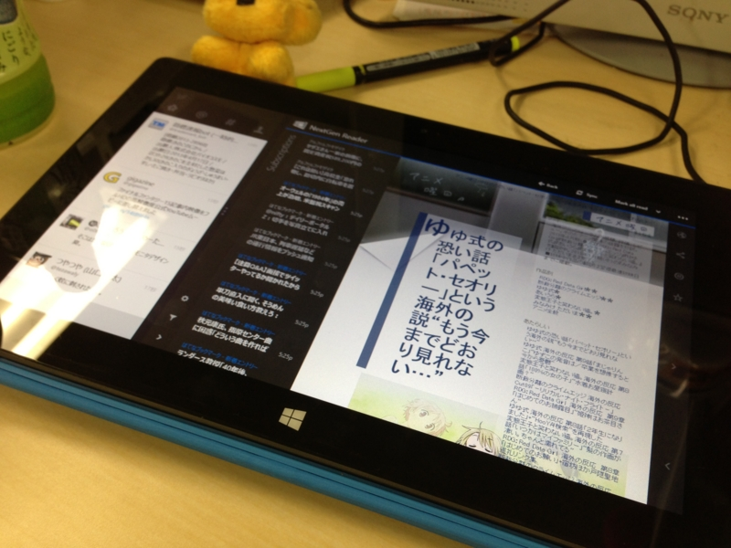

 

<blockquote cite="http://www.microsoft.com/Surface/en-US/support/performance-and-maintenance/rt-update-history">

<h4>June 2013 updates</h4>

Released June 11

Update includes these firmware and performance improvements:

<ul>
<li>Surface Home Button driver update that improves the reliability of the devices waking up immediately on the first button press.</li>
<li>Firmware update for Surface Type Cover and Surface Touch Cover that improves functionality for both accessories. Includes the ability to toggle function keys, new shortcuts, and helpful keyboard navigation improvements.</li>
</ul>

<cite><a href="http://www.microsoft.com/Surface/en-US/support/performance-and-maintenance/rt-update-history">Official Home of Microsoft Surface Computers &amp; Devices &ndash; Microsoft Surface</a></cite>
</blockquote>

ひとつ目の「［Windows］ボタン（キーではない）でスリープから復帰できない」という問題が解決されているのは確認。これ、てっきり仕様だと思ってた……。まぁ、電源ボタンを押せば復帰できるわけで、そんなに困ってなかったってのもある。

ふたつ目の「ショートカットキーの追加」は確認できなかった。

うちの Touch Cover がおかしいのか、日本語配列固有の問題なのかはよくわからない。近くにもってる人がいればうれしいのだけれど。

ほかにも新しく追加されたショートカットが使えない人がいるらしい。

ちなみに、今回追加されたキーボードショートカットは以下の通り。 
 

<table>
<tr>
<td>［Fn］＋［CapsLocks］</td>
<td>最上列のキーを［F1］～［F12］にする。もう一度押すと戻る</td>
</tr>
<tr>
<td>［Fn］＋［Space］</td>
<td>［Print Screen］キー</td>
</tr>
<tr>
<td>［Fn］＋［Space］＋［Alt］</td>
<td>［Alt］＋［Print Screen］キー</td>
</tr>
<tr>
<td>［Fn］＋［Del］</td>
<td>ディスプレイの輝度をあげる</td>
</tr>
<tr>
<td>［Fn］＋［Backspace］</td>
<td>ディスプレイの輝度を下げる</td>
</tr>
<tr>
<td>［Fn］＋［←］</td>
<td>［Home］キー</td>
</tr>
<tr>
<td>［Fn］＋［→］</td>
<td>［End］キー </td>
</tr>
<tr>
<td>［Fn］＋［↑］</td>
<td>［Page Up］キー </td>
</tr>
<tr>
<td>［Fn］＋［↓］</td>
<td>［Page Down］キー </td>
</tr>
</table>
<ul>
<li><a href="http://blog.surface.com/b/surface/archive/2013/06/05/outlook-2013-rt-coming-to-surface-rt-and-more.aspx">http://blog.surface.com/b/surface/archive/2013/06/05/outlook-2013-rt-coming-to-surface-rt-and-more.aspx</a></li>
</ul>
  
あと、この問題はいまだ発生する。

<blockquote cite="https://blog.daruyanagi.jp/entry/2013/05/21/061704">

ファームウェアをアップデートしてから、Touch Cover を後ろに畳んだ（holded back）状態で机の上に置くと（写真の状態）、操作中にもかかわらずスリープ状態になる問題が発生するようになった

<cite><a href="https://blog.daruyanagi.jp/entry/2013/05/21/061704">Surface RT: May 2013 updates - &#x3060;&#x308B;&#x308D;&#x3050;</a></cite>
</blockquote>

こんな感じで使ってると、タッチ中にもかかわらずスリープモードになる（写真では背後にペンを挟むことでこれを回避している）。

この現象は、ほかの環境でも発生するようだ。

<blockquote cite="http://win8room.net/2013/02/27/1610.html">

不具合なのか、裏面に折り曲げ、テーブルなどの平らな所におくと操作中にも関わらず電源が切れてしまい、電源ボタンを押しても復帰しなくなる。（カバーを裏側に回しテーブルにおいて操作しようとすると電源が切れてしまう）

<cite><a href="http://win8room.net/2013/02/27/1610.html">&#x95B2;&#x89A7;&#x306B;&#x306F;&#x6700;&#x9069;&#x3060;&#x304C;&#x30FB;&#x30FB;&#x30FB;Microsoft Surface / Windows RT with Touch Cover | Windows8 Room</a></cite>
</blockquote>
