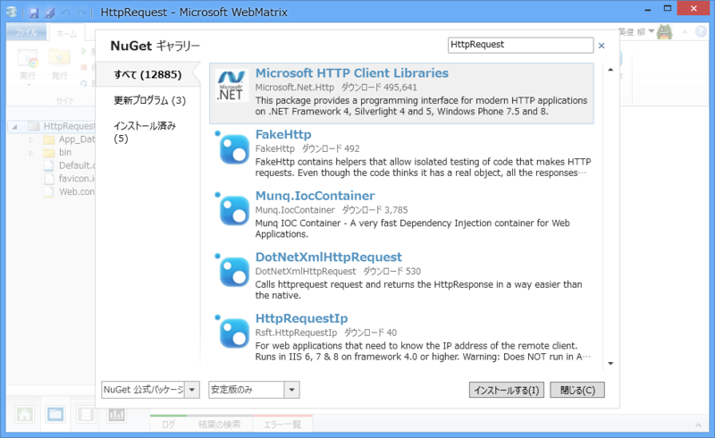
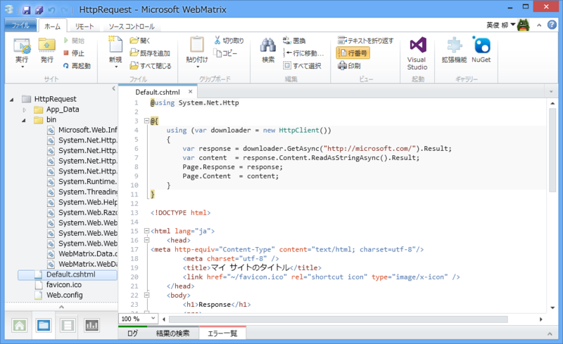
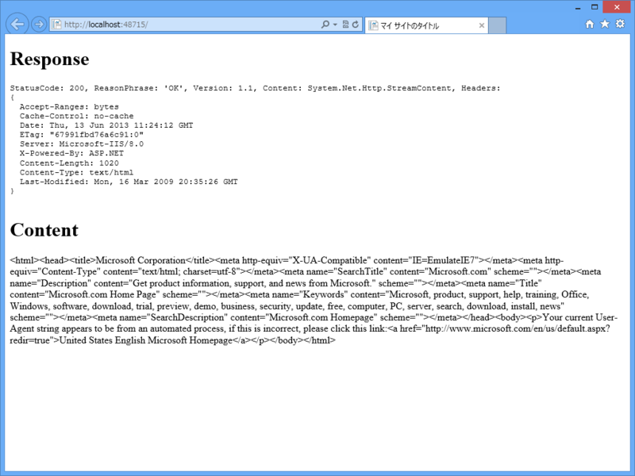
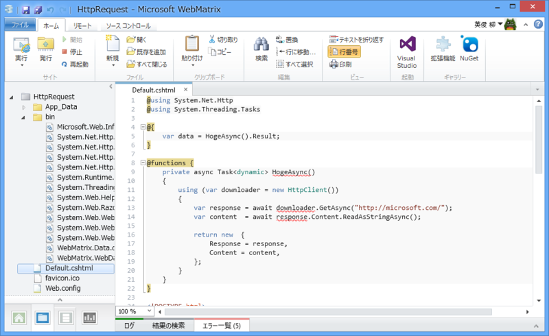

<blockquote cite="http://blogs.msdn.com/b/dotnet/archive/2013/05/29/get-httpclient-rtm-200-ok.aspx">

As promised in our last blog post we’re releasing Microsoft.Net.Http as a stable NuGet package today. Yep, that’s right: You can finally start using the portable HttpClient 2.1 in production!

<cite><a href="http://blogs.msdn.com/b/dotnet/archive/2013/05/29/get-httpclient-rtm-200-ok.aspx">Get /httpclient/rtm &ndash; 200 OK - .NET Blog - Site Home - MSDN Blogs</a></cite>
</blockquote>

Microsoft BCL チームが HttpClient を NuGet で利用できるようにして、すでに2週間が経っていた。汎用性の高いこのネットワーククライアントクラスは .NETer の第二の故郷となり、人々はそれでリクエストを飛ばし、受け取り、そして死んでいった。

――こいつの何が便利なのかは諸兄の解説に譲るとして。

<ul>
<li><a href="http://shiba-yan.hatenablog.jp/entry/20120822/1345563275">Web API &#x3088;&#x308A;&#x3082; HttpClient &#x306B;&#x6CE8;&#x76EE;&#x3057;&#x305F;&#x3044; - &#x3057;&#x3070;&#x3084;&#x3093;&#x96D1;&#x8A18;</a></li>
<li><a href="http://www.slideshare.net/neuecc/httpclient">HttpClient&#x8A73;&#x89E3;&#x3001;&#x6216;&#x3044;&#x306F;&#x975E;&#x540C;&#x671F;&#x306E;&#x843D;&#x3068;&#x3057;&#x7A74;&#x306B;&#x3064;&#x3044;&#x3066;</a></li>
</ul>
オラはこれを WebMatrix で使ってみるぞ！……正直 WebMatrix で使うべきものなのかはよくわからんが。

<h3>NuGet パッケージをインストール</h3>

空のサイト（ASP.NET）を作成。

“HttpClient”で検索して NuGet パッケージをインストール。これでした準備を完了。

<h3>とりあえず使ってみる</h3>

Microsoft のトップページでも Get してみるかの。

<pre class="code lang-html" data-lang="html" data-unlink>@using System.Net.Http

@using (var downloader = new HttpClient())
{
var response = downloader.GetAsync(&quot;http://microsoft.com/&quot;).Result;
var content  = response.Content.ReadAsStringAsync().Result;
Page.Response = response;
Page.Content  = content;
}

&lt;!DOCTYPE html&gt;

&lt;html lang=&quot;ja&quot;&gt;
&lt;head&gt;
&lt;meta http-equiv=&quot;Content-Type&quot; content=&quot;text/html; charset=utf-8&quot;/&gt;
        &lt;meta charset=&quot;utf-8&quot; /&gt;
        &lt;title&gt;マイ サイトのタイトル&lt;/title&gt;
        &lt;link href=&quot;~/favicon.ico&quot; rel=&quot;shortcut icon&quot; type=&quot;image/x-icon&quot; /&gt;
    &lt;/head&gt;
&lt;body&gt;
&lt;h1&gt;Response&lt;/h1&gt;
&lt;pre&gt;
@Page.Response
&lt;/pre&gt;

&lt;h1&gt;Content&lt;/h1&gt;
@Page.Content
&lt;/body&gt;
&lt;/html&gt;
</pre>

普通に使えた。WebClient のときよりも微妙にコードが長くなった気がするけど気にしない。今回は使えるかやってみるのが目標なので。

ちなみに @{ @using(){...} } の外側のカッコは省略できるけど（今回は省略して書いた）、変数のスコープを間違えやすいのでお勧めしない（今回の場合、var response がビューから呼べるような気がするけど呼べない）。

<h3>非同期にしてみる</h3>

これだけではあんまり面白くないので、async/await も使ってみるかな。……で、それで気づいたのだけど、WebMatrix のシンタックスハイライタは async/await に対応していない。まぁ、困りはしないが……

<pre class="code lang-html" data-lang="html" data-unlink>@using System.Net.Http
@using System.Threading.Tasks

@{
var data = HogeAsync().Result;
}

@functions {
private async Task&lt;dynamic&gt; HogeAsync()
{
using (var downloader = new HttpClient())
{
var response = await downloader.GetAsync(&quot;http://microsoft.com/&quot;);
var content  = await response.Content.ReadAsStringAsync();

return new {
Response = response,
Content = content,
};
}
}
}

&lt;!DOCTYPE html&gt;

&lt;html lang=&quot;ja&quot;&gt;
&lt;head&gt;
&lt;meta http-equiv=&quot;Content-Type&quot; content=&quot;text/html; charset=utf-8&quot;/&gt;
        &lt;meta charset=&quot;utf-8&quot; /&gt;
        &lt;title&gt;マイ サイトのタイトル&lt;/title&gt;
        &lt;link href=&quot;~/favicon.ico&quot; rel=&quot;shortcut icon&quot; type=&quot;image/x-icon&quot; /&gt;
    &lt;/head&gt;
&lt;body&gt;
&lt;h1&gt;Response&lt;/h1&gt;
&lt;pre&gt;
@data.Response
&lt;/pre&gt;

&lt;h1&gt;Content&lt;/h1&gt;
@data.Content
&lt;/body&gt;
&lt;/html&gt;
</pre>

結果は同じ。

<h3>まとめ</h3>

<ul>
<li>普通に使える</li>
<li>でも、利点は感じない（ストアアプリなんかだったらバリバリ使うけど）</li>
<li>シンタックスハイライタが async/await に対応していなかった</li>
</ul>

