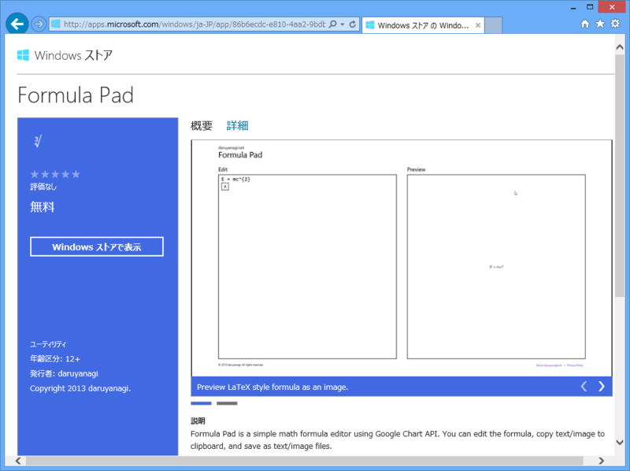

もしあなたが Windows ストア アプリを作っていて、なおかつ自分のサイトを APS.NET MVC/Web Pages で構築していたならば<a href="#f-a90bc3c5" name="fn-a90bc3c5" title="そんなやつおんのか？">*1</a>、Web ページに Windows ストア アプリの情報を埋め込みたいと思うかもしれませんね。

公式に oEmbed <a href="#f-928f5a5c" name="fn-928f5a5c" title="http://oembed.com/">*2</a>のような仕組みが提供されていればベストなのですが、残念ながらないみたい。仕方ないので、スクレイピングして埋め込み用のコードを取得する HTML ヘルパーを作ってみたいと思います。

 

<pre class="code lang-cs" data-lang="cs" data-unlink>#~/AppCode/WindowsStore.cshtml

@using System.Text
@using System.Text.RegularExpressions

@helper GetHtml(string id) {
const string ENDPOINT = &quot;http://apps.microsoft.com/windows/ja-JP/app/&quot;;
const string PATTERN1 = @&quot;itemprop=&quot;&quot;(?&lt;itemprop&gt;[^&quot;&quot;]+)&quot;&quot; content=&quot;&quot;(?&lt;content&gt;[^&quot;&quot;&lt;]+)&quot;&quot;&quot;;
const string PATTERN2 = @&quot;(href|src)=&quot;&quot;(?&lt;content&gt;[^&quot;&quot;&lt;]+)&quot;&quot;.+itemprop=&quot;&quot;(?&lt;itemprop&gt;[^&quot;&quot;]+)&quot;&quot;&quot;;
const string PATTERN3 = @&quot;itemprop=&quot;&quot;(?&lt;itemprop&gt;[^&quot;&quot;]+)&quot;&quot;[^&quot;&quot;&gt;]*&gt;(?&lt;content&gt;[^&lt;]+)&lt;&quot;;

using (var downloader = new WebClient())
{
downloader.Encoding = Encoding.UTF8;

var s = downloader.DownloadString(ENDPOINT + id);

var result = new Regex(@&quot;background-color:#([0-9a-fA-F]{6});&quot;)
.Matches(s)
.Cast&lt;Match&gt;()
.Skip(1).Take(1) // 2番目の background-color を取得
.Select(_ =&gt; new {
ItemProp = &quot;appColor&quot;,
Content = _.Groups[1].Value,
})
.Concat(
new Regex(PATTERN1).Matches(s).Cast&lt;Match&gt;()
.Select(_ =&gt; new {
ItemProp = _.Groups[&quot;itemprop&quot;].Value,
Content = _.Groups[&quot;content&quot;].Value.Trim(),
})
)
.Concat(
new Regex(PATTERN2).Matches(s).Cast&lt;Match&gt;()
.Select(_ =&gt; new {
ItemProp = _.Groups[&quot;itemprop&quot;].Value,
Content = _.Groups[&quot;content&quot;].Value.Trim(),
})
)
.Concat(
new Regex(PATTERN3).Matches(s).Cast&lt;Match&gt;()
.Select(_ =&gt; new {
ItemProp = _.Groups[&quot;itemprop&quot;].Value,
Content = _.Groups[&quot;content&quot;].Value.Trim(),
})
)
// 正規表現が手抜きなのでゴミ取り
.Where(_ =&gt; !string.IsNullOrEmpty(_.Content));

&lt;dl&gt;
@foreach (var item in result)
{
&lt;dt&gt;@item.ItemProp&lt;/dt&gt;
&lt;dd&gt;@item.Content&lt;/dd&gt;
}
&lt;/dl&gt;

}
}
</pre>
Windows ストアは Microdata<a href="#f-b492556d" name="fn-b492556d" title="http://www.w3.org/html/wg/drafts/microdata/master/">*3</a>で構造化されているみたいなので、基本的に itemprop という属性を探して値らしきものを取得するという方法でいいみたい（それでも数パターンの正規表現が必要だけど）。ただ、アプリのブランディングカラーは CSS でべた書きされているので、それは別途スクレイピング（今回は background-color を探して Take と Skip で二番目に現れたモノだけを取得るつという手抜き実装）。

あとはこれを実際に使ってみる。

<pre class="code lang-html" data-lang="html" data-unlink>#~/Default.cshtml

@{

}

&lt;!DOCTYPE html&gt;

&lt;html lang=&quot;ja&quot;&gt;
&lt;head&gt;
&lt;meta http-equiv=&quot;Content-Type&quot; content=&quot;text/html; charset=utf-8&quot;/&gt;
        &lt;meta charset=&quot;utf-8&quot; /&gt;
        &lt;title&gt;マイ サイトのタイトル&lt;/title&gt;
        &lt;link href=&quot;~/favicon.ico&quot; rel=&quot;shortcut icon&quot; type=&quot;image/x-icon&quot; /&gt;
    &lt;/head&gt;
&lt;body&gt;
@WindowsStore.GetHtml(&quot;86b6ecdc-e810-4aa2-9bdb-bb0da5b34737&quot;)
&lt;/body&gt;
&lt;/html&gt;
</pre>
で、結果はこんな感じ（name がダブってたりして、不完全だけど！）。

あとはビューやスタイルをいじっていい感じに仕上げればいい……のだけど、飽きた。

しかも、よく考えたら NancyFx <a href="#f-e1ed6ee5" name="fn-e1ed6ee5" title="https://blog.daruyanagi.jp/search?q=Nancy">*4</a>で JSON を返す API か何かにすればよかったね。そっちの方が汎用的に使える。

<a href="#fn-a90bc3c5" name="f-a90bc3c5" class="footnote-number">*1</a>:そんなやつおんのか？

<a href="#fn-928f5a5c" name="f-928f5a5c" class="footnote-number">*2</a>:<a href="http://oembed.com/">http://oembed.com/</a>

<a href="#fn-b492556d" name="f-b492556d" class="footnote-number">*3</a>:<a href="http://www.w3.org/html/wg/drafts/microdata/master/">http://www.w3.org/html/wg/drafts/microdata/master/</a>

<a href="#fn-e1ed6ee5" name="f-e1ed6ee5" class="footnote-number">*4</a>:<a href="https://blog.daruyanagi.jp/search?q=Nancy">https://blog.daruyanagi.jp/search?q=Nancy</a>

