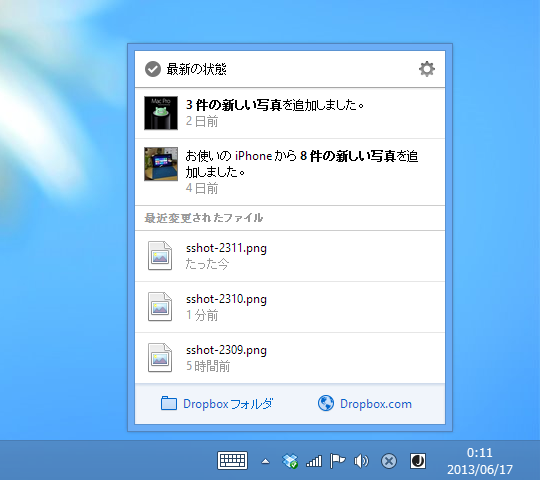
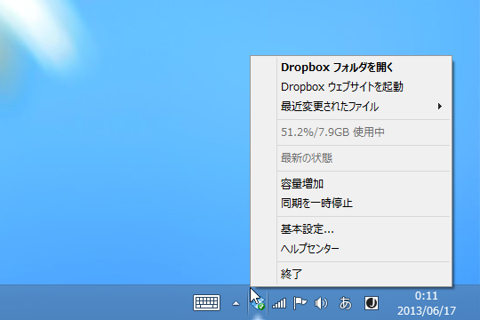
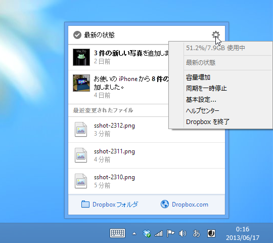

<blockquote cite="http://kjx130.blog19.fc2.com/blog-entry-4244.html">

新しいインターフェイスが使いにくい、どうしても馴染めないという方は⌥ を押すと良いみたいですよ。お好みで使い分けて下さい♪

<cite><a href="http://kjx130.blog19.fc2.com/blog-entry-4244.html">[Mac] Dropbox v2.x &#x3067;&#x65E7;&#x6765;&#x306E;&#x30E1;&#x30CB;&#x30E5;&#x30FC;&#x3092;&#x4F7F;&#x7528;&#x3059;&#x308B;&#x65B9;&#x6CD5;</a></cite>
</blockquote>

Windows 版も Dropbox v2.x で新しいユーザーインターフェイスが採用されているのだけれど、“どうしても馴染めないという方”がいるかもしれない。

そんな方は［Ctrl］キーを押しながらメニューを開いてください。古いメニューが表示されます。お好みで使い分けて下さい。

個人的には新しいメニューの方が好き。タッチだとコンテキストメニューを触るのは苦痛だしね。

