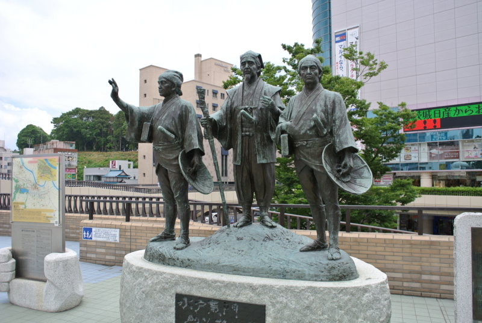
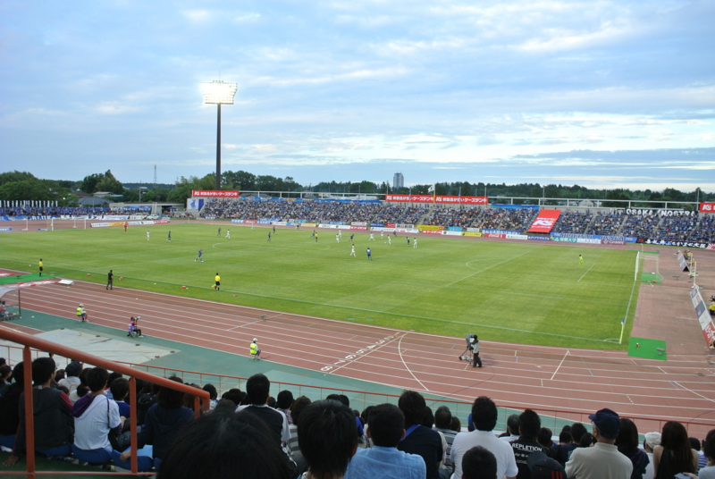
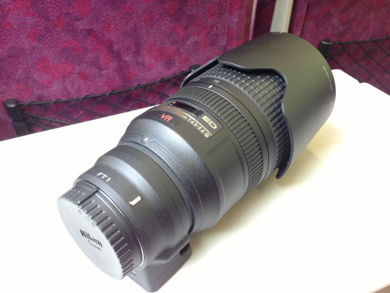
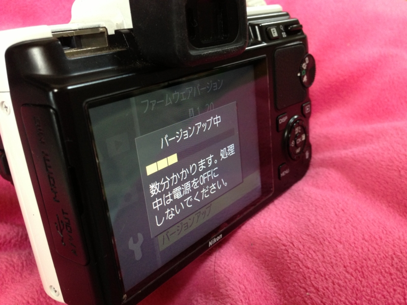
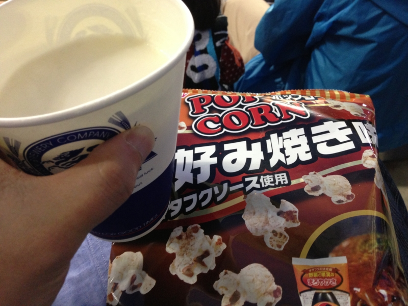

のんきにこんなこと（<a href="https://blog.daruyanagi.jp/entry/2012/11/25/230119">&#x30AC;&#x30F3;&#x30D0;&#x5927;&#x962A;&#x304C;&#x6B8B;&#x7559;&#x3059;&#x308B;&#x78BA;&#x7387;&#x3092;&#x8A08;&#x7B97;&#x3057;&#x3066;&#x307F;&#x305F;&#x3002; - &#x3060;&#x308B;&#x308D;&#x3050;</a>）してるうちに J2 降格を喫したガンバ大阪。今年は一回は応援しに行きたいなぁ、と思っていたところ、@herata_jp さんに誘われたので、はるばる水戸まで行ってきたった！<a href="#f-e1545595" name="fn-e1545595" title="残念ながら @herata_jp さんは仕事の都合で観戦できず……チケットまで手配してもらったのに、なんか申し訳ない">*1</a>

当日は雨の予報だったので、折り畳み傘もカッパも用意したのに、結局雨は降りませんでした。まぁ、わし、基本的に晴れ男やしな……。

今回は、サッカーを観る以外にも一つ試したいことがあった。それは、Nikon 1 V1 と FT-1 と AF-S VR Zoom-Nikkor 70-300mm f/4.5-5.6G を組み合わせて、超望遠撮影を行うこと！　理論上の焦点距離（35mm換算）はこれで 800mm を超えるはずなので、グラウンドとスタンドの距離が遠くてもちゃんと選手の姿が収められるはず。

 

<blockquote cite="http://dc.watch.impress.co.jp/docs/news/20130611_603165.html">

ニコンは11日、ミラーレスカメラ「Nikon 1」シリーズのボディおよびマウントアダプターFT1、GPSユニットの最新ファームウェアを公開した。これまでNikon 1ボディにFT1経由で一眼レフカメラ用AF-Sレンズを取り付けた場合、AFモードはシングルAFに限定されていたが、今回のファームアップでコンティニュアスAFにも対応する。

<cite><a href="http://dc.watch.impress.co.jp/docs/news/20130611_603165.html">&#x300C;Nikon 1&#x300D;&#x304C;AF-S&#x30EC;&#x30F3;&#x30BA;&#x4F7F;&#x7528;&#x6642;&#x306E;&#x30B3;&#x30F3;&#x30C6;&#x30A3;&#x30CB;&#x30E5;&#x30A2;&#x30B9;AF&#x306B;&#x5BFE;&#x5FDC; - &#x30C7;&#x30B8;&#x30AB;&#x30E1; Watch Watch</a></cite>
</blockquote>

ファームウェアのアップデートもばっちりやで！

――でも、結果はこんな感じ。

鈴木師匠<a href="#f-90697d11" name="fn-90697d11" title="退場乙であります！(`・ω・́)ゝ">*2</a>。ピントが合わない！

というか、あっちこっちに飛び交うボールを捉えるのですら一苦労だ。やっぱ素人にはムリか。航空祭なんかだと、少しは戦えるかなぁ。

試合の方は、ガンバが前半と後半に1点ずつ加えて無難に勝利。水戸のほうは少し引いてくるのかなと思っていたのだけど、案外ガップリ四つ、ガチで攻めるシーンも少なくなくて「なかなかやるなぁ」と思わされた。とはいえ、ガヤさんのミスを誘発するほどのピンチもなく、ほとんど完勝といっていい出来だったと思う。

個人的には水戸の SB 近藤が結構気に入った。プレイに魂が感じられる選手は大好き。自分が水戸ファンなら、ユニフォームを買ってもいいなと思う。ガンバ側は、明神が効いていたかな？　あと、「入場者数、10,025人！」のアナウンスでスタジオ全体がどよめいたのは、ちょっと楽しくて、行ってよかったなと思えた。

最後に。

帰るときにハンドタオルを落としたのだけど、近くにいた女の子が届けてくれました。水戸のサポーターかな？　水戸の人は優しいですなぁ……ほんま、おおきに！

<a href="#fn-e1545595" name="f-e1545595" class="footnote-number">*1</a>:残念ながら @herata_jp さんは仕事の都合で観戦できず……チケットまで手配してもらったのに、なんか申し訳ない

<a href="#fn-90697d11" name="f-90697d11" class="footnote-number">*2</a>:退場乙であります！(`・ω・́)ゝ

