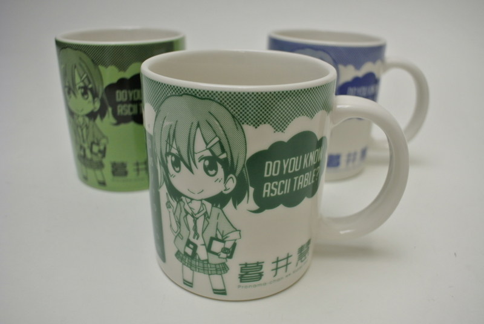
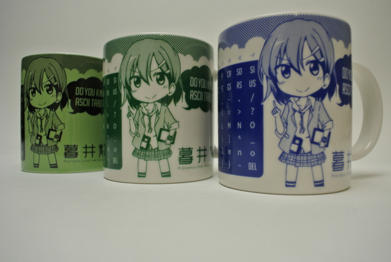
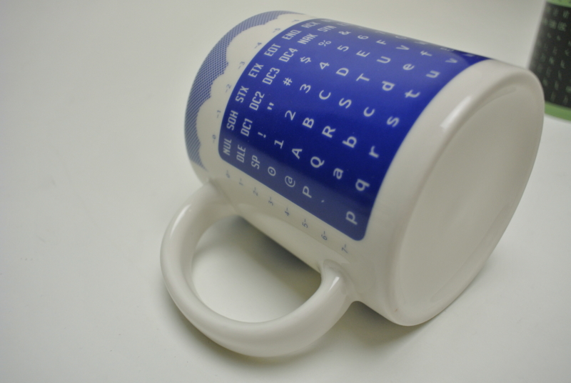
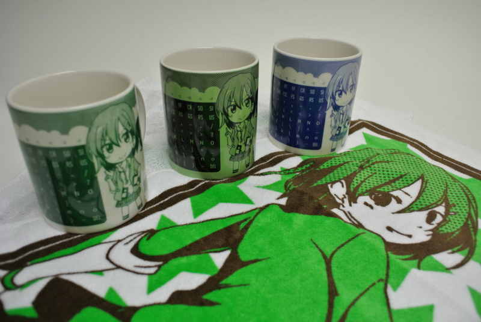

とある日の朝、プロ生ちゃんのプロデューサーから突如謎の段ボールが送られてきた。震える手でそれを開くと……なかには新しいプロ生ちゃんグッズが！！

今回はマグカップらしい。なかなかのデキである。

で、注目すべきはコレ！　ASCII コード表がプリントしてある。本職のプログラマーなら頭の中に入ってるんだろうけれど、自分のようなホビープログラマーは毎回これを<del>ググ</del>ビングってるわけだが……これからはそんな必要もない！　かわいいだけでなく、実用的。これぞ「用の美」（<a href="http://ja.wikipedia.org/wiki/%E6%9F%B3%E5%AE%97%E6%82%A6">&#x67F3;&#x5B97;&#x60A6; - Wikipedia</a>）ではないだろうか。

ぜひ、タオルともども勉強会（直近は <a href="http://atnd.org/events/40204">&#x30D7;&#x30ED;&#x30B0;&#x30E9;&#x30DF;&#x30F3;&#x30B0;&#x751F;&#x653E;&#x9001;&#x52C9;&#x5F37;&#x4F1A; &#x7B2C;23&#x56DE;&#xFF20;&#x5927;&#x962A; #pronama : ATND</a>）でゲットしてくれたまい。

<ul>
<li><a href="http://pronama.jp/">&#x30D7;&#x30ED;&#x30B0;&#x30E9;&#x30DF;&#x30F3;&#x30B0;&#x751F;&#x653E;&#x9001;</a></li>
</ul>