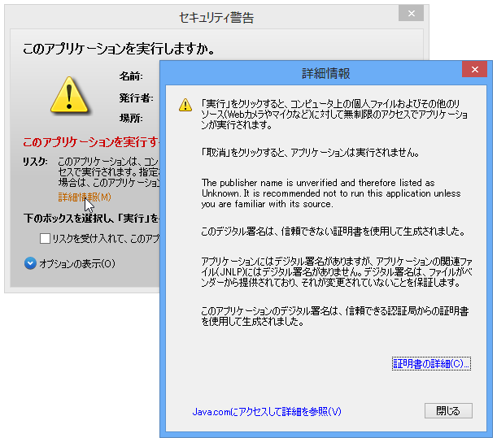
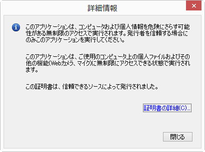
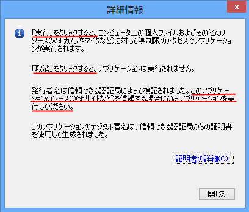
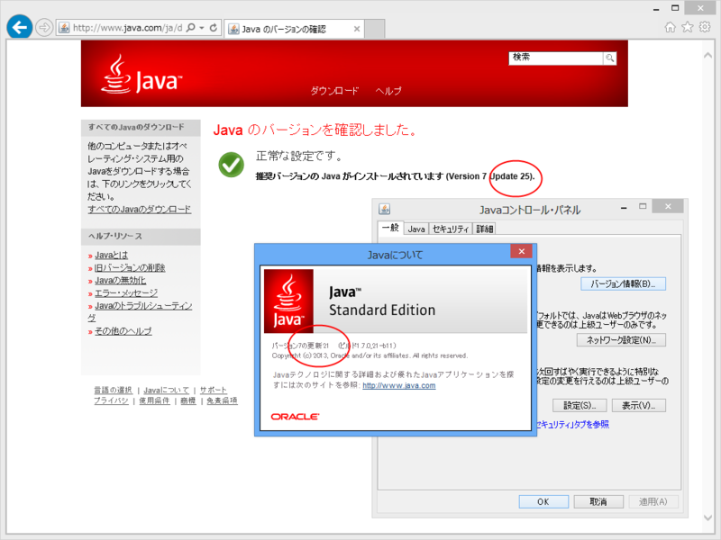

開発者向けのセキュリティ機能はこの際置いとくとして、エンドユーザー向けにも結構親切な作りになってきたなと思わせる変更。

<h3>Update 21</h3>

すごくそっけない。

<h3>Update 25</h3>

［実行］を押したらどうなるか、［取消］を押したらどうなるか、が明確に書かれている。また、どういう基準で実行していいのかもわかりやすい。地味なダイアログなので、どこまでみてもらえるか多少心もとないけど、書いてあるのとないのとでは大きな違いだ。

この［詳細情報］ダイアログはアプリケーションによって内容は異なるのだけど、数種類のアプリケーションを試して、どれもメッセージが丁寧になっている点には好感をもった。

とはいえ、なんだかなーっていう部分もまだまだ多いのだけど。

それはそうと、Java のアップデートで McAfee がインストールされるようになったと耳にしたのだけど、ウチの環境ではそんなことなかった。毎回インストーラーで更新しているのだけど、アップデーターではそうなるのだろうか。

<ul>
<li><a href="http://www.forest.impress.co.jp/docs/news/20130619_604263.html">Oracle&#x3001;40&#x4EF6;&#x306E;&#x8106;&#x5F31;&#x6027;&#x3092;&#x4FEE;&#x6B63;&#x3057;&#x305F;&#x300C;JRE 7 Update 25&#x300D;&#x300C;JDK 7 Update 25&#x300D;&#x3092;&#x516C;&#x958B; - &#x7A93;&#x306E;&#x675C;</a></li>
</ul>

