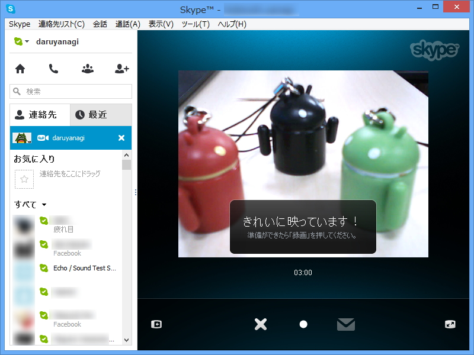

<blockquote cite="http://www.forest.impress.co.jp/docs/news/20130618_604141.html">

Skypeは17日、“ビデオメッセージ”機能を正式リリースしたと発表した。本機能は、これまでテストを目的としたプレビュー版として提供されていた。

<cite><a href="http://www.forest.impress.co.jp/docs/news/20130618_604141.html">Skype&#x3001;&#x30D3;&#x30C7;&#x30AA;&#x30E1;&#x30C3;&#x30BB;&#x30FC;&#x30B8;&#x6A5F;&#x80FD;&#x3092;&#x6B63;&#x5F0F;&#x30EA;&#x30EA;&#x30FC;&#x30B9; - &#x7A93;&#x306E;&#x675C;</a></cite>
</blockquote>

      Skype、ビデオメッセージ機能を正式リリース - 窓の杜 <a class="twitter-tweet-url" href="http://t.co/VQF8ukUfnJ" target="_top">URL</a> @<a class="twitter-user-screen-name" href="http://twitter.com/madonomori" target="_top">madonomori</a>さんから　WindowsPhoneは・・・

<a href="http://twitter.com/myon_kajika/status/346916347353124864" class="twitter-detail-info-permalink">2013-06-18 18:04:37</a> via <a href="http://twitter.com/tweetbutton" rel="nofollow">Tweet Button</a>

 

Windows Phone ね！　ボクも大好きさ。だから、もちろん試してあるんだ。

記事にも書いてある通り、正式サポートされていない端末ではブラウザーを利用したビデオメッセージの再生が可能。リンクとパスコードが送られてくるので、それを開けばいい……

はずなんだけど！　いつまで経っても再生されない。

ちなみに日本で合法的に利用できる Windows Phone 7.x 端末<a href="#f1" name="fn1" title="海外 SIM を使うとか言う手段で合法化できるらしいが、私がおすすめすることではない">*1</a>で利用できる Skype の最新版は、1.3.0.0 だ。Windows Phone 8 の場合は、 2.6.0.148。とてもうらやましいですね。

最近 Windows Phone 7.x のサポートがないアプリが増えてきていて、もう終わりなんだなぁ、と感じさせられる<a href="#f2" name="fn2" title="もし自分が開発者だったとしても、新しい端末だけをサポートするだろう">*2</a>。

<a href="#fn1" name="f1" class="footnote-number">*1</a>:海外 SIM を使うとか言う手段で合法化できるらしいが、私がおすすめすることではない

<a href="#fn2" name="f2" class="footnote-number">*2</a>:もし自分が開発者だったとしても、新しい端末だけをサポートするだろう

