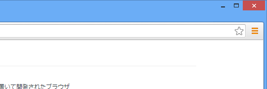
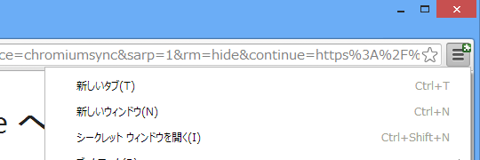

「Google Chrome」本体にアップデートがあると［Google Chrome の設定］ボタンが青くなる<a href="#f-2499763b" name="fn-2499763b" title="緑色だけど">*1</a>というのを、<a href="https://blog.daruyanagi.jp/entry/2013/06/09/234743">Google Chrome &#x3092;&#x66F4;&#x65B0;&hellip;&hellip;&#x304C;&#x66F4;&#x65B0; - &#x3060;&#x308B;&#x308D;&#x3050;</a> で紹介したのだけど、<a href="http://www.forest.impress.co.jp/docs/news/20130620_604504.html">Google&#x3001;&#x30D7;&#x30ED;&#x30B0;&#x30E9;&#x30DF;&#x30F3;&#x30B0;&#x8A00;&#x8A9E;&#x300C;Dart&#x300D;&#x521D;&#x3081;&#x3066;&#x306E;&#x30D9;&#x30FC;&#x30BF;&#x7248;&#x3092;&#x30EA;&#x30EA;&#x30FC;&#x30B9; - &#x7A93;&#x306E;&#x675C;</a> で「Dartium」を試していて、このボタンが黄色くなる場合があることにも気付いた。

「Chronium 29」で確認<a href="#f-a8808e0d" name="fn-a8808e0d" title="「Google Chrome 28」（Beta）でも確認">*2</a>。どうやらサードパーティアプリによって新しい拡張機能が（こっそり）ブラウザーへ追加されたことを示すようだ（<a href="https://blog.daruyanagi.jp/entry/2013/02/26/213124">Google Chrome 25&#xFF1A;&#x8ABF;&#x6574;&#x306E;&#x305F;&#x3081;&#x306E;&#x6642;&#x9593; - &#x3060;&#x308B;&#x308D;&#x3050;</a>）。

ちなみに従来の表示はこんな感じだった。拡張機能のアイコンが小さく［Google Chrome の設定］ボタンの上に表示される。正直、これはちょっとわかりづらい。

だからなんだって感じなのだけど、こういう改善もあるんだなぁ、と。

ちなみに、「Google Chrome」本体のアップデートとサードパーティアプリによる拡張機能の追加がカブッた場合は、黄色が優先されるようだ。

<a href="#fn-2499763b" name="f-2499763b" class="footnote-number">*1</a>:緑色だけど

<a href="#fn-a8808e0d" name="f-a8808e0d" class="footnote-number">*2</a>:「Google Chrome 28」（Beta）でも確認

