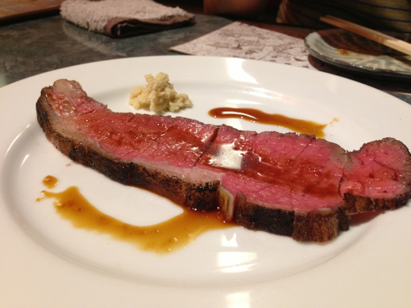
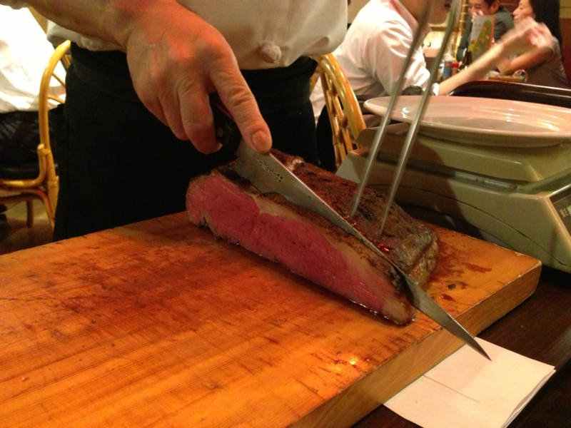
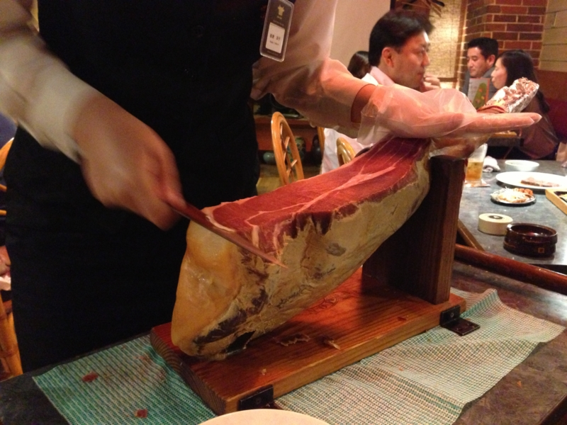
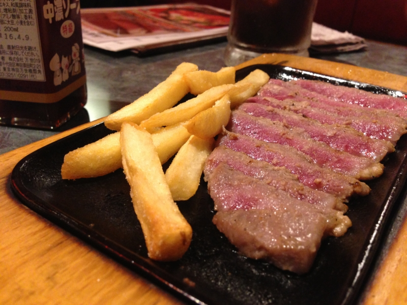
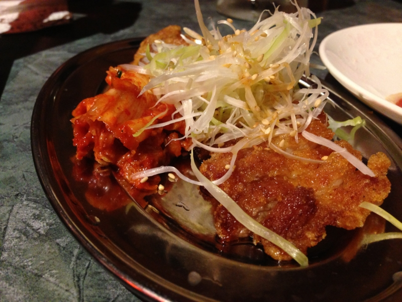

木曜日の晩だったかな？　@shibayan と“肉の万世”のビル（通称“肉ビル”）の地下にある居酒屋『呉越同舟』に行ってきた。最上階は行かないのかって？　そんなカネはない<a href="#f1" name="fn1" title="肉ビルでは階が上になればなるほど、お値段が高くなるという。今のところ 5F の焼き肉店『万世牧場』までしか行ったことがない">*1</a>。

おっちゃんが目の前でローストビーフを切ってくれるぜー！

お姉さん（顔出し不許可）も目の前で生ハムを切ってくれるぜー！

なんということもないのだけど、こういう演出があるだけでちょっと楽しくなる。

結構食べまくったけど、二人で10,000円ちょっとだったので、それほど高くはない。というか、変なところでハズレ引くことを考えれば、なかなかよいチョイス。お肉美味しいし、また行きたい。

ちなみに、1F で提供されるパーコーメン（排骨拉麵）の“排骨”をツマミとして頼むこともできる。排骨拉麵はまだ食べたことがないので行ってみたい。

<ul>
<li><a href="http://akiba-pc.watch.impress.co.jp/hotline/20121013/etc_comic1.html">&#x3061;&#x3087;&#x3073;&#xFF06;&#x59C9;&#x3061;&#x3083;&#x3093;&#x306E;&#x300E;&#x30A2;&#x30AD;&#x30D0;&#x3067;&#x3054;&#x306F;&#x3093;&#x98DF;&#x3079;&#x305F;&#x3044;&#x306A;&#x3002;&#x300F; &#x301C;&#x30E9;&#x30FC;&#x30E1;&#x30F3;/&#x7ACB;&#x5451;&#x307F;&#x300C;&#x8089;&#x306E;&#x4E07;&#x4E16; &#x79CB;&#x8449;&#x539F;&#x672C;&#x5E97; &#x4E07;&#x4E16;&#x6A4B;&#x9152;&#x5834;&#x300D;&#x7DE8;&#x301C;</a></li>
</ul>

<a href="#fn1" name="f1" class="footnote-number">*1</a>:肉ビルでは階が上になればなるほど、お値段が高くなるという。今のところ 5F の焼き肉店『万世牧場』までしか行ったことがない

