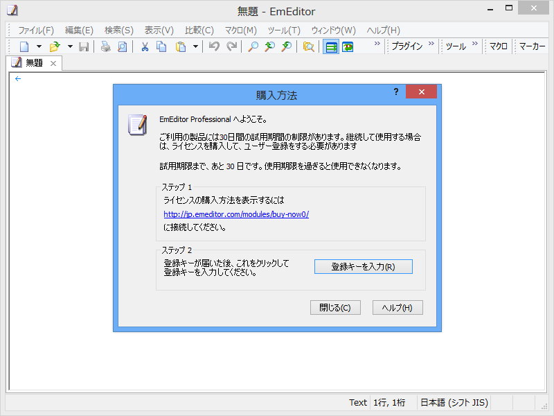
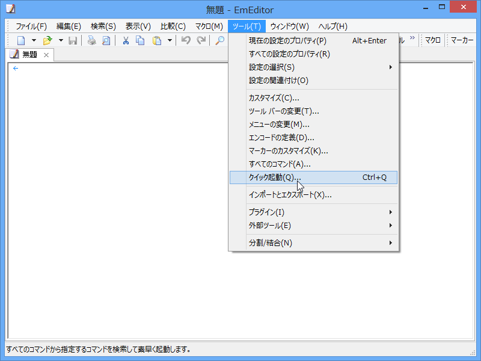
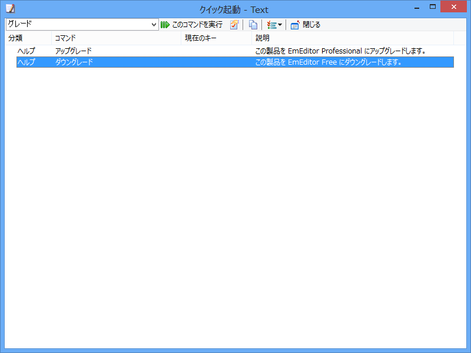
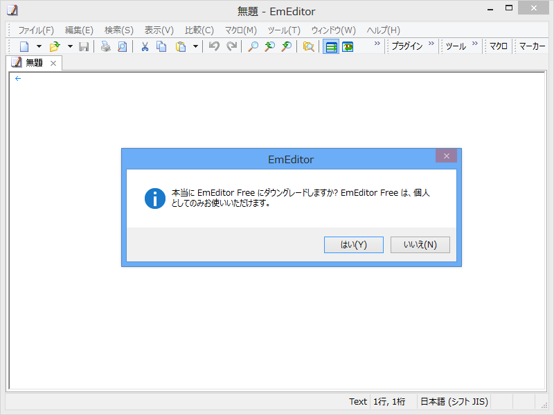
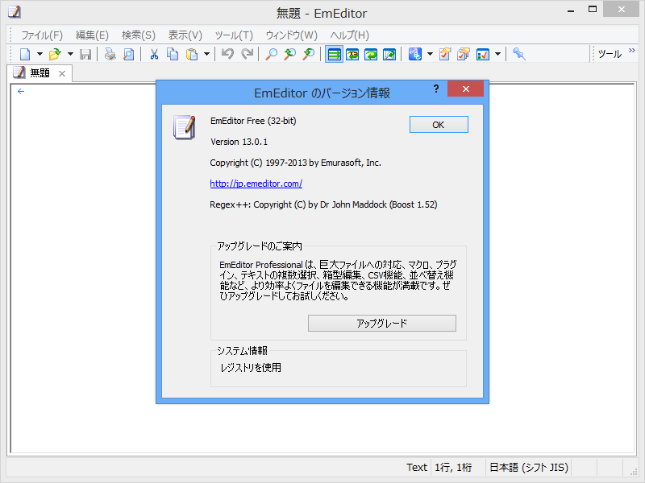

<a href="http://it.slashdot.jp/story/13/06/21/0545212/">&#x30C6;&#x30AD;&#x30B9;&#x30C8;&#x30A8;&#x30C7;&#x30A3;&#x30BF;&#x300C;EmEditor&#x300D;v13.0&#x304C;&#x30EA;&#x30EA;&#x30FC;&#x30B9;&#x3002;&#x7121;&#x511F;&#x7248;&#x3082;&#x4F75;&#x305B;&#x3066;&#x30EA;&#x30EA;&#x30FC;&#x30B9; | &#x30B9;&#x30E9;&#x30C3;&#x30B7;&#x30E5;&#x30C9;&#x30C3;&#x30C8;&#x30FB;&#x30B8;&#x30E3;&#x30D1;&#x30F3; IT</a> を読んでいて「試用期間中のダイアログがうるさい」という意見をみかけたので。この方法は、公式（<a href="http://jp.emeditor.com/modules/newbb/viewtopic.php?topic_id=2067&forum=21">EmEditor (&#x30C6;&#x30AD;&#x30B9;&#x30C8;&#x30A8;&#x30C7;&#x30A3;&#x30BF;) - EmEditor Free &#x3068; EmEditor Professional &#x306E;&#x6A5F;&#x80FD;&#x306E;&#x9055;&#x3044;</a>）でもアナウンスされている。

<h3>“クイック起動”をクイッと起動</h3>

［ツール］－［クイック起動］メニューを選択。［Ctrl］＋［Q］キーだとクイックに起動できる。この機能は「Visual Studio 2012」から<del>パクっ</del>、じゃなくて、インスパイアされたのかな？　メニューがやたら多いソフトにはこういう機能がついていると嬉しいよね。

<h3>“ダウングレード”コマンド</h3>

コマンドの絞り込み検索機能で“ダウングレード”コマンドを探して実行。ちなみに“アップグレード”コマンドで Pro 版になる。

Free 版は個人用途に限定されているので注意。

「EmEditor」がライセンス周りに五月蠅く、方針も二転三転してめんどくさいのは確か。でも、だからといってライセンスをそれが守らない理由になるわけではないですよ。

バージョンダイアログで Free 版になっていることを確認しましょう。終り！

ソースコードを書くならともかく、記事書くときは「Sublime Text 2」って感じじゃないんだよねぇ……。

