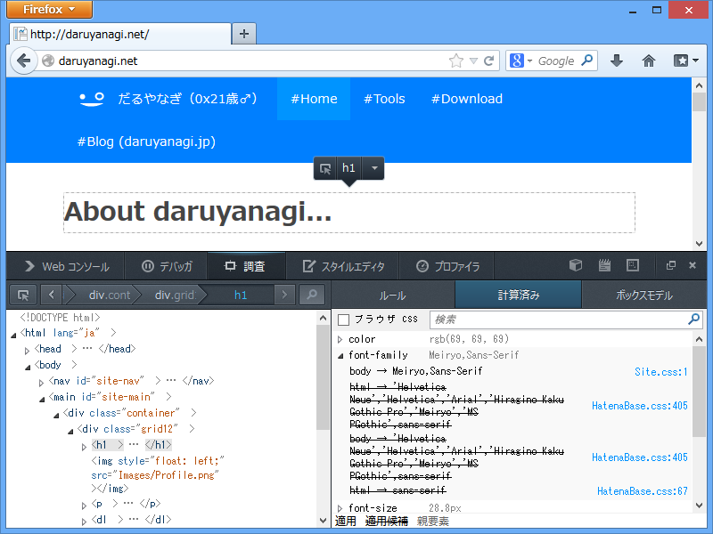
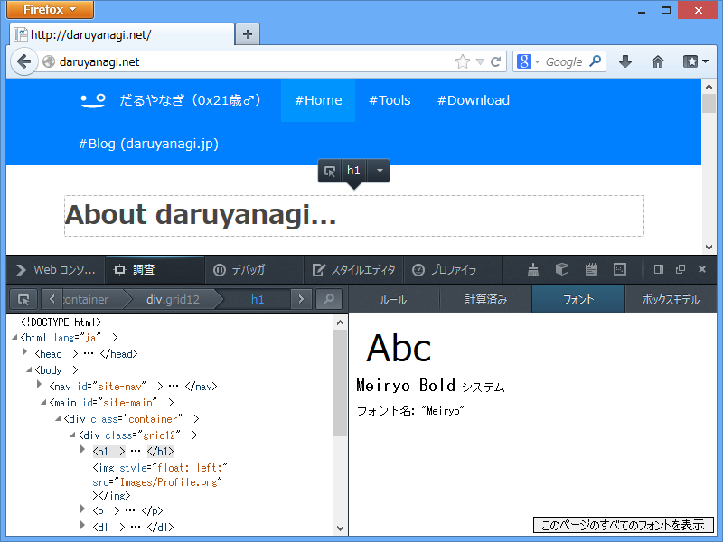
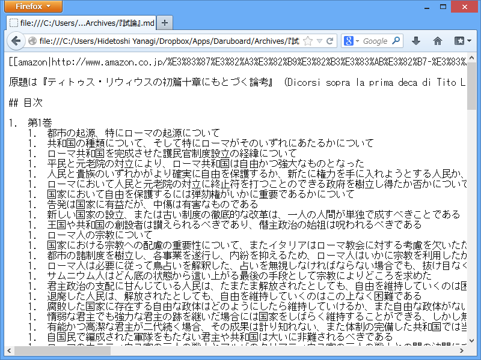
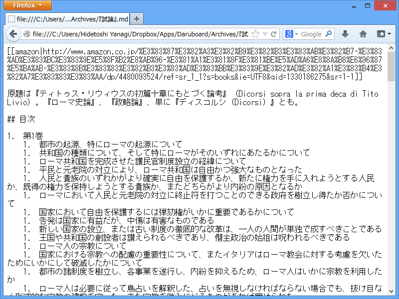

<h3>インスペクタでフォントのプレビューが可能に</h3>

「Mozilla Firefox 21」の場合。

「Mozilla Firefox 22」の場合。ページでつかわれているフォントをすべてプレビューすることもできるみたい。

<h3>プレーンテキストの折り返し</h3>

「Mozilla Firefox 21」の場合。

「Mozilla Firefox 22」の場合。右端で折り返されるので、行が長くても横スクロールが不要。

<ul>
<li><a href="http://www.forest.impress.co.jp/docs/news/20130626_605181.html">Mozilla&#x3001;&#x300C;Firefox 22&#x300D;&#x3092;&#x6B63;&#x5F0F;&#x516C;&#x958B; - &#x7A93;&#x306E;&#x675C;</a></li>
</ul>
そのほかにも、いろいろ挙げればキリがないケド。

