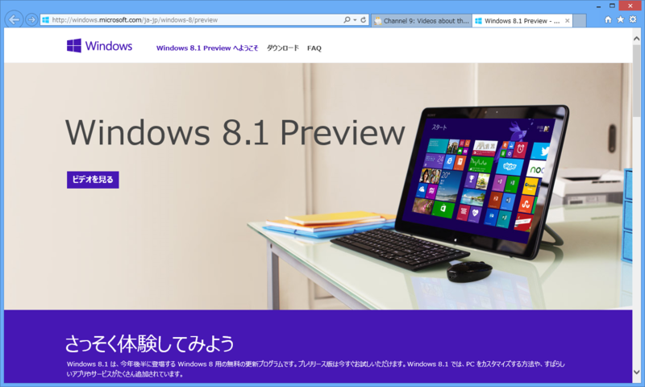
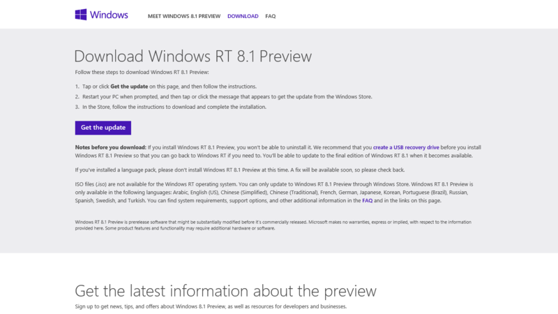
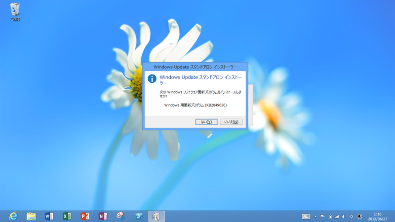
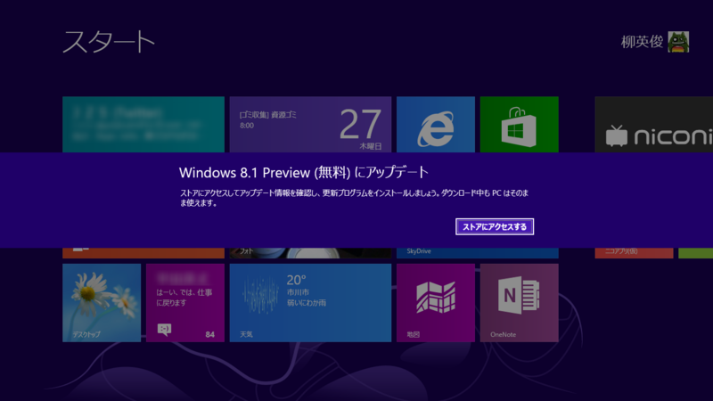
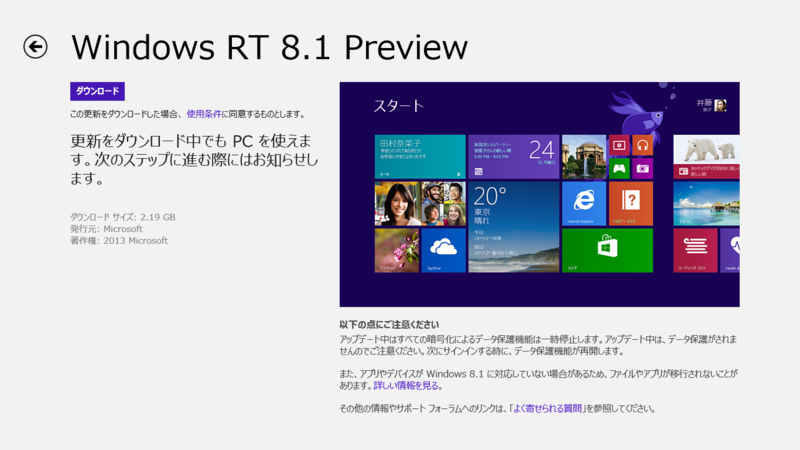
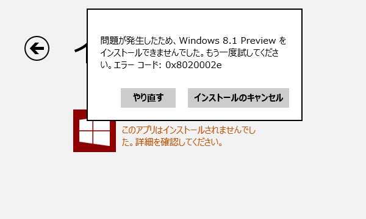
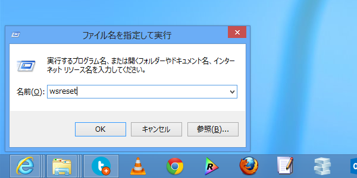
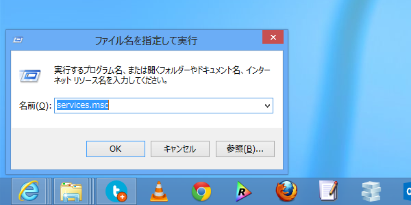
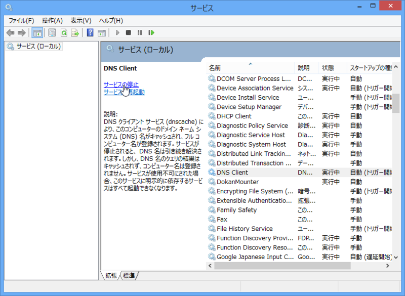

Windows RT 8.1 Preview がきた━━━━━━(ﾟ∀ﾟ)━━━━━━!!!!

<ul>
<li><a href="http://windows.microsoft.com/ja-jp/windows-8/preview">Windows 8.1 Preview - Microsoft Windows</a></li>
</ul>
さっそくインストールしてみました。

<h3>KB2849636 のインストール</h3>

まず更新プログラム KB2849636 をダウンロード。これは Windows ストアで Windows RT 8.1 Preview のダウンロードを入手するために必要。

デスクトップでダウンロードした更新プログラムをインストール。

Windows ストアで Windows RT 8.1 Preview が入手できるようになる。

<h3>Windows ストアからダウンロード</h3>

Windows ストアで Windows RT 8.1 Preview をダウンロード。

2GB 以上あるのでじっと待つ。

死にたい。

Surface RT を工場出荷時へ初期化してインストールを数回試みたけれど、いずれも 0x8020002e エラーで停止する。

というわけで、Windows 8.1 Preview のフォーラムへ一番乗りしたった！

<ul>
<li><a href="http://answers.microsoft.com/ja-jp/windows/forum/windows8_1_pr-windows_update/windows-rt-81-preview/ac0096c9-447c-4544-b757-c7f3f687ec53">Windows RT 8.1 Preview &#x306E;&#x30A4;&#x30F3;&#x30B9;&#x30C8;&#x30FC;&#x30EB;&#x306B;&#x5931;&#x6557;&#x3059;&#x308B;&#xFF08;0x8020002e&#xFF09; - &#x30DE;&#x30A4;&#x30AF;&#x30ED;&#x30BD;&#x30D5;&#x30C8; &#x30B3;&#x30DF;&#x30E5;&#x30CB;&#x30C6;&#x30A3;</a></li>
</ul>
自分でも解決策を模索してみるけれど、もし先に見つけた人がいたら教えてください。

<h3>追記: 0x8020002e エラーの解消</h3>

まともな情報がココぐらいしかないので、挙げられている解決策をしらみつぶしに行なってみた。

<ul>
<li><a href="http://answers.microsoft.com/en-us/windows/forum/windows_8-windows_store/error-code-0x8020002e-unable-to-update-or-install/26b83d0b-9385-42a6-a5cd-72ee33e2426d">Error code: 0x8020002e unable to update or install windows 8 pro - Microsoft Community</a></li>
</ul>

<h4>wsreset.exe によるキャッシュのクリア</h4>

ストアアプリのキャッシュを削除する。まずこれを試してみて、動けば幸運。自分の場合、これだけではダメだった。

<h4>DNS Client Service の停止</h4>

Windows サービスの管理画面を起動し、

「DNS Client」を停止する（キャッシュのクリアも忘れないこと）。ウチの環境ではこれが正解だった。ダウンロードを再試行したところ、インストールが開始された。

あとは、安定した回線を利用するようにするといった対策をとるしかないみたい。 

