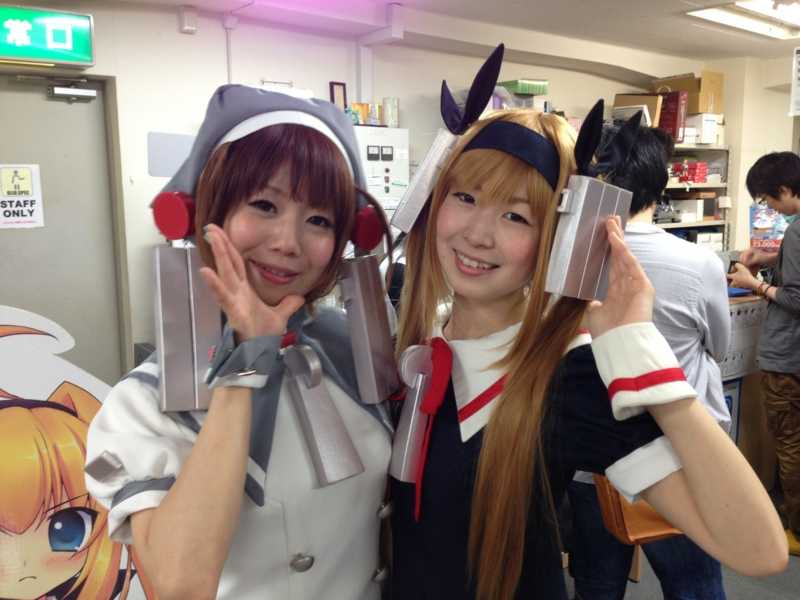
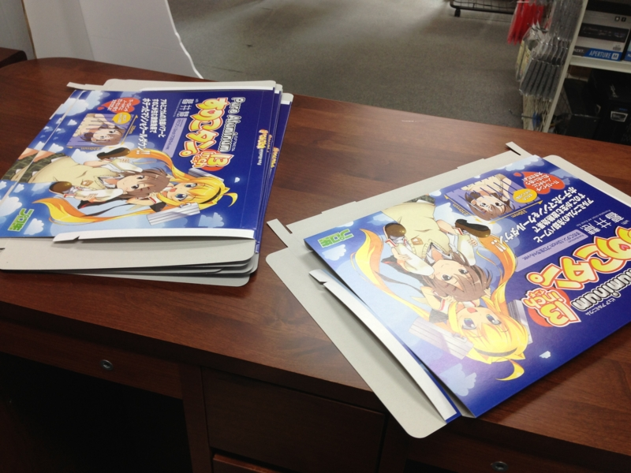
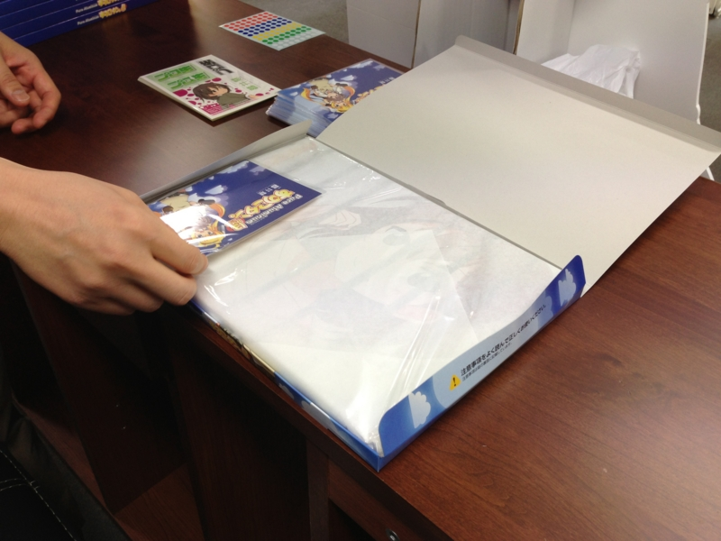
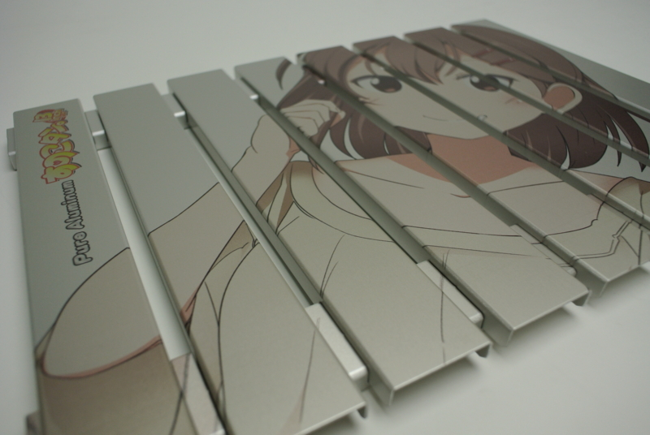
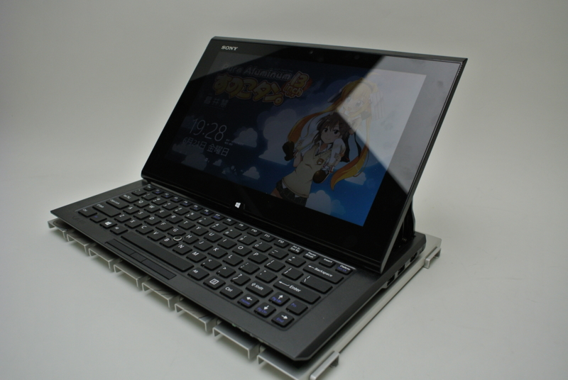
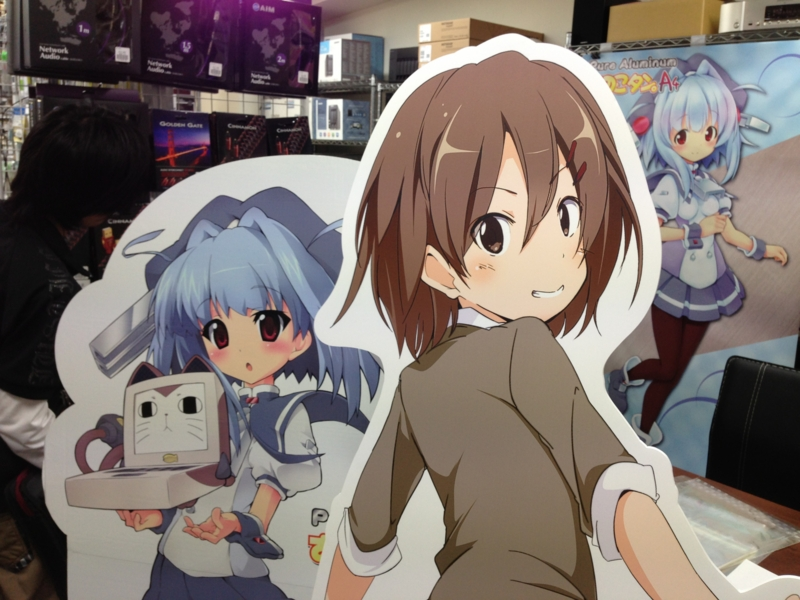
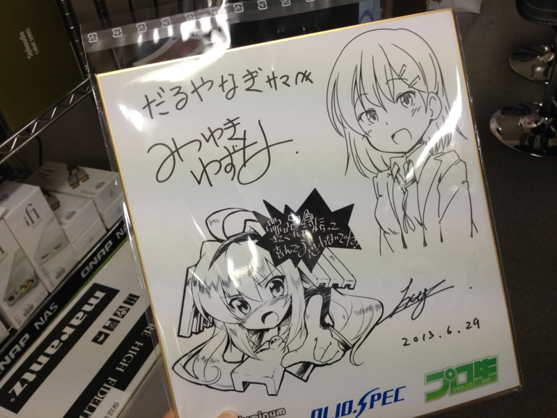
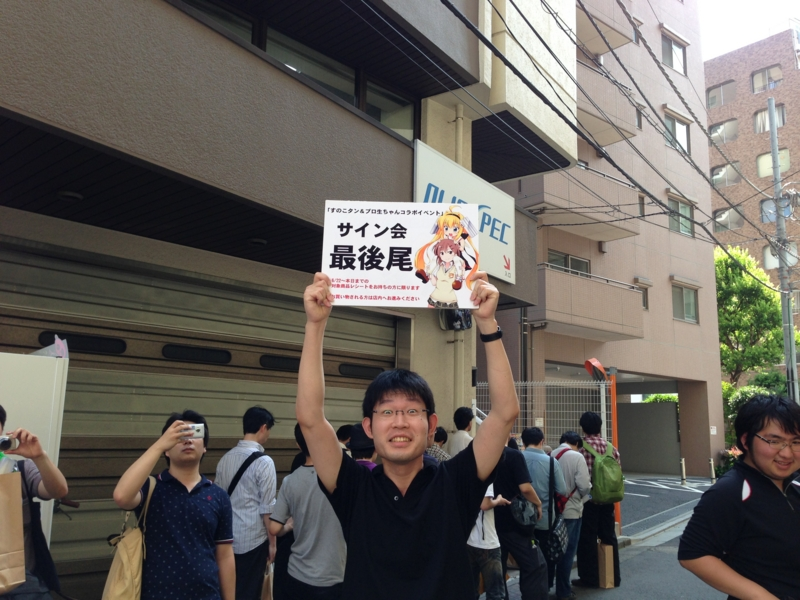
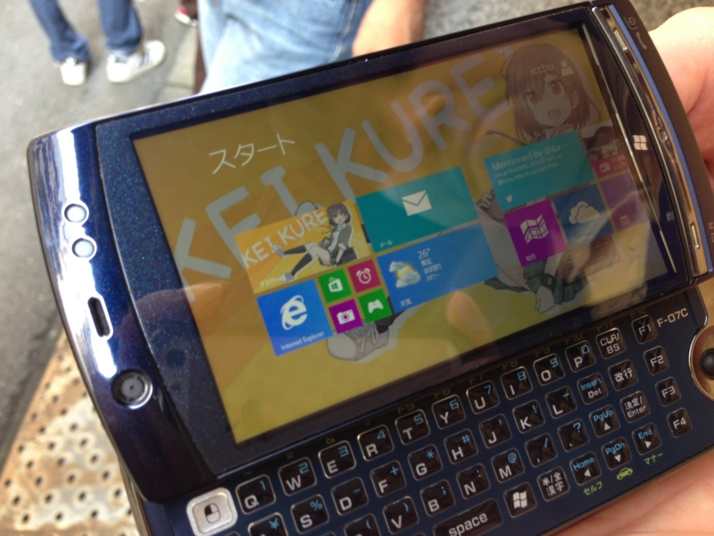

<blockquote cite="http://akiba-pc.watch.impress.co.jp/docs/news/news/20130629_605770.html">

　ちょっと異色だったのが、オリオスペックが実施した「すのこタン」と「プロ生ちゃん」のコラボイベント。

　このイベントは、マルダイのアルミ製冷却台「すのこタン。」と、IT・開発系コミュニティ「プログラミング生放送」のキャラクター「暮井 慧（プロ生ちゃん）」という両キャラクターのコラボ製品の発売を記念したもの。

<cite><a href="http://akiba-pc.watch.impress.co.jp/docs/news/news/20130629_605770.html">&#x81EA;&#x4F5C;&#x7CFB;&#x30A4;&#x30D9;&#x30F3;&#x30C8;&#x304C;&#x591A;&#x6570;&#x5B9F;&#x65BD;&#x3001;&#x5909;&#x614B;/&#x30AA;&#x30DA;&#x30A2;&#x30F3;&#x30D7;/OC/&#x30B3;&#x30B9;&#x30D7;&#x30EC;&#x30A4;&#x30E4;&#x30FC;&hellip;</a></cite>
</blockquote>

参加してきました！

<ul>
<li><a href="http://pronama.azurewebsites.net/2013/07/01/collabo-event-report">&#x3059;&#x306E;&#x3053;&#x30BF;&#x30F3;&#xFF06;&#x30D7;&#x30ED;&#x751F;&#x3061;&#x3083;&#x3093;&#x30B3;&#x30E9;&#x30DC;&#x30A4;&#x30D9;&#x30F3;&#x30C8; &#x7D42;&#x4E86;&#xFF01; | &#x30D7;&#x30ED;&#x30B0;&#x30E9;&#x30DF;&#x30F3;&#x30B0;&#x751F;&#x653E;&#x9001;</a></li>
</ul>
というか、なぜか製品の梱包箱を折るのを手伝わされていました……。

折った箱には、すのことオリジナルカードを封入。これが店頭に並んだわけです。

ちなみに「すのこ」というのはノート PC の冷却台。アルミかなにかでできていて、PC の下に敷いて使う。夏場だと放熱が大変だったりするので、こういうのが一枚あると案外役に立つそうだ。で、そのキャラクターが「すのこタン。」になのかな？　プロ生ちゃん（<a href="http://pronama.jp/">&#x30D7;&#x30ED;&#x30B0;&#x30E9;&#x30DF;&#x30F3;&#x30B0;&#x751F;&#x653E;&#x9001;</a>）については、説明は必要ありませんよね。

コスプレパフォーマンスあり、イラストレーターさんのサイン会ありと、かなり盛り上がったような気がします。こういうイベントに参加したのは初めてだったのだけど、あんがい楽しいものですねぇ。

なにはともあれ、参加してくださった方、ありがとうございました！<a href="#f1" name="fn1" title="写真は荒ぶる野村君">*1</a>

<ul>
<li>商品の紹介: <a href="http://akiba-pc.watch.impress.co.jp/hotline/20130629/ni_csunoko.html">[&#x65B0;&#x88FD;&#x54C1;]&#x30DE;&#x30EB;&#x30C0;&#x30A4; &#x3059;&#x306E;&#x3053;&#x30BF;&#x30F3;&#x3002;13inch &#x30D7;&#x30ED;&#x751F;&#x3061;&#x3083;&#x3093; ver. (2013&#x5E74;6&#x6708;29&#x65E5;)</a></li>
</ul>

<h3>番外編</h3>

Windows 8.1 Phone。頭おかしい。

縦解像度が足りなくてストアアプリが起動できないけれど<a href="#f2" name="fn2" title="アスペクト比が崩れてもいいのならば、最低限の縦解像度を確保して起動することは可能">*2</a>、スタート画面の動きはなめらか。これは案外ありかもしれない。

<a href="#fn1" name="f1" class="footnote-number">*1</a>:写真は荒ぶる野村君

<a href="#fn2" name="f2" class="footnote-number">*2</a>:アスペクト比が崩れてもいいのならば、最低限の縦解像度を確保して起動することは可能

