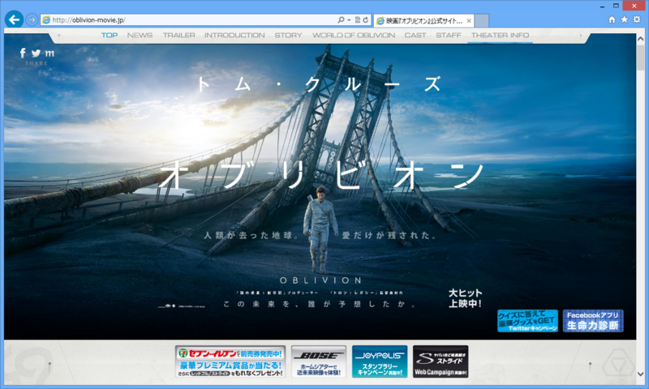
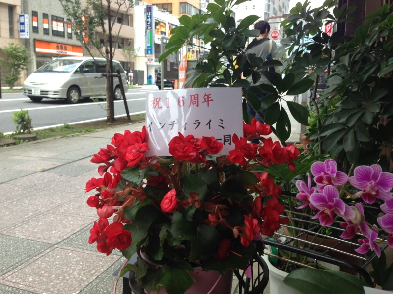
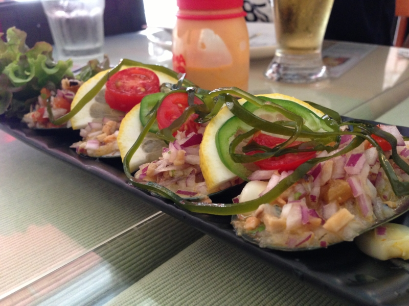
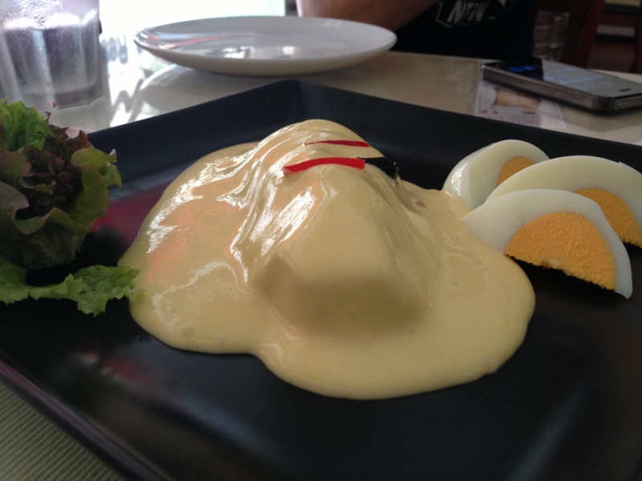
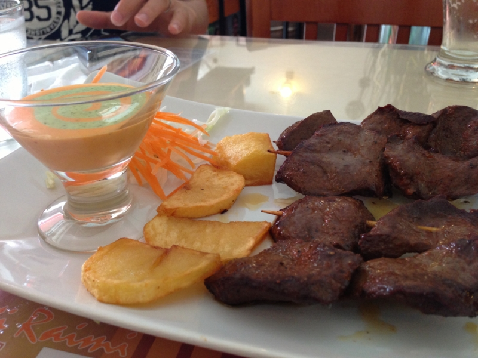

<a href="http://oblivion-movie.jp/">&#x6620;&#x753B;&#x300E;&#x30AA;&#x30D6;&#x30EA;&#x30D3;&#x30AA;&#x30F3;&#x300F;&#x516C;&#x5F0F;&#x30B5;&#x30A4;&#x30C8; 5&#x6708;31&#x65E5;&#xFF08;&#x91D1;&#xFF09;&#x30ED;&#x30FC;&#x30C9;&#x30B7;&#x30E7;&#x30FC;</a>

本当は『<a href="http://kokaku-a.com/">&#x653B;&#x6BBB;&#x6A5F;&#x52D5;&#x968A;ARISE -GHOST IN THE SHELL-</a>』が観たかったのだけど、上映時間が59分しかないらしい。四部作であるということも、少し躊躇させられた。全部観に行けるかわからなかったし<a href="#f1" name="fn1" title="結局、『ベルセルク』は最終篇を見逃した">*1</a>、どうせあとで4部作を連続上映したりするんだろうって気もした。

というわけで、今回は『オブリビオン』をチョイスした。

感想は……まぁまぁ、おもしろかった。ちょっと『マトリックス』っぽさのある“地球絶滅後の世界”系フィクションになるのかな。ツッコミどころ満載だけど、それも含めて楽しめるというか。映画代を無駄にした感じはなかった。

あと、ちょっと上映時間が長かったのだけどチネチッタ（<a href="http://lacittadella.co.jp/">http://lacittadella.co.jp/</a>）のシートは結構フカフカしていて、お尻がぜんぜん痛くならなかった。これははありがたいのぉ。

そのあとは、ペルー料理屋さん『インティ ライミ』でお昼ご飯。

どっちかっていうと素朴な味付けだけど、結構おいしいので、気に入ってたまに通っている。

<iframe width="425" height="350" frameborder="0" scrolling="no" marginheight="0" marginwidth="0" src="https://maps.google.co.jp/maps?q=%E3%82%A4%E3%83%B3%E3%83%86%E3%82%A3+%E3%83%A9%E3%82%A4%E3%83%9F&amp;ie=UTF8&amp;hl=ja&amp;hq=%E3%82%A4%E3%83%B3%E3%83%86%E3%82%A3+%E3%83%A9%E3%82%A4%E3%83%9F&amp;t=m&amp;z=14&amp;iwloc=A&amp;brcurrent=3,0x60185fcdb944c15b:0xef2db50ecbbe381f,0&amp;cid=6683405416641313286&amp;ll=35.531401,139.692164&amp;output=embed"></iframe> <small><a href="https://maps.google.co.jp/maps?q=%E3%82%A4%E3%83%B3%E3%83%86%E3%82%A3+%E3%83%A9%E3%82%A4%E3%83%9F&amp;ie=UTF8&amp;hl=ja&amp;hq=%E3%82%A4%E3%83%B3%E3%83%86%E3%82%A3+%E3%83%A9%E3%82%A4%E3%83%9F&amp;t=m&amp;z=14&amp;iwloc=A&amp;brcurrent=3,0x60185fcdb944c15b:0xef2db50ecbbe381f,0&amp;cid=6683405416641313286&amp;ll=35.531401,139.692164&amp;source=embed" style="color:#0000FF;text-align:left">大きな地図で見る</a></small>

<a href="#fn1" name="f1" class="footnote-number">*1</a>:結局、『ベルセルク』は最終篇を見逃した

