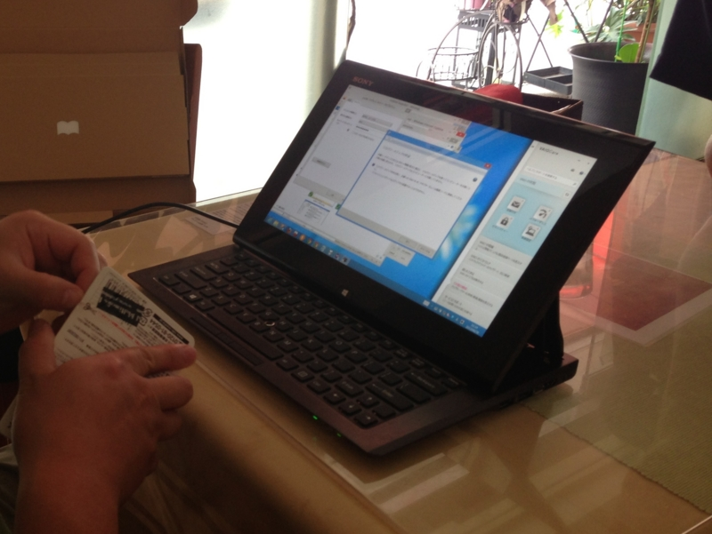

いろいろ策を練り、他人の褌で Surface Pro（128GB）を入手。これに伴い、VAIO Duo 11（<a href="https://blog.daruyanagi.jp/category/VAIO%20Duo%2011">VAIO Duo 11</a>）は友人の元へドナドナです。約250日間のお付き合いでした。ありがとう！

まぁ、それだけ Surface に惚れこんでしまったということですね。Windows 8 搭載機のリファレンス的ポジションでもあるので、なんやかんやいってレビューの検証端末としては使いやすいというのもある。

Surface Pro のいいところは、なんといってもデスクトップアプリが動作するところ。「Visual Studio」も「WebMatrix」も、フルスペックの「Microsoft Office」（同梱！）だって使える。あと、感圧式のペンが使えるのもイイ。これは是非 Surface RT の方にもほしかった。ペンはアダプターの接続面に磁力でくっつけておける。これはスマートでいいのだけど、充電中にペンをなくさないか少し不安になる（ぁ

そうそう、そのアダプターですが。

USB 給電ができるのが地味にイイ。このアダプター（48W）は RT（24W）でも利用可能で、その場合は急速充電器として使えるみたい。これだったら予備のアダプターは Pro 用を買えばよかったと思ったが、値段が倍ぐらい違うので（RT：3,980円、Pro：7,980円）、まぁ、別によかったのかもしれない。

ちなみに、RT 用のアダプターで Pro を充電することもできるみたい。ただし、充電時間はだいぶ延びるんだろう。

そんなわけで、これまた結構気に入った Surface Pro なのだけど、弱点もある。なかでも一番の問題は、熱。熱すぎる！　これでは布団のなかで使えない。重いのと厚いのは甘受できても、これからの季節、熱だけはキツい。Surface は「タッチ」が極めて身近なデバイスではあるけれど、世間一般でいうところの「タブレット」では決してない。

とはいえ、「ノートパソコン」でもない。VAIO Duo 11 のときも感じたが、タブレットとラップトップの間にある、まったく新しいカテゴリなのだと思う。Touch Cover のおかげで VAIO Duo 11 よりも機動性は上で、入力も机が必須な点を除けば Surface の方が楽だ<a href="#f-ee93185b" name="fn-ee93185b" title="ココは個人差がありそうだが、自分は適用能力が高いらしくさっさと慣れてしまった。もしくは Surface 信者なのかもしれない">*1</a>。

こいつはかなり面白い端末だなぁ。第二世代になって Connected Stanby にでも対応すれば、ほとんど死角がなくなるんじゃないか。Atom を載せて処理能力より低消費電力・低発熱を狙ってもいいし。その場合、Surface RT とかぶるのならば、RT は小型化して 5 ～ 7 インチタブレットのセグメントを狙えばいいと思った。

<a href="#fn-ee93185b" name="f-ee93185b" class="footnote-number">*1</a>:ココは個人差がありそうだが、自分は適用能力が高いらしくさっさと慣れてしまった。もしくは Surface 信者なのかもしれない

