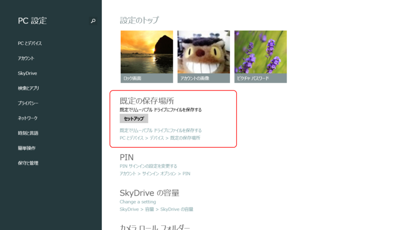
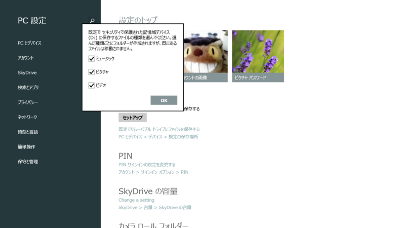
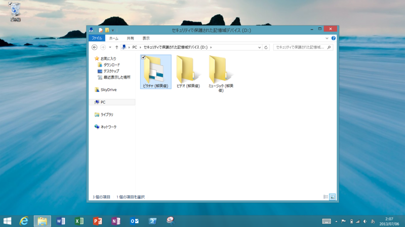
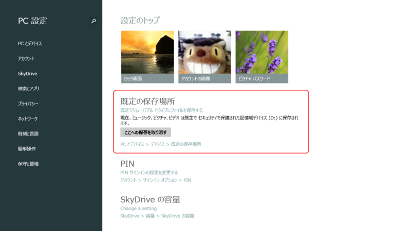
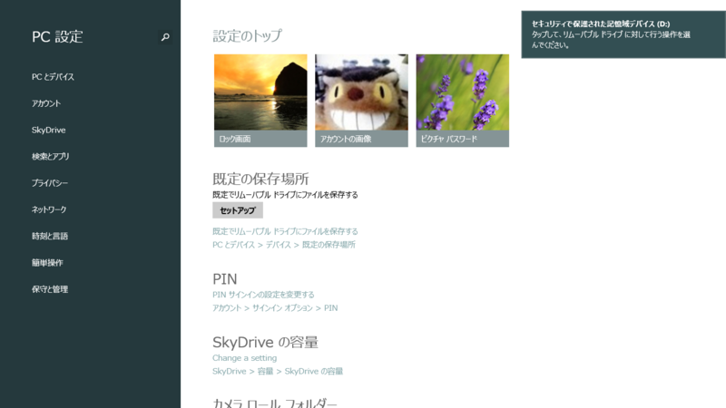
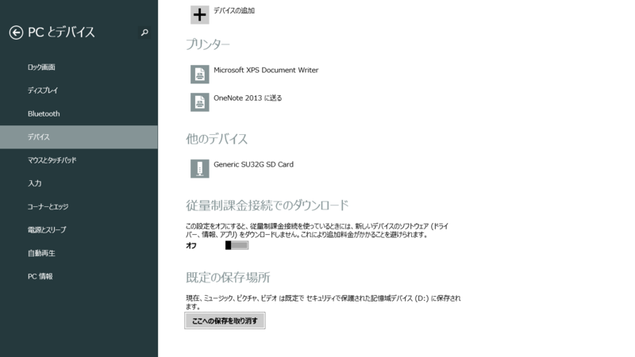

なんや、Windows 8.1 RT に新しいオプションが追加されとるやないか。どれどれおっちゃんに見せてみぃ。

というわけで、<a href="https://blog.daruyanagi.jp/entry/2013/06/30/234252">&#x3059;&#x306E;&#x3053;&#x30BF;&#x30F3;&#x3002;&#x3068;&#x30D7;&#x30ED;&#x751F;&#x3061;&#x3083;&#x3093;&#x306E;&#x30B3;&#x30E9;&#x30DC;&#x30A4;&#x30D9;&#x30F3;&#x30C8;&#x3092;&#x306A;&#x305C;&#x304B;&#x624B;&#x4F1D;&#x3063;&#x3066;&#x304D;&#x305F; - &#x3060;&#x308B;&#x308D;&#x3050;</a> のときにアキバで Surface RT に挿すための SD カードを仕入れてきた。

<a href="http://www.amazon.co.jp/exec/obidos/ASIN/B007VBIXYG/bestylesnet-22/">サンディスク SanDisk microSDHC UHS-I カード 32GB 超高速クラス10 世界国内シェアNo.1 並行輸入品パッケージ品</a>
<ul><li>出版社/メーカー: SanDisk</li><li>メディア: エレクトロニクス</li><li>購入: 2人 クリック: 15回</li><li><a href="http://d.hatena.ne.jp/asin/B007VBIXYG/bestylesnet-22" target="_blank">この商品を含むブログを見る</a></li></ul>

ちなみに、アキバで買うより Amazon のほうが安かった（死

セットアップを行うと、SD カードにピクチャ・ビデオ・ミュージックフォルダが作成される。

ライブラリ<a href="#f-8f9e81cf" name="fn-8f9e81cf" title="プレビュー版公開時に「ライブラリがなくなった？」という声が聞かれたけれど、そんなことはない。ただし、隠蔽はされた">*1</a>にも追加され、既定の保存先になる。ためしにブラウザーで画像を保存したら、ちゃんと SD カードに保存された。<del>“セキュリティで保護された記憶域デバイス”とあるように、カードは暗号化される。そのため、万が一盗まれてもデータを読み取ることは難しい（はず）。</del><a href="#f-ed21157e" name="fn-ed21157e" title="これは著作権保護の意味であり、データの暗号化のことではないようだ">*2</a>

ちなみに、［ここへの保存を取り消す］ボタンを押すと、ライブラリの既定の保存先がローカルドライブに戻るが、ライブラリからは削除されない。

SD カードを抜くと、一時的にローカルドライブが既定の保存先になるが、挿せば再び SD カードが既定の保存先になる。

同様の設定は［PC の設定］－［デバイス］にもある。機能はまったく同じ。

<a href="#fn-8f9e81cf" name="f-8f9e81cf" class="footnote-number">*1</a>:プレビュー版公開時に「ライブラリがなくなった？」という声が聞かれたけれど、そんなことはない。ただし、隠蔽はされた

<a href="#fn-ed21157e" name="f-ed21157e" class="footnote-number">*2</a>:これは著作権保護の意味であり、データの暗号化のことではないようだ

